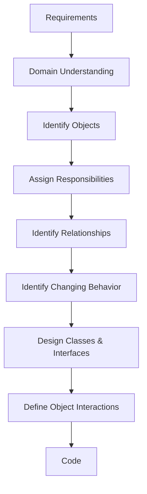

# **🧠 00 · LLD FOUNDATIONS**

🏷️ Tags: `LLD` `OOP` `Design` `Software-Architecture` `Interview-Prep` `Java` `UML` `Object-Oriented-Design`

---

## **❓ Problem**

Writing working code is not the same as designing good software.

A system can work correctly and still become difficult to:

- understand
- test
- modify
- extend
- debug
- maintain

LLD exists to answer questions such as:

**What objects should exist?**
 **What should each object know?**
 **What should each object do?**
 **How should objects communicate?**
 **Where should changing behavior live?**
 **How can the design evolve without breaking unrelated code?**

For example, consider a food-ordering system.

A naive implementation might put everything into one `OrderService`:

```
OrderService
 ├── create order
 ├── calculate price
 ├── apply discount
 ├── process payment
 ├── reserve inventory
 ├── assign delivery
 ├── send notification
 └── generate invoice
```

It may work initially.

But as requirements grow, the class becomes difficult to understand and every change becomes risky.

LLD is about finding better boundaries before the codebase becomes difficult to change.

---

## **📋 Prerequisites**

For these foundations, no advanced knowledge is required.

It helps to understand:

- basic programming
- variables and methods
- basic Java syntax
- basic idea of classes and objects

The deeper OOP concepts are covered separately in Section `01 · Object-Oriented Programming`.

---

## **🎯 Why This Exists**

LLD exists primarily because **software changes**.

A design that works perfectly for today’s requirements may become painful when tomorrow’s requirements arrive.

For example:

```
Today:
UPI
Card

Tomorrow:
Wallet
Net Banking
Buy Now Pay Later
International Cards
```

A good LLD should make such changes localized.

The goal is not:

“Create as many classes as possible.”

The goal is:

**Create the right boundaries and responsibilities so the system remains understandable and changeable.**

---

## **🧠 Core Concept**

LLD can be viewed as the bridge between requirements and implementation.

```
Requirements
     ↓
Domain Understanding
     ↓
Objects & Responsibilities
     ↓
Relationships
     ↓
Interfaces / Abstractions
     ↓
Object Interactions
     ↓
Code
```

A useful mental model is:

```
WHAT?
↓
Requirements

WHO?
↓
Objects / Entities / Services

HOW?
↓
Interactions / Interfaces / Classes

CODE
↓
Implementation
```

### **What LLD deals with**

LLD commonly deals with:

- classes
- objects
- interfaces
- abstract classes
- responsibilities
- relationships
- dependencies
- object interactions
- state transitions
- design patterns
- extensibility
- testability

### **LLD is not just class diagrams**

A class diagram is only a representation of a design.

The actual skill is:

**Understanding the problem and making good design decisions.**

---

## **🌍 Real-World Analogy**

Think about designing a restaurant kitchen.

You wouldn’t create one person responsible for:

```
Taking orders
Cooking
Billing
Cleaning
Inventory
Delivery
Customer complaints
```

Instead, responsibilities are separated:

```
Waiter
Chef
Cashier
Inventory Manager
Delivery Staff
```

Each role has a focused responsibility and they communicate with each other.

LLD does something similar with software objects.

---

## **❌ Bad Design**

A common bad design is the **God Object / God Service**.

```
class OrderService {

    void createOrder() {}

    void calculatePrice() {}

    void applyDiscount() {}

    void processPayment() {}

    void sendEmail() {}

    void updateInventory() {}

    void assignDelivery() {}

    void generateInvoice() {}
}
```

The class now knows too much.

Problems:

- low cohesion
- high coupling
- difficult testing
- difficult modification
- many reasons to change
- unrelated responsibilities become dependent on each other

Adding a new payment method could potentially affect an unrelated part of the class.

---

## **✅ Better Design**

Separate responsibilities according to the domain.

```
OrderService
 ├── coordinates order creation
 │
 ├── PricingService
 │      └── calculates price
 │
 ├── PaymentService
 │      └── handles payment
 │
 ├── InventoryService
 │      └── manages inventory
 │
 ├── DeliveryService
 │      └── manages delivery
 │
 └── NotificationService
        └── sends notifications
```

For payment:

```
PaymentProcessor
       ↑
 ┌─────┼──────────┬───────────┐
 │     │          │           │
UPI   Card      Wallet    NetBanking
```

Adding Net Banking should not require changing the abstraction:

```
interface PaymentProcessor {
    PaymentResult pay(Payment payment);
}
```

Instead:

```
class NetBankingPaymentProcessor
        implements PaymentProcessor {

    @Override
    public PaymentResult pay(Payment payment) {
        // Net banking implementation
        return PaymentResult.success();
    }
}
```

This is a concrete example of designing for change.

---

## **💻 Code Example**

### **Payment abstraction**

```
interface PaymentProcessor {

    PaymentResult pay(Payment payment);
}
```

Concrete implementations:

```
class UpiPaymentProcessor implements PaymentProcessor {

    @Override
    public PaymentResult pay(Payment payment) {
        System.out.println("Processing UPI payment");
        return PaymentResult.success();
    }
}
```

```
class CardPaymentProcessor implements PaymentProcessor {

    @Override
    public PaymentResult pay(Payment payment) {
        System.out.println("Processing card payment");
        return PaymentResult.success();
    }
}
```

```
class WalletPaymentProcessor implements PaymentProcessor {

    @Override
    public PaymentResult pay(Payment payment) {
        System.out.println("Processing wallet payment");
        return PaymentResult.success();
    }
}
```

The higher-level service depends on the abstraction:

```
class PaymentService {

    private final PaymentProcessor paymentProcessor;

    PaymentService(PaymentProcessor paymentProcessor) {
        this.paymentProcessor = paymentProcessor;
    }

    PaymentResult process(Payment payment) {
        return paymentProcessor.pay(payment);
    }
}
```

The important design decision is:

```
PaymentService
      ↓
PaymentProcessor
      ↑
 ┌────┼────────┐
UPI  Card     Wallet
```

`PaymentService` does not need to know the implementation details of UPI, Card, or Wallet.

---

## **🗺️ Diagram**



The relationship between HLD and LLD:

```
                 SYSTEM
                   │
                  HLD
                   │
        ┌──────────┼──────────┐
        ↓          ↓          ↓
   Order Service Payment    Delivery
                    │
                   LLD
                    │
        ┌───────────┼────────────┐
        ↓           ↓            ↓
 PaymentService PaymentProcessor Payment
                    │
              ┌─────┼─────┐
              ↓     ↓     ↓
             UPI   Card  Wallet
```

---

## **🏢 Real-World Application**

Similar design thinking is useful in systems such as:

- food ordering
- payment processing
- movie booking
- hotel booking
- ride sharing
- notification systems
- inventory systems
- e-commerce
- parking systems

The exact architecture varies by system, but the underlying LLD questions remain similar:

```
What are the important objects?
Who owns what responsibility?
What changes frequently?
Where should that change live?
How should objects communicate?
```

---

## **⚖️ Trade-offs**

Good LLD does **not** mean maximum abstraction.

### **More abstraction**

Pros:

- easier extension
- better isolation
- easier testing
- lower coupling

Cons:

- more classes
- more interfaces
- more indirection
- harder to understand if unnecessary

### **Simpler design**

Pros:

- easier to understand
- faster to implement
- less code
- less indirection

Cons:

- may become difficult to extend
- responsibilities may become mixed

The important interview principle:

**Introduce abstraction when there is a meaningful variation or change point—not simply because a design pattern exists.**

---

## **🎯 Interview Questions**

### **1. What is LLD?**

**Answer:**

LLD is the detailed design of software components, including classes, objects, interfaces, responsibilities, relationships, dependencies, and interactions.

---

### **2. Is LLD just writing classes?**

**Answer:**

No.

Classes are one representation of the design. The important part is deciding:

- what objects should exist
- what responsibilities they have
- how they interact
- where abstractions are needed
- how the design handles change

---

### **3. What problem does LLD solve?**

**Answer:**

LLD helps manage software complexity and change by assigning clear responsibilities and defining appropriate boundaries between components.

---

### **4. Why not put everything into one service?**

**Answer:**

A large service develops:

- low cohesion
- high coupling
- multiple reasons to change
- difficult testing
- difficult maintenance

Responsibilities should be separated where they represent independent concerns.

---

### **5. What is the relationship between HLD and LLD?**

**Answer:**

HLD defines the system-level architecture and component boundaries.

LLD designs the internal structure of those components.

```
HLD
↓
Services / Components
↓
LLD
↓
Classes / Interfaces / Objects
↓
Code
```

---

### **6. When should you introduce an interface?**

**Answer:**

When there is a meaningful abstraction or variation that should be isolated from the caller.

For example:

```
PaymentProcessor
 ├── UPI
 ├── Card
 └── Wallet
```

If there is only one implementation and no meaningful variation, introducing an interface may add unnecessary complexity.

---

### **7. Why is****`PaymentProcessor`****better than directly using****`UpiPaymentProcessor`****?**

**Answer:**

The higher-level code depends on the payment abstraction rather than a specific implementation.

This makes it easier to:

- replace implementations
- test using a fake/mock processor
- add new payment methods
- reduce coupling

---

### **8. What is the most important mindset in LLD?**

**Answer:**

Don’t start by drawing classes.

Start with:

```
Requirements
↓
Use Cases
↓
Domain Objects
↓
Responsibilities
↓
Relationships
↓
Changing Behavior
↓
Abstractions
↓
Interactions
↓
Code
```

---

## **🧪 Practice Problem**

### **Design a Food Ordering System**

Start with only these requirements:

1. Customer can browse restaurants.
2. Customer can add food items to a cart.
3. Customer can place an order.
4. Customer can make a payment.
5. Customer receives an order confirmation.

Before writing code, identify:

```
Actors
↓
Use Cases
↓
Candidate Nouns
↓
Entities
↓
Responsibilities
↓
Services
↓
Changing Behaviors
↓
Interfaces
```

Do **not** immediately create classes for every noun.

Ask:

Does this concept have meaningful state, behavior, or responsibility?

---

## **⚠️ Mistakes / Gotchas**

### **1. “Every noun should become a class”**

False.

Requirements contain many nouns that do not need to become objects.

A noun is only a **candidate**.

---

### **2. “Every verb should become a method”**

Also false.

For example:

```
Customer books a movie
```

doesn’t necessarily mean:

```
customer.bookMovie();
```

The operation may belong to:

```
bookingService.createBooking();
```

depending on where the required knowledge and responsibility naturally belong.

---

### **3. “LLD means more classes”**

Not necessarily.

More classes can actually make a design worse if they don’t represent meaningful responsibilities.

---

### **4. “Use design patterns everywhere”**

Avoid this.

Patterns should solve an actual design problem.

```
Problem
  ↓
Variation / Complexity
  ↓
Need for abstraction
  ↓
Pattern if justified
```

Not:

```
Pattern
  ↓
Find somewhere to use it
```

---

### **5. “Domain object should do everything”**

An entity should not automatically own every operation related to it.

For example, an `Order` should not necessarily:

```
process payment
send email
assign delivery
update inventory
```

Those may belong to other components.

---

### **6. Confusing domain with implementation**

```
Domain
= business/problem space

Implementation
= Java/Spring/database/etc.
```

For a food delivery system:

```
Domain:
Customer
Restaurant
Menu
Cart
Order
Payment
Delivery

Technical implementation:
Java
Spring Boot
MySQL
Redis
Kafka
HTTP
JPA
```

---

### **7. Treating every design decision as a universal rule**

For example, whether `Room` owns availability depends on the requirements.

In a simple hotel-booking exercise:

```
Room → availability
```

may be sufficient.

For date-based hotel inventory:

```
Room + Date → availability
```

may require a different model.

---

## **🔑 Key Takeaways**

- **LLD is about structuring software for complexity and change.**
- Start with **requirements** , not classes.
- Identify **objects, responsibilities, relationships, and changing behavior** .
- A noun is a **candidate object** , not automatically a class.
- Separate responsibilities to improve cohesion and reduce coupling.
- Prefer abstractions where meaningful variation exists.
- **LLD is not “more classes”; it is better boundaries.**
- A good LLD should make future changes easier without unnecessarily complicating today’s code.

---

## **🔗 Related Concepts**

- Object-Oriented Programming
- Encapsulation
- Abstraction
- Polymorphism
- Composition
- SOLID Principles
- Coupling & Cohesion
- Design Patterns
- Dependency Injection
- UML
- Domain Modeling
- Clean Architecture
- Machine Coding
- HLD

---