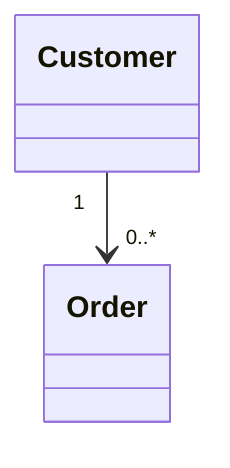
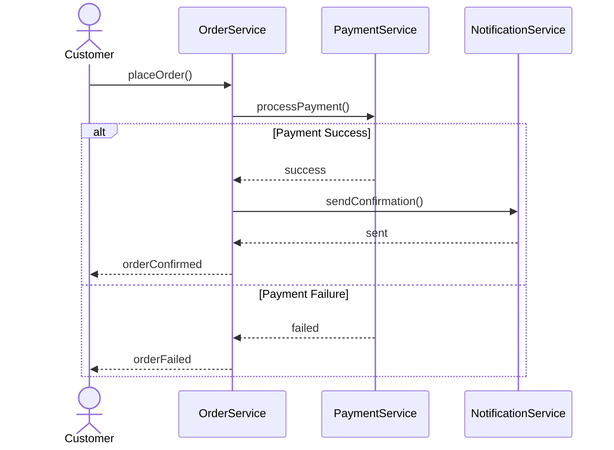
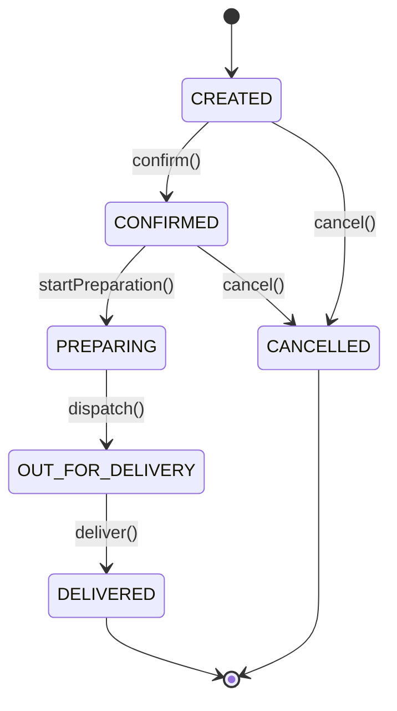
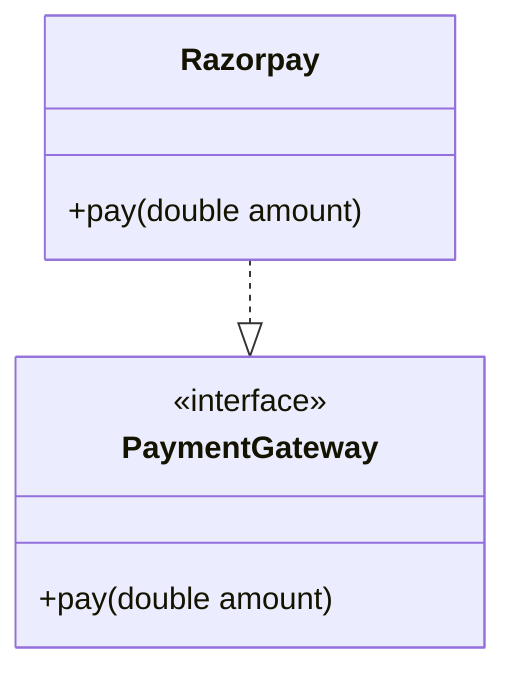
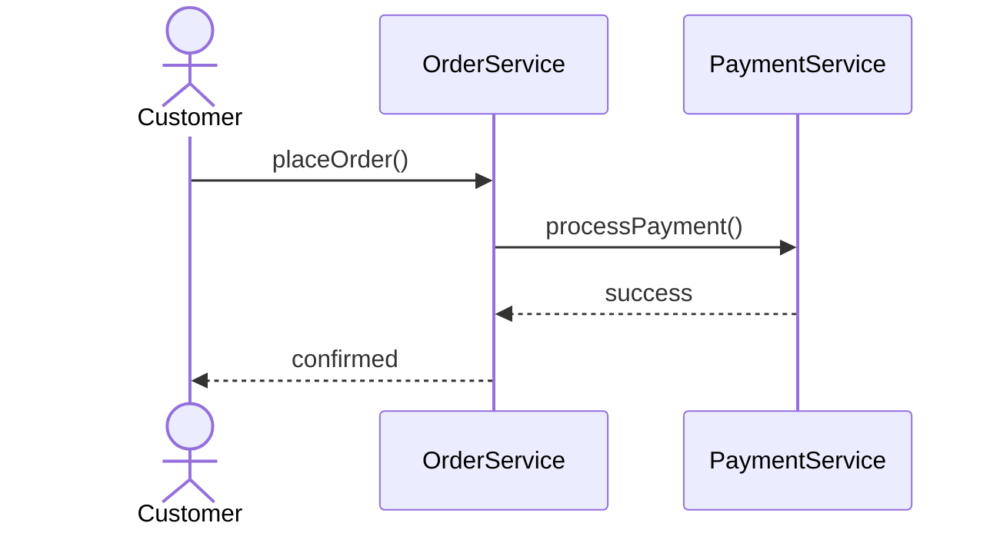
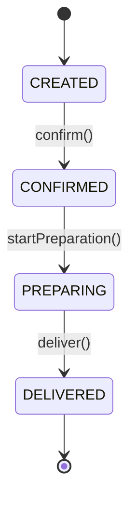
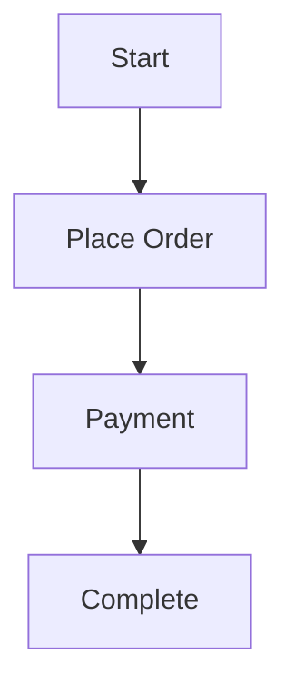
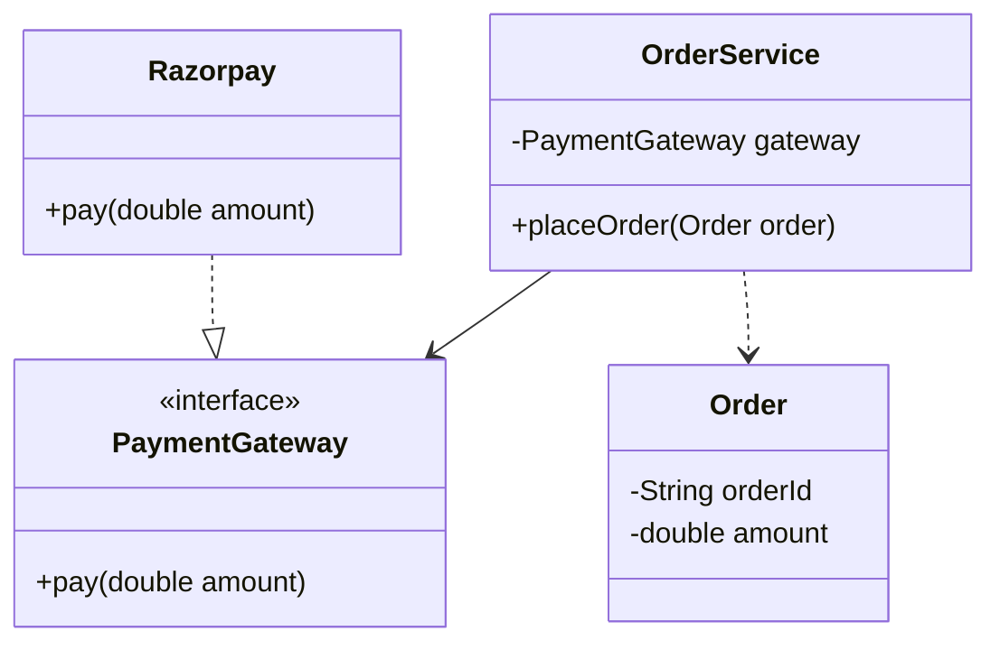

# 02 · UML & DESIGN REPRESENTATION

> **LLD principle:** UML is a communication language for expressing a design. It is not the design itself.
>
> This chapter moves from **why UML exists → structural diagrams → interaction/workflow/lifecycle diagrams → relationship semantics → Mermaid → interview reading**.

---

# 02.1 · Why UML

🏷️ **Tags:** `UML` `LLD` `Design Communication` `Modeling` `Interview`

## ❓ Problem

A system can be designed correctly but still be difficult to communicate.

For example, saying:

> "Customer has orders, Order contains order items, OrderService uses PaymentGateway, and Razorpay implements PaymentGateway."

is understandable, but becomes harder as the design grows.

UML provides a standard visual language to communicate structure and behavior.

## 📋 Prerequisites

- Basic OOP
- Classes and objects
- Encapsulation
- Inheritance
- Interfaces
- Composition
- SOLID basics

## 🎯 Why This Exists

UML helps answer different design questions quickly:

| Question | Diagram |
|---|---|
| What is the system made of? | Class Diagram |
| What does it look like at a particular moment? | Object Diagram |
| Who calls whom and in what order? | Sequence Diagram |
| What is the workflow? | Activity Diagram |
| How does one entity change over time? | State Diagram |

## 🧠 Core Concept

UML separates **modeling** from **implementation**.

```text
Requirements
    ↓
Identify responsibilities
    ↓
Design objects/classes
    ↓
Define relationships
    ↓
Model interactions/workflows/states
    ↓
Represent using UML
```

UML is useful because it makes hidden design decisions visible:

- ownership
- coupling
- multiplicity
- responsibilities
- lifecycle
- interaction order
- state transitions

## 🌍 Real-World Analogy

A building blueprint is not the building.

Similarly:

> A UML diagram is not the software. It is a representation of the software design.

## ❌ Bad Design

Trying to explain a large object model only through prose:

```text
Customer has orders and order service calls payment
and payment has gateway and gateway has...
```

This becomes difficult to review.

## ✅ Better Design

Represent the structure visually:

```text
Customer ───> Order
Order ◆── OrderItem
OrderService ───> PaymentGateway
Razorpay ..|> PaymentGateway
```

## 💻 Code Example

```java
interface PaymentGateway {
    void pay(double amount);
}

class Razorpay implements PaymentGateway {
    public void pay(double amount) {
        // implementation
    }
}

class OrderService {
    private final PaymentGateway gateway;

    OrderService(PaymentGateway gateway) {
        this.gateway = gateway;
    }
}
```

## 🗺️ Diagram

```text
Requirements
    │
    ├───────────────┐
    ▼               ▼
Structure       Behavior
    │               │
    ▼               ▼
Class/Object   Sequence/Activity/State
    │               │
    └───────┬───────┘
            ▼
          UML
```

## 🏢 Real-World Application

UML is useful when:

- designing an unfamiliar domain
- explaining an LLD interview solution
- reviewing an existing design
- documenting a GitHub project
- communicating boundaries between components

## ⚖️ Trade-offs

**Benefits**
- visual communication
- exposes coupling
- makes responsibilities easier to discuss
- useful during interviews and design reviews

**Costs**
- diagrams can become outdated
- excessive detail creates noise
- UML does not automatically make a design good

## 🎯 Interview Questions

1. Why do we use UML?
2. Is UML a design pattern?
3. Which diagram shows class structure?
4. Which diagram shows runtime interaction?
5. Which diagram shows an entity's lifecycle?
6. When would you use a sequence diagram instead of a class diagram?

## 🧪 Practice Problem

Given an Order Management System, decide which diagram answers each question:

- "What classes exist?" → Class Diagram
- "How is an order placed?" → Sequence/Activity Diagram
- "What states can an order enter?" → State Diagram

## ⚠️ Mistakes / Gotchas

- UML is not the implementation.
- Do not use one diagram type for every question.
- Do not draw everything just because it can be drawn.
- Diagram only what helps communicate the design.

## 🔑 Key Takeaways

- UML is a design communication language.
- Different diagrams answer different questions.
- Start with requirements and responsibilities, then represent the design.
- A diagram should reduce ambiguity, not increase it.

## 🧾 Cheatsheet

```text
Class Diagram     → structure / types
Object Diagram    → concrete instances at a moment
Sequence Diagram  → interactions / call order
Activity Diagram  → workflow / process
State Diagram     → lifecycle / state transitions
```

## 🔗 Related Concepts

- OOP
- SOLID
- Design Patterns
- LLD Interview Approach

## 🚧 Pending / Related Topics

- Advanced UML notation
- Design Pattern diagrams
- Component and deployment diagrams

---

# 02.2 · Class Diagram

🏷️ **Tags:** `UML` `Class Diagram` `Relationships` `Multiplicity` `LLD`

## ❓ Problem

We need to communicate:

- classes
- attributes
- methods
- interfaces
- inheritance
- relationships
- multiplicity

without reading the implementation.

## 📋 Prerequisites

- Class/Object
- Encapsulation
- Inheritance
- Interface
- Composition
- Association

## 🎯 Why This Exists

The class diagram answers:

> **"What is the system structurally made of?"**

It is usually the most important UML diagram in LLD.

## 🧠 Core Concept

A UML class is commonly represented as:

```text
┌──────────────────────────┐
│          Order           │
├──────────────────────────┤
│ - orderId : String       │
│ - amount : double        │
├──────────────────────────┤
│ + confirm() : void       │
│ + cancel() : void        │
└──────────────────────────┘
```

Three sections:

1. Class name
2. Attributes
3. Operations/methods

### Visibility

```text
+ public
- private
# protected
~ package/default
```

### Example

```java
class Order {
    private String orderId;
    private double amount;

    public void confirm() {}
    public void cancel() {}
}
```

## 🌍 Real-World Analogy

A class diagram is like an architectural floor plan showing:

- rooms
- connections
- ownership
- dimensions

but not the actual activity happening inside each room.

## ❌ Bad Design

Putting every implementation detail into the diagram:

```text
Order
 ├── every local variable
 ├── every helper method
 ├── SQL query
 ├── logging
 └── framework internals
```

This creates noise.

## ✅ Better Design

Show design-relevant structure:

```text
Order
 ├── orderId
 ├── amount
 ├── confirm()
 └── cancel()
```

## 💻 Code Example

```java
class Customer {
    private String customerId;
    private String name;
}

class Order {
    private String orderId;
    private double amount;

    public void confirm() {}
    public void cancel() {}
}
```

## 🗺️ Diagram

```text
Customer 1 ───────── 0..* Order
```

Mermaid:



## 🏢 Real-World Application

Class diagrams are useful for:

- interview LLD
- object model documentation
- domain modeling
- reviewing dependencies
- explaining service boundaries

## ⚖️ Trade-offs

**Benefits**
- clear structure
- easy relationship review
- exposes coupling and ownership

**Costs**
- large systems can produce huge diagrams
- static structure does not show runtime order

## 🎯 Interview Questions

1. What does a class diagram show?
2. What does `+`, `-`, `#`, `~` mean?
3. What is multiplicity?
4. Difference between association and dependency?
5. Difference between aggregation and composition?
6. Difference between generalization and realization?

## 🧪 Practice Problem

Model:

```text
Customer
Order
OrderItem
Product
PaymentGateway
Razorpay
```

Identify attributes, methods, and relationships before writing code.

## ⚠️ Mistakes / Gotchas

- A field reference is generally an association.
- A method parameter/local use is generally a dependency.
- `extends` = generalization.
- `implements` = realization.
- Aggregation/composition require whole-part semantics, not merely "field exists."

## 🔑 Key Takeaways

- Class diagrams represent static structure.
- Multiplicity describes how many objects can participate.
- Relationship semantics matter more than drawing arrows mechanically.

## 🧾 Cheatsheet

### Visibility

```text
+  public
-  private
#  protected
~  package/default
```

### Multiplicity

```text
1       exactly one
0..1    zero or one
*       zero or many
0..*    zero or many
1..*    one or many
2..5    between two and five
```

### Relationships

```text
Association       ─────────>
Dependency        - - - - ->
Aggregation       ◇────────
Composition       ◆────────
Generalization    ───────▷
Realization       - - - -▷
```

## 🔗 Related Concepts

- Association
- Dependency
- Aggregation
- Composition
- Generalization
- Realization
- Object Diagram

## 🚧 Pending / Related Topics

- Advanced UML constraints
- Generic/template notation
- Component diagrams

---

# 02.3 · Object Diagram

🏷️ **Tags:** `UML` `Object Diagram` `Runtime Snapshot` `Instances`

## ❓ Problem

A class diagram tells us what types exist, but sometimes we need to see the **actual objects and values at a particular moment**.

## 📋 Prerequisites

- Class Diagram
- Object
- Association
- Multiplicity

## 🎯 Why This Exists

Object Diagram answers:

> **"What does the object graph look like right now?"**

## 🧠 Core Concept

Class diagram:

```text
Customer
Order
```

Object diagram:

```text
customer101 : Customer
order501    : Order
order502    : Order
```

with actual values:

```text
customer101 : Customer
----------------------
name = "Adi"

order501 : Order
----------------------
orderId = "O501"
amount = 500

order502 : Order
----------------------
orderId = "O502"
amount = 800
```

### Class vs Object

```text
Class Diagram
    ↓
Blueprint / type

Object Diagram
    ↓
Actual instances / snapshot
```

## 🌍 Real-World Analogy

Class diagram:

> "A customer can have many orders."

Object diagram:

> "Customer 101 currently has orders O501 and O502."

## ❌ Bad Design

Showing class names when the goal is to explain a concrete runtime object graph.

## ✅ Better Design

Use concrete instances and values.

```text
customer101 : Customer
      │
      ├──── order501 : Order
      └──── order502 : Order
```

## 💻 Code Example

```java
Customer customer = new Customer("C101");

Order order1 = new Order("O501", 500);
Order order2 = new Order("O502", 800);
```

## 🗺️ Diagram

```text
customer101 : Customer
       │
       ├──────── order501 : Order
       │             amount = 500
       │
       └──────── order502 : Order
                     amount = 800
```

## 🏢 Real-World Application

Useful for:

- validating object graphs
- explaining examples during interviews
- debugging domain relationships
- showing concrete runtime state

## ⚖️ Trade-offs

**Benefits**
- concrete
- useful for explaining instances
- validates multiplicity assumptions

**Costs**
- snapshot only
- less useful than class diagrams for large static designs

## 🎯 Interview Questions

1. Class diagram vs object diagram?
2. Why would you use an object diagram?
3. What does `customer101 : Customer` mean?
4. Can multiple objects belong to the same class?

## 🧪 Practice Problem

Given:

```text
Customer C101
Orders O501, O502
```

draw the object graph showing both orders belonging to C101.

## ⚠️ Mistakes / Gotchas

- `Customer` is a class; `customer101` is an object.
- Object diagrams represent a snapshot.
- Don't duplicate the same object accidentally when modeling multiple relationships.

## 🔑 Key Takeaways

> **Class = type. Object = instance.**

Object diagrams answer:

> "What objects and values exist at this moment?"

## 🧾 Cheatsheet

```text
Class:
Customer

Object:
customer101 : Customer

Class diagram:
Customer 1 ─── 0..* Order

Object diagram:
customer101 ─── order501
             └── order502
```

## 🔗 Related Concepts

- Class Diagram
- Object
- Multiplicity
- Runtime Object Graph

## 🚧 Pending / Related Topics

- Runtime debugging
- Heap/object graphs

---

# 02.4 · Sequence Diagram

🏷️ **Tags:** `UML` `Sequence Diagram` `Interaction` `Runtime Flow`

## ❓ Problem

A class diagram tells us structure, but not:

> "Who calls whom, and in what order?"

## 📋 Prerequisites

- Class Diagram
- Objects
- Methods
- Dependency

## 🎯 Why This Exists

Sequence diagrams model **interaction over time**.

Time flows:

```text
TOP
 ↓
 ↓
BOTTOM
```

## 🧠 Core Concept

Main elements:

- participant
- actor
- lifeline
- message
- activation
- return
- `alt`
- `opt`
- `loop`
- `par`

Example:

```text
Customer
   │
   │ placeOrder()
   ▼
OrderService
   │
   │ processPayment()
   ▼
PaymentService
```

### Synchronous call

Caller waits:

```text
A ->> B
```

### Return

```text
B -->> A
```

### Self-call

```text
A ->> A
```

## 🌍 Real-World Analogy

A conversation transcript:

```text
Customer: Place order
OrderService: Process payment
PaymentService: Success
OrderService: Confirm order
```

The sequence diagram makes the interaction order explicit.

## ❌ Bad Design

Adding conditions as participants:

```text
Customer
OrderService
PaymentSuccessful   ← not a participant
```

A condition is behavior/control flow, not an object.

## ✅ Better Design

```text
Customer
OrderService
PaymentService
NotificationService
```

and represent the condition with `alt`.

## 💻 Code Example

```java
customer.placeOrder();

orderService.placeOrder(order);

paymentService.processPayment(order.getAmount());

notificationService.sendConfirmation();
```

## 🗺️ Diagram



## 🏢 Real-World Application

Useful for:

- API request flows
- payment workflows
- service-to-service interactions
- async/sync communication
- failure-path analysis

## ⚖️ Trade-offs

**Benefits**
- clear runtime order
- exposes missing interactions
- excellent for interview walkthroughs

**Costs**
- can become large
- not ideal for static structure

## 🎯 Interview Questions

1. What does a lifeline represent?
2. Synchronous vs asynchronous call?
3. What does `alt` mean?
4. When do you use `loop`?
5. What does `par` mean?
6. What is an activation bar?

## 🧪 Practice Problem

Model Place Order:

```text
Customer
→ OrderService
→ PaymentService
→ NotificationService
```

Include success and failure paths.

## ⚠️ Mistakes / Gotchas

- Time flows top to bottom.
- Participants are actors/objects/components involved in the interaction.
- Conditions belong in combined fragments such as `alt`.
- Don't confuse a participant with a workflow/path.
- Always consider failure paths.

## 🔑 Key Takeaways

> **Sequence Diagram = who calls whom, and in what order.**

## 🧾 Cheatsheet

```text
Participant       → actor/object/component involved
Lifeline          → vertical existence line
Activation        → currently executing
A ->> B           → synchronous message
B -->> A          → return message
alt               → if/else
opt               → optional branch
loop              → repetition
par               → parallel execution
```

### Mermaid

```text
sequenceDiagram
actor Customer
participant OS as OrderService

Customer->>OS: placeOrder()
OS-->>Customer: confirmation
```

## 🔗 Related Concepts

- Activity Diagram
- State Diagram
- Async Processing
- Distributed Systems

## 🚧 Pending / Related Topics

- Async messaging
- Event-driven architecture
- Message queues

---

# 02.5 · Activity Diagram

🏷️ **Tags:** `UML` `Activity Diagram` `Workflow` `Decision` `Parallelism`

## ❓ Problem

A sequence diagram focuses on interactions. Sometimes the main question is:

> "What is the workflow?"

## 📋 Prerequisites

- Sequence Diagram
- Control flow
- Conditions
- Parallel execution

## 🎯 Why This Exists

Activity diagrams represent processes/workflows:

```text
Start
 ↓
Action
 ↓
Decision
 ├── Path A
 └── Path B
 ↓
End
```

## 🧠 Core Concept

Main constructs:

### Initial node

```text
●
```

### Final node

```text
◎
```

### Activity/action

```text
[Process Payment]
```

### Decision

```text
◇
```

### Merge

Combines alternative paths.

### Fork

Starts parallel paths.

### Join

Synchronizes parallel paths.

### Swimlane

Shows responsibility.

## 🌍 Real-World Analogy

A process flowchart:

```text
Start
 ↓
Take order
 ↓
Payment successful?
 ├── No → Fail
 └── Yes → Prepare → Deliver
```

## ❌ Bad Design

Using a decision node to represent parallel execution.

Decision means:

> choose a path.

Fork means:

> start multiple paths.

## ✅ Better Design

```text
Payment Success
      ↓
     Fork
    /    \
 Email   SMS
    \    /
     Join
      ↓
    Complete
```

## 💻 Code Example

```java
if (paymentSuccessful) {
    sendEmail();
    sendSms();
}
```

If the two notifications are designed to execute concurrently:

```java
parallel(
    () -> sendEmail(),
    () -> sendSms()
);
```

## 🗺️ Diagram

```text
        ●
        │
        ▼
   Place Order
        │
        ▼
     Payment
        │
        ▼
       ◇
   Payment OK?
    /       \
  [No]      [Yes]
   │           │
  Fail        Fork
               ├── Email
               └── SMS
                 \   /
                  Join
                   │
                  End
```

## 🏢 Real-World Application

Useful for:

- checkout
- onboarding
- approval workflows
- order fulfillment
- business processes

## ⚖️ Trade-offs

**Benefits**
- excellent workflow representation
- clear decisions and parallelism

**Costs**
- less useful for object structure
- large workflows become difficult to read

## 🎯 Interview Questions

1. Decision vs fork?
2. Merge vs join?
3. Why use swimlanes?
4. Activity vs sequence diagram?
5. When should parallel processing be represented?

## 🧪 Practice Problem

Model:

```text
Place Order
→ Validate
→ Payment
→ Success?
→ Send email + SMS in parallel
→ Complete
```

## ⚠️ Mistakes / Gotchas

```text
Decision → choose one path
Merge    → combine alternative paths

Fork     → start parallel paths
Join     → wait/synchronize parallel paths
```

Do not interchange them.

## 🔑 Key Takeaways

> **Activity Diagram = what the system/process does.**

## 🧾 Cheatsheet

```text
●       Initial node
◎       Final node
◇       Decision / merge
Fork    Start parallel paths
Join    Synchronize parallel paths
Swimlane Responsibility boundary
[guard] Condition on a transition/path
```

## 🔗 Related Concepts

- Sequence Diagram
- State Diagram
- Workflow Engines
- BPMN

## 🚧 Pending / Related Topics

- Advanced workflow modeling
- BPMN
- Saga/workflow orchestration

---

# 02.6 · State Diagram

🏷️ **Tags:** `UML` `State Machine` `Lifecycle` `Transitions` `Guards`

## ❓ Problem

An entity behaves differently depending on its current state.

For an Order:

```text
CREATED
CONFIRMED
PREPARING
OUT_FOR_DELIVERY
DELIVERED
CANCELLED
```

We need to define valid transitions.

## 📋 Prerequisites

- OOP
- State
- Events
- Conditions
- Activity Diagram

## 🎯 Why This Exists

State diagrams answer:

> **"How does one entity change state throughout its lifecycle?"**

## 🧠 Core Concept

A transition can be thought of as:

```text
source -- event [guard] / action --> target
```

Example:

```text
CREATED -- confirm() --> CONFIRMED
```

With a guard:

```text
PROCESSING -- [success] --> SUCCESS
PROCESSING -- [failure] --> FAILED
```

### State-dependent behavior

If an Order is `DELIVERED`, `cancel()` may not be valid.

If it is `CREATED`, cancellation may be allowed.

## 🌍 Real-World Analogy

A traffic light:

```text
RED → GREEN → YELLOW → RED
```

The current state determines what transition is possible next.

## ❌ Bad Design

Using activities as if they were persistent entity states:

```text
Validate → Payment → CheckSuccess
```

These are primarily workflow activities.

## ✅ Better Design

Model actual Order states:

```text
CREATED
 ↓
CONFIRMED
 ↓
PREPARING
 ↓
OUT_FOR_DELIVERY
 ↓
DELIVERED
```

## 💻 Code Example

```java
enum OrderStatus {
    CREATED,
    CONFIRMED,
    PREPARING,
    OUT_FOR_DELIVERY,
    DELIVERED,
    CANCELLED
}
```

The diagram helps define which transitions are valid.

## 🗺️ Diagram



## 🏢 Real-World Application

Useful for:

- orders
- payments
- shipments
- subscriptions
- tickets
- workflow entities

## ⚖️ Trade-offs

**Benefits**
- makes lifecycle explicit
- prevents invalid transitions
- clarifies state-dependent behavior

**Costs**
- state machines can grow large
- not every object needs a state diagram

## 🎯 Interview Questions

1. What is a state?
2. What is a transition?
3. What is a guard?
4. State vs activity?
5. State diagram vs State Design Pattern?
6. How do you prevent invalid transitions?

## 🧪 Practice Problem

Model Payment:

```text
INITIATED
→ PROCESSING
→ SUCCESS

or

PROCESSING
→ FAILED
→ PROCESSING (retry)
```

with:

```text
[retryCount < 3]
```

as a guard.

## ⚠️ Mistakes / Gotchas

- State = condition/status.
- Event = trigger causing transition.
- Guard = condition controlling transition.
- State Diagram is a modeling tool; State Pattern is an implementation pattern.
- Do not model every method as a state.

## 🔑 Key Takeaways

> **State Diagram = what state the entity is in and how it transitions.**

## 🧾 Cheatsheet

```text
State       → condition/status
Transition  → movement between states
Event       → trigger
Guard       → condition
Action      → behavior during transition

Activity    → what the system does
State       → what the entity is
```

## 🔗 Related Concepts

- State Pattern
- State Machine
- Activity Diagram
- Workflow

## 🚧 Pending / Related Topics

- State Design Pattern
- Finite State Machines
- Event-driven state transitions

---

# 02.7 · Dependency Relationships

🏷️ **Tags:** `UML` `Association` `Dependency` `Aggregation` `Composition` `Generalization` `Realization`

## ❓ Problem

Relationship arrows look similar, but they carry very different semantics.

The interview question is often:

> "What relationship exists between these two classes and why?"

## 📋 Prerequisites

- OOP relationships
- Interfaces
- Composition
- SOLID
- Class Diagram

## 🎯 Why This Exists

Correct relationship modeling communicates:

- coupling
- ownership
- lifecycle
- inheritance
- contract implementation

## 🧠 Core Concept

### 1. Association

A class maintains a structural reference to another class.

```java
class OrderService {
    private final PaymentGateway gateway;
}
```

Primary UML relationship:

```text
OrderService ─────────> PaymentGateway
```

Think:

> **"I have/know a reference to this object."**

### 2. Dependency

A class temporarily uses another class.

```java
class OrderService {
    void placeOrder(Order order) {
        order.confirm();
    }
}
```

Primary relationship:

```text
OrderService - - - - - - > Order
```

Think:

> **"I need this object to perform this operation."**

### 3. Aggregation

Weak whole-part relationship.

The part has an independent lifecycle.

```text
Company ◇──────── Employee
```

Example:

```java
class Company {
    private List<Employee> employees;
}
```

An Employee can continue to exist independently of the Company.

### 4. Composition

Strong whole-part relationship with lifecycle ownership.

```text
Order ◆──────── OrderItem
```

Example:

```java
class Order {
    private final List<OrderItem> items;

    void addItem(Product product, int quantity) {
        items.add(new OrderItem(product, quantity));
    }
}
```

The Order owns the OrderItem lifecycle in this domain model.

### 5. Generalization

Inheritance / `extends`.

```java
class Car extends Vehicle {}
```

```text
Car ─────────▷ Vehicle
```

Think:

> **IS-A**

### 6. Realization

Implementation of an interface.

```java
class Razorpay implements PaymentGateway {}
```

```text
Razorpay - - - - -▷ PaymentGateway
```

Think:

> **"Fulfills this interface contract."**

## 🌍 Real-World Analogy

```text
Association:
Employee knows Manager.

Dependency:
Employee temporarily uses Printer.

Aggregation:
Company has Employees.

Composition:
Order owns OrderItems.

Generalization:
Car is a Vehicle.

Realization:
Razorpay fulfills PaymentGateway.
```

## ❌ Bad Design

Assuming:

```java
private SomeClass object;
```

automatically means aggregation or composition.

It does not.

A field reference usually indicates **association**. Aggregation/composition require additional whole-part lifecycle semantics.

## ✅ Better Design

Ask in this order:

```text
Is it extends?
    ↓ yes → Generalization

Is it implements?
    ↓ yes → Realization

Is it a temporary use?
    ↓ yes → Dependency

Is it a stored reference?
    ↓ yes → Association

Is it whole-part?
    ↓ yes → Aggregation / Composition

If composition:
    whole owns lifecycle
```

## 💻 Code Example

```java
interface PaymentGateway {
    void pay(double amount);
}

class Razorpay implements PaymentGateway {
    public void pay(double amount) {}
}

class OrderService {
    private final PaymentGateway gateway;

    OrderService(PaymentGateway gateway) {
        this.gateway = gateway;
    }

    void placeOrder(Order order) {
        gateway.pay(order.getAmount());
    }
}
```

Relationships:

```text
OrderService → PaymentGateway = Association
OrderService → Order = Dependency
Razorpay → PaymentGateway = Realization
```

## 🗺️ Diagram

```text
                         PaymentGateway
                              ▲
                              │ realization
                              │
                           Razorpay

OrderService ───────────> PaymentGateway
     │
     │ dependency
     ▼
   Order
```

## 🏢 Real-World Application

Relationship semantics are essential in:

- class diagrams
- design reviews
- interview LLD
- refactoring
- dependency analysis

## ⚖️ Trade-offs

Incorrect relationship modeling can:

- hide coupling
- imply false ownership
- confuse lifecycle
- lead to wrong implementation decisions

## 🎯 Interview Questions

1. Association vs dependency?
2. Aggregation vs composition?
3. Generalization vs realization?
4. Does every field mean aggregation?
5. Does `new` automatically mean composition?
6. Why is constructor injection not itself a UML relationship?
7. How does DIP relate to UML relationships?

## 🧪 Practice Problem

Identify the primary relationship:

```java
void generateInvoice(InvoiceGenerator generator)
```

→ Dependency

```java
private PaymentGateway gateway;
```

→ Association

```java
class Razorpay implements PaymentGateway
```

→ Realization

```java
class Car extends Vehicle
```

→ Generalization

## ⚠️ Mistakes / Gotchas

### Constructor Injection ≠ Association

```java
OrderService(PaymentGateway gateway)
```

is a dependency-injection mechanism.

The stored field:

```java
private PaymentGateway gateway;
```

is the structural association.

### Field ≠ Aggregation

A field only proves that a reference exists.

### `new` ≠ automatically Composition

Lifecycle ownership and domain semantics determine composition.

### Aggregation ≠ "anything inside"

Aggregation is a whole-part relationship where the part has an independent lifecycle.

## 🔑 Key Takeaways

```text
"has/knows a reference"       → Association
"temporarily uses"            → Dependency
"whole + independent part"    → Aggregation
"whole + owned lifecycle"     → Composition
"extends / IS-A"              → Generalization
"implements contract"         → Realization
```

## 🧾 Cheatsheet

| Relationship | UML Symbol | Java clue | Meaning |
|---|---|---|---|
| Association | `──────>` | field/reference | knows/has reference |
| Dependency | `- - - ->` | parameter/local use | temporarily uses |
| Aggregation | `◇──────` | whole-part | independent lifecycle |
| Composition | `◆──────` | owned part | lifecycle ownership |
| Generalization | `──────▷` | `extends` | IS-A |
| Realization | `- - - -▷` | `implements` | fulfills interface |

### Mermaid equivalents

```text
Association       A --> B
Dependency        A ..> B
Aggregation       A o-- B
Composition       A *-- B
Generalization    A --|> B
Realization       A ..|> B
```

## 🔗 Related Concepts

- SOLID
- DIP
- Dependency Injection
- Composition over Inheritance
- Class Diagram

## 🚧 Pending / Related Topics

- Advanced UML relationship notation
- Dependency Injection implementation
- Design Patterns

---

# 02.8 · Mermaid for GitHub

🏷️ **Tags:** `Mermaid` `GitHub` `UML` `Documentation`

## ❓ Problem

Manually drawing diagrams makes design documentation harder to version, review, and maintain.

## 📋 Prerequisites

- Class Diagram
- Sequence Diagram
- Activity Diagram
- State Diagram
- UML relationships

## 🎯 Why This Exists

Mermaid lets us represent diagrams as text inside Markdown.

This makes diagrams:

- version-controlled
- reviewable in Git
- easy to update
- embedded directly beside explanations

## 🧠 Core Concept

### GitHub Markdown

Use:

````markdown

````

### Mermaid editor/parser

Paste only:

```text
classDiagram
    Customer "1" --> "0..*" Order
```

Do not include the Markdown fence when a Mermaid parser expects raw Mermaid source.

## 🌍 Real-World Analogy

Mermaid is like writing source code for a diagram.

Instead of manually moving boxes:

```text
drag → resize → connect → repeat
```

you write:

```text
classDiagram
Customer --> Order
```

and the renderer produces the diagram.

## ❌ Bad Design

Treating Mermaid as the design process:

```text
Open Mermaid
→ randomly add classes
→ call it LLD
```

## ✅ Better Design

```text
Requirements
    ↓
Responsibilities
    ↓
Objects/classes
    ↓
Relationships
    ↓
Validate design
    ↓
Represent with Mermaid
```

## 💻 Code Example

### Class Diagram



### Sequence Diagram



### State Diagram



### Activity-like Flowchart



## 🗺️ Diagram

```text
Mermaid
   │
   ├── classDiagram
   │       ↓
   │    Structure
   │
   ├── sequenceDiagram
   │       ↓
   │    Interaction
   │
   ├── stateDiagram-v2
   │       ↓
   │    Lifecycle
   │
   └── flowchart
           ↓
        Workflow
```

## 🏢 Real-World Application

For a GitHub LLD repository, keep the Mermaid source close to the explanation:

```markdown
## Design

[reasoning]

## Class Diagram

```mermaid
classDiagram
...
```

## Why These Relationships?

[reasoning]
```

This makes the documentation **synchronized** rather than a collection of disconnected diagrams.

## ⚖️ Trade-offs

**Benefits**
- Git-friendly
- text-based
- easy to update
- renders in GitHub Markdown

**Costs**
- syntax limitations
- complex diagrams can become hard to maintain
- layout control is less direct than drawing tools

## 🎯 Interview Questions

1. Why use Mermaid?
2. How do you represent a class diagram?
3. How do you represent realization?
4. How do you represent composition?
5. How do you represent multiplicity?
6. Which Mermaid diagram represents state?
7. How do you represent `alt` in a sequence diagram?

## 🧪 Practice Problem

Convert:

```text
Customer 1 ───── 0..* Order
Order ◆──── 1..* OrderItem
Razorpay implements PaymentGateway
```

into Mermaid.

## ⚠️ Mistakes / Gotchas

- `classDiagram` is required for class diagram source.
- `sequenceDiagram` is required for sequence diagrams.
- `stateDiagram-v2` is required for state diagrams.
- `flowchart TD` is used for flowcharts.
- `erDiagram` is an ER/database diagram, not a UML class diagram.
- Mermaid source and Markdown code fences are different layers.

### Important Mermaid relationship syntax

```text
Association       -->
Dependency        ..>
Aggregation       o--
Composition       *--
Generalization    --|>
Realization       ..|>
```

### Multiplicity

```text
Customer "1" --> "0..*" Order
```

## 🔑 Key Takeaways

> **Mermaid is a representation tool for the design you've already reasoned about.**

Don't design by blindly drawing.

## 🧾 Cheatsheet

```text
Diagram Type          Mermaid declaration

Class                 classDiagram
Sequence              sequenceDiagram
State                 stateDiagram-v2
Workflow              flowchart TD

Relationship          Mermaid

Association           A --> B
Dependency            A ..> B
Aggregation            A o-- B
Composition            A *-- B
Generalization         A --|> B
Realization            A ..|> B
```

### Sequence syntax

```text
A->>B: message
B-->>A: response
alt condition
else condition
end

loop condition
end

par branch A
and
branch B
end
```

## 🔗 Related Concepts

- Git
- Markdown
- UML
- GitHub documentation
- Class/Sequence/State diagrams

## 🚧 Pending / Related Topics

- Advanced Mermaid styling
- Component diagrams
- Deployment diagrams
- ER diagrams in DBMS section

---

# 02.9 · Reading Diagrams in Interviews

🏷️ **Tags:** `UML` `Interview` `Design Review` `Coupling` `Responsibilities`

## ❓ Problem

In an interview, you may be given an unfamiliar diagram and asked:

> "Walk me through this design."

The goal is not merely to name arrows.

You need to extract:

- responsibilities
- coupling
- ownership
- flow
- failure paths
- design smells

## 📋 Prerequisites

- All previous UML topics
- OOP
- SOLID

## 🎯 Why This Exists

A strong LLD candidate should be able to **read as well as draw** a design.

## 🧠 Core Concept

### Class Diagram reading order

```text
1. Classes / Interfaces
       ↓
2. Responsibilities
       ↓
3. Relationships
       ↓
4. Multiplicity
       ↓
5. Ownership / Lifecycle
       ↓
6. Dependencies
       ↓
7. Design smells
```

### Sequence Diagram reading order

```text
Participants
    ↓
Trigger
    ↓
Main flow
    ↓
Conditions
    ↓
Loops
    ↓
Parallel operations
    ↓
Failure paths
```

### State Diagram reading order

```text
Entity
  ↓
Initial state
  ↓
Valid transitions
  ↓
Guards
  ↓
Terminal states
  ↓
Invalid transitions
```

## 🌍 Real-World Analogy

Reading a design diagram is like reading a map:

- classes = places
- relationships = roads
- sequence = route
- state = current location/status
- multiplicity = how many connections are possible

## ❌ Bad Design

Only describing symbols:

> "This is an arrow. This is a box. This is another arrow."

That doesn't demonstrate design understanding.

## ✅ Better Design

Explain semantics:

> "`OrderService` maintains a reference to the `PaymentGateway` abstraction, so it is associated with the gateway. `Razorpay` realizes the interface. `Order` is passed into `placeOrder`, so the service depends on it."

Then discuss why that design is useful.

## 💻 Code Example

```java
interface PaymentGateway {
    void pay(double amount);
}

class Razorpay implements PaymentGateway {
    public void pay(double amount) {}
}

class OrderService {
    private final PaymentGateway gateway;

    OrderService(PaymentGateway gateway) {
        this.gateway = gateway;
    }

    void placeOrder(Order order) {
        gateway.pay(order.getAmount());
    }
}
```

Interview explanation:

> `PaymentGateway` is an abstraction. `Razorpay` realizes it. `OrderService` has an association with the gateway because it stores the reference, while `Order` is a dependency because it is passed into the method.

## 🗺️ Diagram



### Sequence reading example


Correct interpretation:

1. Customer initiates the flow.
2. OrderService orchestrates the order.
3. PaymentService is responsible for payment.
4. NotificationService is responsible for notification.
5. On success, confirmation is sent.
6. On failure, the customer receives an order-failed result.

## 🏢 Real-World Application

This approach applies directly to LLD interviews:

```text
Interviewer gives diagram
        ↓
Identify components
        ↓
Explain responsibilities
        ↓
Explain relationships
        ↓
Trace main flow
        ↓
Trace failure flow
        ↓
Identify design smells
        ↓
Suggest improvements
```

## ⚖️ Trade-offs

A good diagram should expose enough information to reason about the design without becoming an implementation dump.

The right level of detail depends on the interview question.

## 🎯 Interview Questions

1. Walk me through this class diagram.
2. Which class owns this object?
3. Where is the coupling?
4. Which dependencies are concrete?
5. What happens when payment fails?
6. Which component is responsible for notification?
7. Is this relationship association or composition?
8. What design principle is being violated?
9. How would you reduce coupling?
10. Which component should own this behavior?

## 🧪 Practice Problem

Given:

```text
OrderService
 ├── MySQLDatabase
 ├── Razorpay
 └── EmailService

placeOrder()
processPayment()
saveOrder()
sendConfirmation()
```

Identify:

- direct concrete dependencies
- possible SRP violation
- abstraction opportunities

A better conceptual structure:

```text
OrderService
 ├── PaymentGateway
 ├── OrderRepository
 └── NotificationService
```

## ⚠️ Mistakes / Gotchas

### Mistake 1: confusing component and path

A component is a participant.

A path is the sequence of interactions.

### Mistake 2: confusing responsibility

If:

```text
OrderService → PaymentService
```

then PaymentService should own payment-specific behavior.

OrderService can orchestrate the process without implementing payment internals.

### Mistake 3: treating `public` as automatically bad

Public methods can be legitimate service APIs.

Ask whether the exposed operation is part of the class's intended responsibility.

### Mistake 4: identifying arrows without reasoning

Always explain:

> **"This relationship exists because..."**

## 🔑 Key Takeaways

### Interview Class Diagram Formula

```text
What exists?
     ↓
What does each class own?
     ↓
Who knows whom?
     ↓
Who depends on whom?
     ↓
Who implements what?
     ↓
Who owns the lifecycle?
     ↓
Where is coupling?
     ↓
Where are design smells?
```

### Interview Sequence Formula

```text
Who starts?
     ↓
Who calls whom?
     ↓
What is the success path?
     ↓
What is the failure path?
     ↓
What repeats?
     ↓
What runs in parallel?
```

## 🧾 Cheatsheet

### Diagram selection

```text
"What is it made of?"       → Class Diagram
"What instances exist?"     → Object Diagram
"Who calls whom?"            → Sequence Diagram
"What is the workflow?"      → Activity Diagram
"How does it change state?" → State Diagram
```

### Relationship selection

```text
extends                  → Generalization
implements               → Realization
stored reference         → Association
temporary use            → Dependency
whole + independent part → Aggregation
whole + owned lifecycle  → Composition
```

### Interview explanation pattern

```text
1. Identify
2. Explain responsibility
3. Explain relationship
4. Explain flow
5. Explain failure path
6. Identify coupling/smells
7. Suggest improvement
```

## 🔗 Related Concepts

- SOLID
- Design Patterns
- Dependency Injection
- System Design
- Distributed Systems
- API Design

## 🚧 Pending / Related Topics

- Design Patterns
- Advanced LLD problems
- Mock LLD interviews
- Refactoring exercises

---

# 02 · UML MASTER CHEATSHEET

## Diagram Selection

| Need | Diagram |
|---|---|
| Static structure | Class |
| Concrete instances | Object |
| Runtime interactions | Sequence |
| Workflow/process | Activity |
| Entity lifecycle | State |

## UML Relationship Cheatsheet

```text
Association
A ─────────> B
"I know/reference B"

Dependency
A - - - - -> B
"I temporarily use B"

Aggregation
A ◇──────── B
"B is a part of A, but B has independent lifecycle"

Composition
A ◆──────── B
"A owns B's lifecycle"

Generalization
A ────────▷ B
"A extends B / A IS-A B"

Realization
A - - - -▷ B
"A implements B"
```

## Java → UML Mapping

```text
class Car extends Vehicle
        ↓
Generalization

class Razorpay implements PaymentGateway
        ↓
Realization

private PaymentGateway gateway
        ↓
Association

void placeOrder(Order order)
        ↓
Dependency

Order owns OrderItem lifecycle
        ↓
Composition

Company has independently existing Employee
        ↓
Aggregation
```

## Mermaid → UML Mapping

```text
classDiagram
    A --> B          Association
    A ..> B          Dependency
    A o-- B          Aggregation
    A *-- B          Composition
    A --|> B         Generalization
    A ..|> B         Realization
```

## Mermaid Diagram Types

```text
classDiagram       → Class structure
sequenceDiagram    → Interaction
stateDiagram-v2    → Lifecycle
flowchart TD       → Workflow
erDiagram          → Database ER model
```

> **Important:** `erDiagram` is for ER/database modeling; it is not a replacement for a UML class diagram.

## Multiplicity

```text
1       → exactly one
0..1    → zero or one
0..*    → zero or many
1..*    → one or many
2..5    → between two and five
```

Example:


## Sequence Cheatsheet

```text
->>       message/call
-->>      return
alt       if/else
opt       optional
loop      repetition
par       parallel
and       next parallel branch
activate  start execution
deactivate end execution
actor     external actor
participant participant/object
```

## Activity Cheatsheet

```text
Initial      → start
Final        → end
Action       → work being performed
Decision     → choose one path
Merge        → combine alternatives
Fork         → start parallel paths
Join         → synchronize parallel paths
Swimlane     → responsibility
```

## State Cheatsheet

```text
State        → current condition/status
Transition   → state change
Event        → trigger
Guard        → condition
Action       → behavior during transition

Activity:
"What does the system do?"

State:
"What state is the entity in?"
```

---

# 02 · UML & DESIGN REPRESENTATION — FINAL CHECKLIST

```text
02.1 Why UML
    ✅ UML purpose
    ✅ Diagram selection

02.2 Class Diagram
    ✅ Class structure
    ✅ Visibility
    ✅ Multiplicity
    ✅ Relationships
    ✅ Class diagram reading

02.3 Object Diagram
    ✅ Instance vs class
    ✅ Runtime snapshot
    ✅ Concrete object graph

02.4 Sequence Diagram
    ✅ Participants
    ✅ Lifelines
    ✅ Messages
    ✅ Activation
    ✅ alt
    ✅ opt
    ✅ loop
    ✅ par
    ✅ Success/failure paths

02.5 Activity Diagram
    ✅ Initial/final
    ✅ Actions
    ✅ Decision
    ✅ Merge
    ✅ Fork
    ✅ Join
    ✅ Swimlanes

02.6 State Diagram
    ✅ States
    ✅ Transitions
    ✅ Events
    ✅ Guards
    ✅ Lifecycle
    ✅ State vs activity

02.7 Dependency Relationships
    ✅ Association
    ✅ Dependency
    ✅ Aggregation
    ✅ Composition
    ✅ Generalization
    ✅ Realization
    ✅ Relationship identification from Java

02.8 Mermaid
    ✅ classDiagram
    ✅ sequenceDiagram
    ✅ stateDiagram-v2
    ✅ flowchart
    ✅ Relationships
    ✅ Multiplicity
    ✅ GitHub Markdown usage

02.9 Reading Diagrams
    ✅ Class diagram reading
    ✅ Sequence diagram reading
    ✅ State diagram reading
    ✅ Responsibility analysis
    ✅ Coupling analysis
    ✅ Design smell detection
```

---

# Final Mental Model

```text
                         UML
                          │
             ┌────────────┼────────────┐
             │            │            │
         Structure     Behavior      Lifecycle
             │            │            │
        Class/Object   Sequence      State
                          │
                       Workflow
                          │
                       Activity


Relationship reasoning:

extends ────────────────→ Generalization
implements ─────────────→ Realization
stored reference ───────→ Association
temporary use ──────────→ Dependency
whole + independent ────→ Aggregation
whole + owned lifecycle → Composition


Representation:

UML reasoning
      ↓
Mermaid
      ↓
GitHub Markdown
      ↓
Version-controlled LLD documentation
```

---

# Interview Rule to Remember

> **Never just name the arrow. Explain why the relationship exists.**

For example:

❌ "This is composition."

✅ "This is composition because `Order` owns the lifecycle of its `OrderItem`s."

❌ "This is dependency."

✅ "This is dependency because `Order` is supplied as a method parameter and is only temporarily used."

❌ "This is realization."

✅ "This is realization because `Razorpay` implements the `PaymentGateway` interface."

That **reasoning** is more valuable in an LLD interview than memorizing UML symbols.

```
                         UML CLASS DIAGRAM — CHEAT SHEET
┌──────────────────────────────────────────────────────────────────────────────┐
│                                                                              │
│  CLASS                                                                       │
│                                                                              │
│  ┌─────────────────────────────┐                                             │
│  │          Order              │                                             │
│  ├─────────────────────────────┤                                             │
│  │ - orderId: String           │  - private                                  │
│  │ + status: OrderStatus       │  + public                                   │
│  │ # amount: double            │  # protected                                │
│  │ ~ createdAt: Date           │  ~ package/default                          │
│  ├─────────────────────────────┤                                             │
│  │ + confirm(): void           │  + public method                            │
│  │ - calculateTotal(): double  │  - private method                           │
│  └─────────────────────────────┘                                             │
│                                                                              │
│  VISIBILITY                                                                  │
│  + public     - private     # protected     ~ package/default                │
│                                                                              │
│                                                                              │
│  MULTIPLICITY                                                                │
│                                                                              │
│       1                Exactly one                                            │
│       0..1             Zero or one                                            │
│       0..*             Zero or many                                          │
│       *                Zero or many (shorthand for 0..*)                     │
│       1..*             One or many                                           │
│       2..5             Between 2 and 5                                       │
│                                                                              │
│                                                                              │
│  RELATIONSHIPS                                                               │
│                                                                              │
│  A ───────────── B             Association                                   │
│  A ────────────> B             Directed Association / Navigability           │
│  A ◇──────────── B             Aggregation                                   │
│  A ◆──────────── B             Composition                                   │
│  A - - - - - - -> B            Dependency                                    │
│  A ────────────▷ B             Generalization / Inheritance                  │
│  A - - - - - - -▷ B            Realization / Interface Implementation        │
│                                                                              │
└──────────────────────────────────────────────────────────────────────────────┘

```