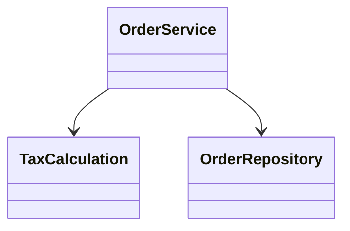
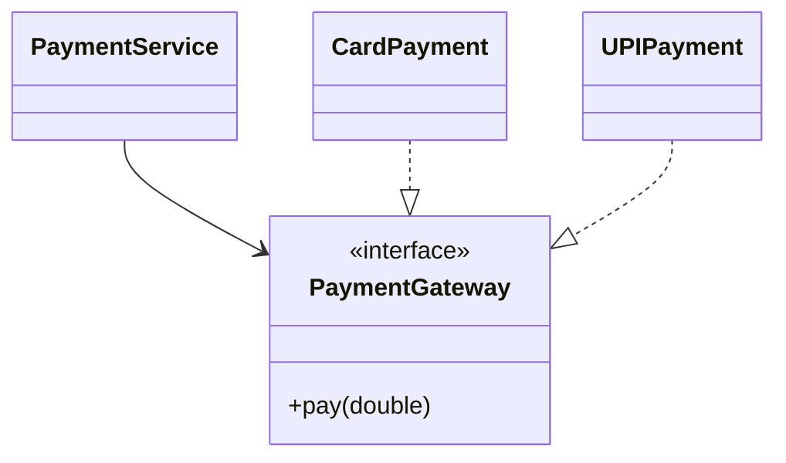
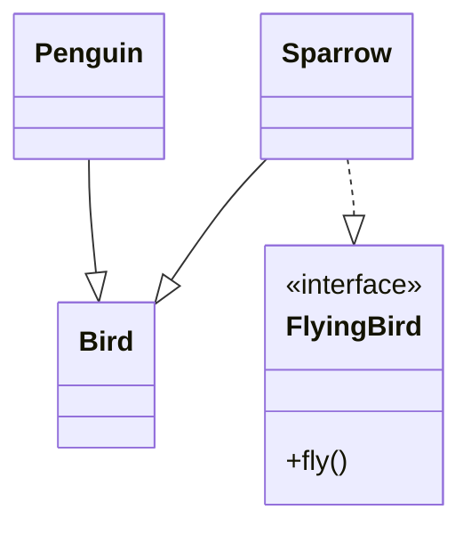
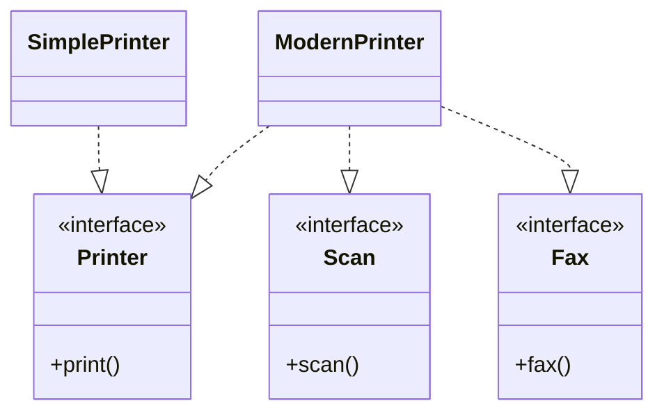
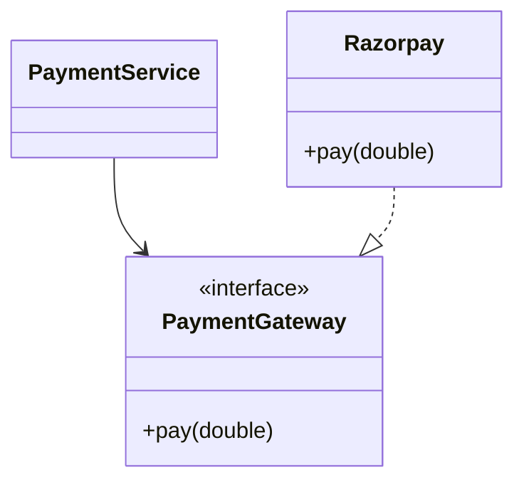
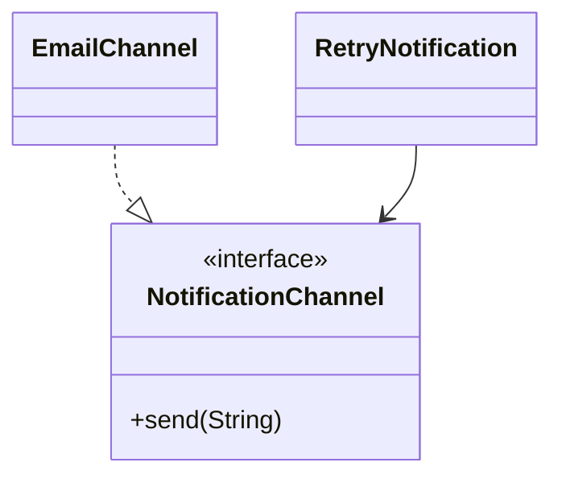
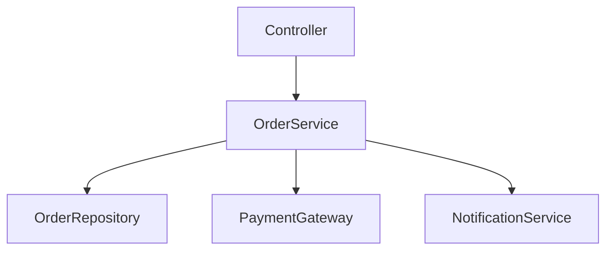
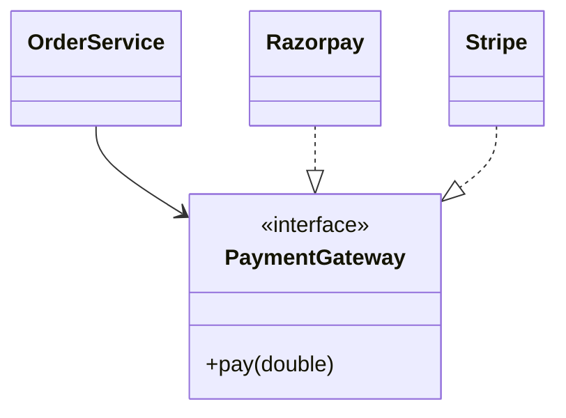

# 03 · Design Principles

🏷️ Tags: <!-- shield.io badges: LLD · SOLID · OOP · Design Principles · Java -->

---

## 03.1 Why Design Principles

## ❓ Problem

Code can work correctly and still become difficult to change.

A small requirement change may force edits across unrelated parts of the system. Design principles provide guidelines for structuring code so that change, extension, testing, and maintenance remain manageable.

## 📋 Prerequisites

- OOP fundamentals
- Classes and interfaces
- Inheritance and composition
- Basic UML relationships

## 🎯 Why This Exists

The goal is not to make code "perfect" or add abstractions everywhere.

The goal is to recognize recurring design problems and choose a structure that makes the **right kind of change easier**.

## 🧠 Core Concept

Design principles are guidelines, not laws.

A useful reasoning flow:

```text
Bad Design
    ↓
Identify the actual design smell
    ↓
Find the most specific principle
    ↓
Explain WHY
    ↓
Make the smallest useful improvement
    ↓
Consider trade-offs
```

## 🌍 Real-World Analogy

A building can stand today but still have a poor layout for future repairs. Good design principles are similar to planning the structure so that normal changes do not require rebuilding unrelated parts.

## ❌ Bad Design

```java
class OrderService {
    void createOrder() {}
    void sendEmail() {}
    void generatePdf() {}
    void saveToDatabase() {}
}
```

The code may work, but unrelated concerns are mixed.

## ✅ Better Design

Separate responsibilities where there is a meaningful reason to change:

```text
OrderService
   ├── OrderRepository
   ├── NotificationService
   └── InvoiceService
```

The exact split depends on the domain; principles should not be applied mechanically.

## 💻 Code Example

```java
interface PaymentGateway {
    void pay(double amount);
}

class Razorpay implements PaymentGateway {
    public void pay(double amount) {
        // payment implementation
    }
}

class OrderService {
    private final PaymentGateway gateway;

    OrderService(PaymentGateway gateway) {
        this.gateway = gateway;
    }
}
```

The service depends on an abstraction instead of a concrete gateway.

## 🗺️ Diagram

```text
                 Design Principles
                       │
        ┌──────────────┼──────────────┐
        ↓              ↓              ↓
   Responsibility   Dependencies   Changeability
        │              │              │
       SRP        DIP / Coupling    OCP / YAGNI
```

## 🏢 Real-World Application

These principles appear throughout service-layer, repository, payment, notification, persistence, and integration code.

## ⚖️ Trade-offs

- More abstraction is not automatically better.
- A principle may be technically applicable but still not justify extra complexity.
- Prefer a design that solves the actual change/problem you have.

## 🎯 Interview Questions

**Q: Are design principles rules?**  
**A:** No. They are guidelines for making design decisions.

**Q: What should you do before applying a principle?**  
**A:** Identify the actual design problem first.

## 🧪 Practice Problem

Take a service containing payment, email, database, and tax logic. Identify the distinct responsibilities before deciding how to refactor it.

## ⚠️ Mistakes / Gotchas

- Memorizing definitions without recognizing design smells.
- Applying every principle to every class.
- Adding abstractions without a meaningful reason.
- Confusing "more classes" with "better design".

## 🔑 Key Takeaways

- Principles solve recurring design problems.
- Working code can still have poor design.
- Identify the actual smell before naming a principle.
- Prefer the smallest useful improvement.
- Principles must be balanced against complexity.

## 🧾 Key Takeaways

```text
Principles → Guidelines, not laws
First       → Identify the design problem
Then        → Choose the most specific principle
Finally     → Improve + evaluate trade-offs
```

## 🔗 Related Concepts

- OOP
- SOLID
- Cohesion
- Coupling
- Composition
- Abstraction

## 🚧 Pending / Related Topics

- Code Quality
- Design Patterns
- Refactoring

---

# 03.2 Single Responsibility Principle (SRP)

🏷️ Tags: <!-- shield.io badges: SOLID · SRP · Cohesion · Java -->

---

## ❓ Problem

A class can gradually collect unrelated responsibilities. Once that happens, changes in one concern can force changes in the same class for other concerns.

## 📋 Prerequisites

- Classes and objects
- Encapsulation
- OOP responsibilities

## 🎯 Why This Exists

SRP helps prevent a class from becoming a container for unrelated business responsibilities.

## 🧠 Core Concept

> **A class should have one responsibility / one reason to change.**

Important correction:

> SRP does **not** mean "one class must contain only one method."

Example:

```java
class OrderService {
    void createOrder() {}
    void cancelOrder() {}
    void updateOrder() {}
}
```

These operations can all belong to the same responsibility: order management.

SRP is about **independent reasons to change**, not method count.

## 🌍 Real-World Analogy

A restaurant chef may own the responsibility of preparing food, while accounting and delivery have separate responsibilities. Giving one person every unrelated job makes changes harder.

## ❌ Bad Design

```java
class OrderService {
    void createOrder() {}
    void calculateTax() {}
    void sendEmail() {}
    void generateInvoicePdf() {}
    void saveToDatabase() {}
}
```

The class can change because of several unrelated concerns.

## ✅ Better Design

```text
OrderService
    ↓
TaxCalculation
    ↓
OrderRepository
    ↓
NotificationService
    ↓
InvoiceService
```

Each class/service owns a meaningful concern.

## 💻 Code Example

```java
class OrderService {
    private final TaxCalculation taxCalculation;
    private final OrderRepository repository;

    OrderService(
        TaxCalculation taxCalculation,
        OrderRepository repository
    ) {
        this.taxCalculation = taxCalculation;
        this.repository = repository;
    }

    void createOrder(Order order) {
        taxCalculation.calculateTax(order.getAmount());
        repository.save(order);
    }
}

interface TaxCalculation {
    double calculateTax(double amount);
}

interface OrderRepository {
    void save(Order order);
}
```

## 🗺️ Diagram



## 🏢 Real-World Application

Service orchestration, repository access, notification delivery, invoice generation, and domain rules often have different change drivers.

## ⚖️ Trade-offs

**Benefits**
- Smaller change boundaries
- Easier testing
- Better cohesion

**Risks**
- Over-splitting can create many tiny classes with little value.
- "One responsibility" requires domain judgment.

## 🎯 Interview Questions

**Q: Does SRP mean one method per class?**  
**A:** No. It means one meaningful responsibility / reason to change.

**Q: How do you detect an SRP problem?**  
**A:** Look for independent reasons to change.

**Q: Is duplicate code automatically an SRP violation?**  
**A:** No. Duplication is primarily a DRY concern unless the duplication also reflects multiple responsibilities.

## 🧪 Practice Problem

Refactor a `FoodOrderService` that calculates delivery fees, processes payments, saves orders, and sends confirmations. Identify the independent responsibilities before writing classes.

## ⚠️ Mistakes / Gotchas

- "One method = one class."
- Treating every utility method as a separate responsibility.
- Calling duplication alone an SRP violation.

## 🔑 Key Takeaways

- SRP is about reasons to change.
- One responsibility can contain multiple related methods.
- Separate unrelated change drivers.
- Avoid over-fragmenting the design.
- Use cohesion to help judge whether responsibilities belong together.

## 🧾 Key Takeaways

```text
SRP → One meaningful responsibility
SRP → One reason to change
NOT → One method per class
```

## 🔗 Related Concepts

- High Cohesion
- Separation of Concerns
- DRY
- Low Coupling

## 🚧 Pending / Related Topics

- Refactoring
- Design Patterns

---

# 03.3 Open/Closed Principle (OCP)

🏷️ Tags: <!-- shield.io badges: SOLID · OCP · Polymorphism · Java -->

---

## ❓ Problem

Stable code becomes risky when every new variation requires repeatedly modifying the same core class.

## 📋 Prerequisites

- Interfaces
- Polymorphism
- Dependency Inversion

## 🎯 Why This Exists

OCP encourages extension points around behavior that is genuinely expected to vary.

## 🧠 Core Concept

> **Open for extension, closed for modification.**

The goal is not literally "never modify code." It is to avoid repeatedly changing stable core logic when adding supported variations.

## 🌍 Real-World Analogy

A power socket provides a standard interface so different compatible devices can be connected without rebuilding the electrical system.

## ❌ Bad Design

```java
class PaymentService {
    void pay(String type, double amount) {
        if (type.equals("CARD")) {
            // card
        } else if (type.equals("UPI")) {
            // UPI
        }
    }
}
```

Every new payment type modifies the same method.

## ✅ Better Design

```java
interface PaymentGateway {
    void pay(double amount);
}

class CardPayment implements PaymentGateway {
    public void pay(double amount) {}
}

class UPIPayment implements PaymentGateway {
    public void pay(double amount) {}
}
```

New behavior can be introduced through another implementation.

## 💻 Code Example

```java
class PaymentService {
    private final PaymentGateway gateway;

    PaymentService(PaymentGateway gateway) {
        this.gateway = gateway;
    }

    void pay(double amount) {
        gateway.pay(amount);
    }
}

interface PaymentGateway {
    void pay(double amount);
}
```

## 🗺️ Diagram



## 🏢 Real-World Application

Payment providers, notification channels, pricing rules, export formats, and other domains with **real, known variation** can benefit from extension points.

## ⚖️ Trade-offs

OCP must be balanced with YAGNI.

If only one implementation exists and future variation is pure speculation, adding multiple abstraction layers can be unnecessary.

```text
Known / realistic variation → OCP can justify abstraction
Pure speculation            → YAGNI may argue against it
```

## 🎯 Interview Questions

**Q: Does OCP mean code can never be modified?**  
**A:** No. It means stable behavior should not require repeated modification just to add expected variations.

**Q: OCP vs YAGNI?**  
**A:** OCP supports meaningful known variation; YAGNI prevents speculative functionality.

## 🧪 Practice Problem

Design a notification system that currently supports email and is expected to add SMS.

## ⚠️ Mistakes / Gotchas

- Creating abstractions for every possible future feature.
- Confusing OCP with "never edit existing code."
- Ignoring YAGNI.

## 🔑 Key Takeaways

- OCP is about controlled extension.
- Polymorphism is a common way to implement it.
- Create extension points where variation is meaningful.
- Don't use OCP to justify speculative architecture.
- OCP and YAGNI must be balanced.

## 🧾 Key Takeaways

```text
OCP → Extend behavior without repeatedly modifying stable core
Real variation → Abstraction may be justified
Speculation → Consider YAGNI
```

## 🔗 Related Concepts

- Polymorphism
- DIP
- Program to an Interface
- YAGNI
- Strategy Pattern

## 🚧 Pending / Related Topics

- Design Patterns
- Strategy Pattern

---

# 03.4 Liskov Substitution Principle (LSP)

🏷️ Tags: <!-- shield.io badges: SOLID · LSP · Inheritance · Polymorphism -->

---

## ❓ Problem

An inheritance hierarchy can compile correctly while a subtype cannot actually honor the behavior promised by its parent.

## 📋 Prerequisites

- Inheritance
- Polymorphism
- Method overriding

## 🎯 Why This Exists

LSP protects the semantic contract of inheritance.

## 🧠 Core Concept

> **A subtype should be safely substitutable for its base type.**

The key question:

> Can code written for the parent continue to work correctly when given the subtype?

Example discussed:

```text
Bird
  └── Penguin
```

If `Bird` requires:

```java
void fly();
```

then a Penguin cannot honestly satisfy that contract.

The problem is the abstraction, not simply the fact that Penguin is a bird.

A better model:

```text
Bird
├── FlyingBird
│   ├── Eagle
│   └── Sparrow
└── Penguin
```

## 🌍 Real-World Analogy

If a "vehicle" contract promises an engine operation, a bicycle should not be modeled as a subtype that must provide an engine.

## ❌ Bad Design

```java
class Bird {
    void fly() {}
}

class Penguin extends Bird {
    @Override
    void fly() {
        throw new UnsupportedOperationException();
    }
}
```

The subtype cannot honor the inherited contract.

## ✅ Better Design

```java
class Bird {
}

interface FlyingBird {
    void fly();
}

class Eagle extends Bird implements FlyingBird {
    public void fly() {}
}

class Penguin extends Bird {
}
```

## 💻 Code Example

```java
interface FlyingBird {
    void fly();
}

class Sparrow implements FlyingBird {
    public void fly() {
        System.out.println("Flying");
    }
}

class Penguin {
    void swim() {
        System.out.println("Swimming");
    }
}
```

## 🗺️ Diagram



## 🏢 Real-World Application

Inheritance hierarchies for domain entities, APIs, storage implementations, and strategy-like abstractions must preserve the behavioral contract expected by callers.

## ⚖️ Trade-offs

- Composition or separate interfaces can produce a more accurate model.
- Do not force inheritance simply because two types share some data.
- LSP is specifically about **behavioral substitutability**, not naming similarity.

## 🎯 Interview Questions

**Q: Is overriding a method enough to satisfy LSP?**  
**A:** No. The subtype must preserve the contract expected by clients.

**Q: Penguin + `Bird.fly()`?**  
**A:** LSP problem because Penguin cannot honor the inherited flying contract.

**Q: LSP vs ISP?**  
**A:**
```text
ISP → Is the interface forcing unnecessary methods?
LSP → Can the implementation/subtype honor its contract?
```

One design can violate both.

## 🧪 Practice Problem

Design a media hierarchy containing audio, video, and live-stream content without forcing unsupported operations onto a subtype.

## ⚠️ Mistakes / Gotchas

- Treating "is-a" as sufficient proof of valid inheritance.
- Throwing `UnsupportedOperationException` for a required inherited behavior.
- Confusing LSP with ISP.

## 🔑 Key Takeaways

- Subtypes must preserve parent contracts.
- LSP is behavioral.
- Bad abstractions often cause LSP violations.
- Separate capabilities when not every subtype supports them.
- Inheritance should be chosen carefully.

## 🧾 Key Takeaways

```text
LSP → Subtype must honor parent contract
Question → "Can I safely substitute this subtype?"
Penguin + fly() → LSP problem
```

## 🔗 Related Concepts

- Inheritance
- Polymorphism
- ISP
- Composition Over Inheritance

## 🚧 Pending / Related Topics

- Design Patterns
- Advanced domain modeling

---

# 03.5 Interface Segregation Principle (ISP)

🏷️ Tags: <!-- shield.io badges: SOLID · ISP · Interfaces · Java -->

---

## ❓ Problem

A large interface can force implementations to depend on methods they do not need.

## 📋 Prerequisites

- Interfaces
- Polymorphism

## 🎯 Why This Exists

ISP keeps interfaces focused on client needs rather than creating one "fat" interface.

## 🧠 Core Concept

> **Clients should not be forced to depend on methods they do not use.**

## 🌍 Real-World Analogy

A simple printer should not be required to support scanning and faxing just because a multifunction device can.

## ❌ Bad Design

```java
interface Printer {
    void print();
    void scan();
    void fax();
}

class SimplePrinter implements Printer {
    public void print() {}

    public void scan() {
        throw new UnsupportedOperationException();
    }

    public void fax() {
        throw new UnsupportedOperationException();
    }
}
```

## ✅ Better Design

```java
interface Printer {
    void print();
}

interface Scan {
    void scan();
}

interface Fax {
    void fax();
}

class ModernPrinter implements Printer, Scan, Fax {
    public void print() {}
    public void scan() {}
    public void fax() {}
}

class SimplePrinter implements Printer {
    public void print() {}
}
```

## 💻 Code Example

```java
interface PaymentProcessor {
    void pay();
    void refund();
    void generateInvoice();
}

class SimpleUPIPayment implements PaymentProcessor {
    public void pay() {}
    public void refund() {}

    public void generateInvoice() {
        throw new UnsupportedOperationException();
    }
}
```

This is both:

```text
ISP → interface is too broad
LSP → implementation cannot honor generateInvoice contract
```

This distinction was important during the discussion.

## 🗺️ Diagram



## 🏢 Real-World Application

Capability-based APIs, payment capabilities, device drivers, storage interfaces, and integration contracts benefit from focused interfaces.

## ⚖️ Trade-offs

- Splitting interfaces too aggressively can create unnecessary fragmentation.
- Group methods that naturally belong to the same client capability.
- ISP is about avoiding forced dependencies, not maximizing the number of interfaces.

## 🎯 Interview Questions

**Q: ISP vs LSP?**  
**A:** ISP is primarily about interface design; LSP is about whether implementations/subtypes honor the contract.

**Q: Can one design violate both?**  
**A:** Yes. A fat interface can force an implementation to provide an unsupported method, causing both ISP and LSP problems.

## 🧪 Practice Problem

Design printer capabilities so that a basic printer can print while an advanced printer can print, scan, and fax.

## ⚠️ Mistakes / Gotchas

- Creating a huge interface "for consistency."
- Using unsupported-operation exceptions to satisfy an interface.
- Confusing ISP with LSP.

## 🔑 Key Takeaways

- Keep interfaces focused.
- Clients should depend only on needed capabilities.
- Unsupported methods are a strong smell.
- ISP and LSP can overlap.
- Avoid both fat interfaces and excessive fragmentation.

## 🧾 Key Takeaways

```text
ISP → Don't force unnecessary methods
Fat interface → ISP smell
Unsupported method → Possible ISP + LSP problem
```

## 🔗 Related Concepts

- LSP
- DIP
- Program to an Interface
- Composition

## 🚧 Pending / Related Topics

- Design Patterns
- Dependency Injection

---

# 03.6 Dependency Inversion Principle (DIP)

🏷️ Tags: <!-- shield.io badges: SOLID · DIP · Dependency Injection · Java -->

---

## ❓ Problem

High-level business logic becomes tightly coupled to low-level implementation details.

## 📋 Prerequisites

- Interfaces
- Dependency Injection
- Polymorphism

## 🎯 Why This Exists

DIP makes policy less dependent on concrete infrastructure.

## 🧠 Core Concept

> **High-level modules should not depend directly on low-level details. Both should depend on abstractions.**

Important distinction:

```text
DIP → Principle
DI  → Mechanism for supplying dependencies
```

## 🌍 Real-World Analogy

A wall socket is an abstraction. A device plugs into the socket without the building's wiring needing to know the exact appliance.

## ❌ Bad Design

```java
class PaymentService {
    private final Razorpay razorpay = new Razorpay();

    void pay(double amount) {
        razorpay.pay(amount);
    }
}
```

Business logic directly creates a concrete infrastructure dependency.

## ✅ Better Design

```java
interface PaymentGateway {
    void pay(double amount);
}

class Razorpay implements PaymentGateway {
    public void pay(double amount) {}
}

class PaymentService {
    private final PaymentGateway gateway;

    PaymentService(PaymentGateway gateway) {
        this.gateway = gateway;
    }

    void pay(double amount) {
        gateway.pay(amount);
    }
}
```

## 💻 Code Example

```java
PaymentGateway gateway = new Razorpay();
PaymentService service = new PaymentService(gateway);
```

## 🗺️ Diagram



## 🏢 Real-World Application

Payment gateways, repositories, message publishers, external APIs, storage systems, and notification providers are common low-level details behind business services.

## ⚖️ Trade-offs

- Abstractions add types and indirection.
- For a tiny stable component, an abstraction may add little value.
- DIP should be used where dependency direction matters, not mechanically everywhere.

## 🎯 Interview Questions

**Q: DIP vs DI?**  
**A:** DIP is the design principle; DI is a technique for supplying a dependency externally.

**Q: Does using an interface automatically mean DIP?**  
**A:** No. The dependency direction and architectural roles matter.

## 🧪 Practice Problem

Refactor an `OrderService` that directly creates `Razorpay` and `MySQLDatabase`.

## ⚠️ Mistakes / Gotchas

- Thinking DIP and DI are synonyms.
- Adding interfaces without a meaningful abstraction boundary.
- Depending on a concrete class unnecessarily.

## 🔑 Key Takeaways

- High-level policy should not depend directly on details.
- Both sides can depend on abstractions.
- DI is a mechanism; DIP is a principle.
- Abstraction should serve a real dependency boundary.
- Concrete dependencies increase coupling.

## 🧾 Key Takeaways

```text
DIP → Depend on abstractions
DI  → Supply dependencies from outside
Concrete detail → Higher coupling
```

## 🔗 Related Concepts

- Low Coupling
- Program to an Interface
- Dependency Injection
- OCP

## 🚧 Pending / Related Topics

- Dependency Injection
- Design Patterns

---

# 03.7 High Cohesion

🏷️ Tags: <!-- shield.io badges: Cohesion · SRP · OOP · Java -->

---

## ❓ Problem

A class can contain methods that have little to do with each other.

## 📋 Prerequisites

- Classes
- SRP
- Encapsulation

## 🎯 Why This Exists

High cohesion keeps closely related responsibilities together so a class has a clear purpose.

## 🧠 Core Concept

> **Responsibilities inside a class should be strongly related.**

Example:

```java
class OrderService {
    void createOrder() {}
    void cancelOrder() {}
    void updateOrder() {}
}
```

These methods are related to order management.

A class that also generates PDFs, sends email, calculates unrelated taxes, and manages database internals has lower cohesion.

## 🌍 Real-World Analogy

A kitchen station dedicated to a related set of food preparation tasks is more coherent than one station responsible for cooking, accounting, deliveries, and electrical maintenance.

## ❌ Bad Design

```java
class OrderService {
    void createOrder() {}
    void calculateTax() {}
    void sendEmail() {}
    void generatePdf() {}
    void saveToDatabase() {}
}
```

Unrelated responsibilities are mixed.

## ✅ Better Design

```text
OrderService
TaxService
NotificationService
InvoiceService
OrderRepository
```

Each unit has a more focused purpose.

## 💻 Code Example

```java
class OrderService {
    void createOrder(Order order) {}
    void cancelOrder(Order order) {}
    void updateOrder(Order order) {}
}
```

The methods belong to the same domain responsibility.

## 🗺️ Diagram

```text
High Cohesion

OrderService
 ├── createOrder()
 ├── cancelOrder()
 └── updateOrder()

All → Order management
```

## 🏢 Real-World Application

Domain services, repositories, notification modules, pricing modules, and API components should group behavior that naturally belongs together.

## ⚖️ Trade-offs

- Excessive splitting can reduce cohesion by scattering one meaningful responsibility across too many classes.
- High cohesion does not mean "smallest possible class."
- Cohesion must be judged by domain relationships.

## 🎯 Interview Questions

**Q: SRP vs cohesion?**  
**A:** SRP focuses on independent reasons to change; cohesion focuses on how closely related responsibilities are.

**Q: Can a class have multiple methods and still be highly cohesive?**  
**A:** Yes, if the methods strongly belong to the same responsibility.

## 🧪 Practice Problem

Given a 15-method `OrderService`, group its methods into cohesive responsibilities before deciding whether to split it.

## ⚠️ Mistakes / Gotchas

- Treating method count as cohesion.
- Splitting every method into a class.
- Confusing cohesion with coupling.

## 🔑 Key Takeaways

- High cohesion = closely related responsibilities.
- SRP and cohesion are related but not identical.
- Avoid unrelated behavior in one class.
- Do not over-fragment cohesive responsibilities.

## 🧾 Key Takeaways

```text
Cohesion → How related are the responsibilities?
High → Strongly related
Low  → Unrelated concerns mixed together
```

## 🔗 Related Concepts

- SRP
- Low Coupling
- SoC

## 🚧 Pending / Related Topics

- Code Quality
- Refactoring

---

# 03.8 Low Coupling

🏷️ Tags: <!-- shield.io badges: Coupling · DIP · Architecture · Java -->

---

## ❓ Problem

Strong dependencies make changes in one component ripple into others.

## 📋 Prerequisites

- Classes
- Interfaces
- Associations
- DIP

## 🎯 Why This Exists

Low coupling reduces unnecessary dependency between components.

## 🧠 Core Concept

> **Minimize unnecessary or overly strong dependencies between components.**

Coupling itself is not automatically bad. Some collaboration is necessary.

The goal is to avoid unnecessary knowledge and concrete dependencies.

## 🌍 Real-World Analogy

Two teams can collaborate through a clear contract without knowing each other's internal implementation.

## ❌ Bad Design

```java
class OrderService {
    private final Razorpay razorpay = new Razorpay();
    private final EmailService emailService = new EmailService();
}
```

The service is tightly coupled to concrete implementations.

## ✅ Better Design

```java
class OrderService {
    private final PaymentGateway gateway;
    private final NotificationService notificationService;

    OrderService(
        PaymentGateway gateway,
        NotificationService notificationService
    ) {
        this.gateway = gateway;
        this.notificationService = notificationService;
    }
}
```

## 💻 Code Example

```java
interface PaymentGateway {
    void pay(double amount);
}

class OrderService {
    private final PaymentGateway gateway;

    OrderService(PaymentGateway gateway) {
        this.gateway = gateway;
    }
}
```

## 🗺️ Diagram

```text
Tight coupling:

OrderService → Razorpay

Lower coupling:

OrderService → PaymentGateway
                    ↑
                 Razorpay
```

## 🏢 Real-World Application

Service-to-service contracts, persistence abstractions, external providers, messaging, and infrastructure boundaries commonly benefit from lower coupling.

## ⚖️ Trade-offs

- Too little coupling can produce excessive indirection.
- Some coupling is natural and useful.
- DIP can help reduce concrete coupling, but "DIP violation" and "composition over inheritance violation" are not the same thing.

## 🎯 Interview Questions

**Q: Is coupling always bad?**  
**A:** No. Necessary collaboration is normal. The goal is to minimize unnecessary/strong coupling.

**Q: How can DIP help?**  
**A:** Depending on abstractions instead of concrete details can reduce concrete coupling.

## 🧪 Practice Problem

Refactor a service directly dependent on `Razorpay`, `EmailService`, and `MySQLDatabase`.

## ⚠️ Mistakes / Gotchas

- Thinking no dependencies is the goal.
- Confusing association with a violation.
- Adding abstractions without reducing meaningful coupling.

## 🔑 Key Takeaways

- Low coupling reduces ripple effects.
- Concrete dependencies often increase coupling.
- Some coupling is necessary.
- Use abstractions where they provide a useful boundary.
- Evaluate the actual dependency, not just the number of fields.

## 🧾 Key Takeaways

```text
Low Coupling → Minimize unnecessary dependency
Not → Zero dependencies
DIP → Can help reduce concrete coupling
```

## 🔗 Related Concepts

- DIP
- High Cohesion
- Law of Demeter
- Program to an Interface

## 🚧 Pending / Related Topics

- Dependency Injection
- Architecture

---

# 03.9 Composition Over Inheritance

🏷️ Tags: <!-- shield.io badges: Composition · Inheritance · OOP · Java -->

---

## ❓ Problem

Deep inheritance hierarchies can become rigid when behavior needs to vary independently.

## 📋 Prerequisites

- Inheritance
- Interfaces
- Polymorphism
- Composition

## 🎯 Why This Exists

Composition lets an object assemble behavior from other objects instead of hard-coding behavior into an inheritance hierarchy.

## 🧠 Core Concept

```text
Inheritance  → IS-A
Composition  → HAS-A / USES-A
```

Prefer composition when behavior is interchangeable or independently variable.

Important correction from the discussion:

> A class having fields such as `Razorpay` and `EmailService` is object composition in the broad OOP sense, but it is **not automatically a Composition Over Inheritance violation**. If there is no inheritance problem, don't label it one.

## 🌍 Real-World Analogy

A car is assembled from an engine, brakes, and transmission. You can replace a component without creating a new inheritance branch for every combination.

## ❌ Bad Design

```java
class EmailNotificationWithRetry extends EmailNotification {
    // retry behavior locked into this hierarchy
}

class SmsNotificationWithRetry extends SmsNotification {
    // another branch
}
```

As combinations grow, the hierarchy can become rigid.

## ✅ Better Design

```java
interface NotificationChannel {
    void send(String message);
}

class EmailChannel implements NotificationChannel {
    public void send(String message) {}
}

class RetryNotification {
    private final NotificationChannel channel;

    RetryNotification(NotificationChannel channel) {
        this.channel = channel;
    }

    void send(String message) {
        // retry logic
        channel.send(message);
    }
}
```

Behavior is assembled through objects.

## 💻 Code Example

```java
NotificationChannel email = new EmailChannel();
RetryNotification notification = new RetryNotification(email);

notification.send("Order confirmed");
```

## 🗺️ Diagram



## 🏢 Real-World Application

Notification channels, payment providers, pricing strategies, storage implementations, and other independently varying behaviors are common composition candidates.

## ⚖️ Trade-offs

Use inheritance when:
- There is a genuine IS-A relationship.
- LSP holds.
- Shared state/behavior belongs naturally in the hierarchy.
- The hierarchy is stable.

Prefer composition when:
- Behavior changes independently.
- Combinations may grow.
- You want runtime replacement.
- Inheritance would create many subclasses.

## 🎯 Interview Questions

**Q: Is inheritance always bad?**  
**A:** No. It is useful when the subtype genuinely is-a parent and can honor its contract.

**Q: What is the core difference?**  
**A:** Inheritance builds a type hierarchy; composition assembles behavior from collaborators.

**Q: Is using a `PaymentGateway` field a Composition Over Inheritance violation?**  
**A:** No. That is composition/has-a, and there is no inheritance problem to violate.

## 🧪 Practice Problem

Design notifications with Email/SMS plus retry behavior without creating separate subclasses for every combination.

## ⚠️ Mistakes / Gotchas

- Saying "composition is always better."
- Using inheritance only for code reuse.
- Calling every field dependency a Composition Over Inheritance violation.
- Ignoring LSP when choosing inheritance.

## 🔑 Key Takeaways

- Inheritance = IS-A.
- Composition = HAS-A / USES-A.
- Composition is useful for independently varying behavior.
- Inheritance remains valid for stable, genuine type hierarchies.
- Don't confuse composition with a "violation."

## 🧾 Key Takeaways

```text
Inheritance → IS-A
Composition  → HAS-A / USES-A
Prefer composition when behavior varies independently.
Inheritance is valid when the hierarchy is genuine and LSP holds.
```

## 🔗 Related Concepts

- LSP
- DIP
- Strategy Pattern
- Polymorphism

## 🚧 Pending / Related Topics

- Design Patterns
- Strategy Pattern

---

# 03.10 DRY

🏷️ Tags: <!-- shield.io badges: DRY · Maintainability · Refactoring -->

---

## ❓ Problem

The same business knowledge or rule gets duplicated in multiple places.

## 📋 Prerequisites

- Methods
- Abstraction
- Basic refactoring

## 🎯 Why This Exists

When one business rule changes, duplicated representations can drift apart.

## 🧠 Core Concept

> **Don't Repeat Yourself** means avoiding duplicated **knowledge**, not blindly eliminating every repeated line.

Important distinction:

```text
Same business logic repeated → DRY concern
Multiple independent reasons to change → SRP concern
```

The two can overlap, but one does not automatically imply the other.

## 🌍 Real-World Analogy

If a tax rule is written on several official documents, changing the tax rate requires finding and updating every copy. One authoritative rule is safer.

## ❌ Bad Design

```java
class OrderService {
    double calculateTax(double amount) {
        return amount * 0.18;
    }
}

class InvoiceService {
    double calculateTax(double amount) {
        return amount * 0.18;
    }
}
```

The same business rule is represented twice.

## ✅ Better Design

```java
interface TaxCalculation {
    double calculateTax(double amount);
}

class TaxCalculationGST implements TaxCalculation {
    public double calculateTax(double amount) {
        return amount * 0.18;
    }
}
```

Consumers share the authoritative rule.

## 💻 Code Example

```java
class OrderService {
    private final TaxCalculation taxCalculation;

    OrderService(TaxCalculation taxCalculation) {
        this.taxCalculation = taxCalculation;
    }

    double calculateTax(double amount) {
        return taxCalculation.calculateTax(amount);
    }
}
```

## 🗺️ Diagram

```text
OrderService ──┐
               ├──> TaxCalculation
InvoiceService ┘        │
                        ↓
                 GST business rule
```

## 🏢 Real-World Application

Tax rules, pricing policies, validation rules, authorization rules, and other business knowledge are common DRY candidates.

## ⚖️ Trade-offs

Do not create a large abstraction merely because two pieces of code look superficially similar.

```text
Meaningful duplication → consider DRY
Superficial similarity → KISS may favor keeping it simple
```

## 🎯 Interview Questions

**Q: Does DRY mean no repeated lines?**  
**A:** No. It targets duplicated knowledge/business rules.

**Q: Is duplicate tax logic automatically an SRP violation?**  
**A:** No. The primary issue is DRY. SRP requires evidence of multiple reasons to change.

## 🧪 Practice Problem

Find duplicated tax calculation across order and invoice flows and extract the authoritative rule.

## ⚠️ Mistakes / Gotchas

- DRYing up every repeated line.
- Creating abstractions for superficial similarity.
- Confusing DRY with SRP.

## 🔑 Key Takeaways

- DRY targets duplicated knowledge.
- Duplication can cause inconsistent behavior.
- Don't abstract superficial similarities.
- DRY must be balanced with KISS.

## 🧾 Key Takeaways

```text
DRY → One authoritative representation of knowledge
Not → "Never repeat code"
```

## 🔗 Related Concepts

- KISS
- SRP
- Refactoring
- OCP

## 🚧 Pending / Related Topics

- Refactoring
- Code Quality

---

# 03.11 KISS

🏷️ Tags: <!-- shield.io badges: KISS · Simplicity · Design -->

---

## ❓ Problem

Developers can create unnecessary abstractions, layers, factories, and indirection for simple requirements.

## 📋 Prerequisites

- Basic OOP
- Abstraction

## 🎯 Why This Exists

Keep the design as simple as the current problem allows.

## 🧠 Core Concept

> **Keep It Simple, Stupid** — prefer the simplest design that correctly solves the current problem.

KISS does not mean:
- one giant class
- no abstraction ever
- no architecture

It means avoid unnecessary complexity.

## 🌍 Real-World Analogy

Use a direct road when it reaches the destination. Don't build a highway interchange for a route that only needs a simple turn.

## ❌ Bad Design

For one payment implementation:

```text
PaymentStrategy
PaymentFactory
PaymentFactoryProvider
PaymentRoutingEngine
PaymentPluginRegistry
```

This adds layers without a demonstrated need.

## ✅ Better Design

```java
interface PaymentGateway {
    void pay(double amount);
}

class Razorpay implements PaymentGateway {
    public void pay(double amount) {}
}
```

Use only the abstractions that solve a real problem.

## 💻 Code Example

```java
class PaymentService {
    private final PaymentGateway gateway;

    PaymentService(PaymentGateway gateway) {
        this.gateway = gateway;
    }

    void pay(double amount) {
        gateway.pay(amount);
    }
}
```

## 🗺️ Diagram

```text
Over-engineered:

Service
 → Provider
 → Factory
 → FactoryProvider
 → Router
 → Registry
 → Gateway

Simpler:

Service → Gateway
             ↑
          Provider
```

## 🏢 Real-World Application

Small services, CRUD workflows, internal utilities, and stable single-implementation components often benefit from avoiding speculative layers.

## ⚖️ Trade-offs

- Simplicity should not remove abstractions that hide meaningful variation.
- KISS and OCP can pull in different directions.
- Choose the simplest design that still supports realistic requirements.

## 🎯 Interview Questions

**Q: Is a large number of classes always bad?**  
**A:** No. Complexity is the issue, not class count itself.

**Q: KISS vs YAGNI?**  
**A:** KISS avoids unnecessary complexity; YAGNI avoids functionality that isn't currently needed.

## 🧪 Practice Problem

Simplify a payment architecture containing several factory/provider/router layers when only one gateway is required.

## ⚠️ Mistakes / Gotchas

- Interpreting KISS as "never use abstractions."
- Confusing simple code with poor design.
- Removing useful boundaries just to reduce line count.

## 🔑 Key Takeaways

- Choose the simplest correct design.
- Avoid unnecessary layers.
- KISS does not mean "no abstraction."
- Complexity must be justified by real requirements.

## 🧾 Key Takeaways

```text
KISS → Don't unnecessarily complicate
Goal → Simplest correct solution
```

## 🔗 Related Concepts

- YAGNI
- OCP
- DRY
- Abstraction

## 🚧 Pending / Related Topics

- Code Quality
- Refactoring

---

# 03.12 YAGNI

🏷️ Tags: <!-- shield.io badges: YAGNI · Simplicity · Agile Design -->

---

## ❓ Problem

Developers build speculative functionality that may never be required.

## 📋 Prerequisites

- KISS
- OCP
- Requirements analysis

## 🎯 Why This Exists

Avoid spending complexity and maintenance cost on unneeded features.

## 🧠 Core Concept

> **You Aren't Gonna Need It.**

Build what the current requirements justify.

## 🌍 Real-World Analogy

Don't build six spare rooms because someone might someday need them.

## ❌ Bad Design

Requirement:

```text
Support UPI.
```

Developer builds:

```text
UPI
Card
Wallet
Crypto
BNPL
International payments
```

None of the additional features are currently required.

## ✅ Better Design

Implement UPI cleanly and add other payment methods when there is a real requirement.

## 💻 Code Example

```java
class UPIPaymentGateway implements PaymentGateway {
    public void pay(double amount) {
        // UPI implementation
    }
}
```

## 🗺️ Diagram

```text
Current requirement
       ↓
      UPI
       ↓
Implement what is needed

Future requirement
       ↓
Add Card / Wallet / ...
when actually required
```

## 🏢 Real-World Application

Payment methods, feature flags, integrations, configuration options, and generalized frameworks are common places where YAGNI prevents premature work.

## ⚖️ Trade-offs

YAGNI does not mean ignoring clearly known future requirements.

If a variation is already a real requirement, an extension point may be justified.

```text
Real expected variation → OCP may justify design
Pure speculation        → YAGNI says wait
```

## 🎯 Interview Questions

**Q: Does YAGNI prohibit extensible designs?**  
**A:** No. It discourages speculative functionality and abstractions without a current or justified need.

## 🧪 Practice Problem

Given a UPI-only requirement, identify which proposed payment features should be deferred.

## ⚠️ Mistakes / Gotchas

- Confusing future planning with speculative implementation.
- Using YAGNI to avoid necessary abstractions.
- Ignoring explicit future requirements.

## 🔑 Key Takeaways

- Don't build unnecessary functionality.
- Speculation has maintenance cost.
- Known requirements can justify extensibility.
- Balance YAGNI with OCP.

## 🧾 Key Takeaways

```text
YAGNI → Don't build what isn't needed
Current need > speculative future
```

## 🔗 Related Concepts

- KISS
- OCP
- DRY
- Principle Trade-offs

## 🚧 Pending / Related Topics

- Code Quality
- Refactoring

---

# 03.13 Separation of Concerns

🏷️ Tags: <!-- shield.io badges: SoC · Architecture · Layering -->

---

## ❓ Problem

Different kinds of work become mixed in the same component.

## 📋 Prerequisites

- OOP
- Layers
- SRP

## 🎯 Why This Exists

Separate distinct concerns so each can evolve independently.

## 🧠 Core Concept

Separation of Concerns can operate at multiple levels:

```text
Method
  ↓
Class
  ↓
Module
  ↓
Service
  ↓
Architecture
```

Example concerns:

```text
HTTP handling
Validation
Business rules
Persistence
Payment
Notification
```

## 🌍 Real-World Analogy

A restaurant separates ordering, cooking, billing, and delivery workflows instead of putting every activity at one counter.

## ❌ Bad Design

```java
class OrderController {

    void createOrder(HttpRequest request) {
        // parse HTTP
        // validate
        // business rules
        // SQL queries
        // payment
        // email
    }
}
```

## ✅ Better Design

```text
Controller
   ↓
Application/Service
   ↓
Repository

Service → PaymentGateway
Service → NotificationService
```

Each layer handles its concern.

## 💻 Code Example

```java
class OrderController {
    private final OrderService orderService;

    OrderController(OrderService orderService) {
        this.orderService = orderService;
    }

    void createOrder(OrderRequest request) {
        orderService.createOrder(request);
    }
}
```

The controller handles the API boundary while the service owns application orchestration.

## 🗺️ Diagram



## 🏢 Real-World Application

Layered backend systems commonly separate controllers, services, repositories, external integrations, and infrastructure concerns.

## ⚖️ Trade-offs

- Excessive layering can create ceremony.
- SoC does not mean every concern needs its own microservice.
- The separation boundary should match actual change and ownership boundaries.

## 🎯 Interview Questions

**Q: SoC vs SRP?**  
**A:** SoC is the broader idea of separating concerns; SRP applies a related responsibility boundary to a class/module.

**Q: Does SoC require microservices?**  
**A:** No. It can be applied inside a single class, module, application, or architecture.

## 🧪 Practice Problem

Refactor a controller that contains HTTP parsing, validation, business logic, SQL, payment, and email.

## ⚠️ Mistakes / Gotchas

- Creating a service for every method.
- Turning every concern into a microservice.
- Confusing separation with excessive indirection.

## 🔑 Key Takeaways

- Separate distinct concerns.
- SoC applies at multiple levels.
- It is broader than class-level SRP.
- Don't over-separate.

## 🧾 Key Takeaways

```text
SoC → Don't mix different concerns
Levels → method → class → module → service → architecture
```

## 🔗 Related Concepts

- SRP
- High Cohesion
- Low Coupling
- Layered Architecture

## 🚧 Pending / Related Topics

- Architecture
- Code Quality

---

# 03.14 Law of Demeter

🏷️ Tags: <!-- shield.io badges: LoD · Encapsulation · Coupling -->

---

## ❓ Problem

Objects can become dependent on long chains of other objects' internal structure.

## 📋 Prerequisites

- Objects
- Composition
- Encapsulation

## 🎯 Why This Exists

Reduce knowledge of internal object relationships.

## 🧠 Core Concept

> **An object should primarily talk to its immediate collaborators.**

A useful rule of thumb:

> **Don't talk to strangers.**

## 🌍 Real-World Analogy

Instead of walking through several departments to reach a person, ask the department you already know to handle the request.

## ❌ Bad Design

```java
order.getCustomer()
     .getAddress()
     .getCity()
     .getName();
```

`OrderService` now knows the internal navigation:

```text
Order → Customer → Address → City
```

## ✅ Better Design

```java
class Order {
    private Customer customer;

    String getCustomerCityName() {
        return customer.getCityName();
    }
}
```

Caller:

```java
order.getCustomerCityName();
```

## 💻 Code Example

```java
class OrderService {

    void process(Order order) {
        String city = order.getCustomerCityName();
        // process using the result
    }
}
```

The caller does not need to know how the city is reached.

## 🗺️ Diagram

```text
Bad:

OrderService
     ↓
 Order
     ↓
 Customer
     ↓
 Address
     ↓
 City

Better:

OrderService
     ↓
 Order
     ↓
 getCustomerCityName()
```

## 🏢 Real-World Application

Domain models, service orchestration, nested configuration objects, and API integrations can suffer from excessive navigation chains.

## ⚖️ Trade-offs

Not every chained call is automatically a Law of Demeter violation.

For example:

```java
order.getItems().size();
```

is not automatically a serious design problem.

The real concern is excessive knowledge of object structure.

## 🎯 Interview Questions

**Q: Is every `a.getB().getC()` a violation?**  
**A:** No. Look for inappropriate knowledge of object relationships and internal structure.

**Q: What does LoD primarily reduce?**  
**A:** Coupling caused by knowledge of object structure.

## 🧪 Practice Problem

Refactor:

```java
order.getCustomer().getAccount().getStatus()
```

so that the caller does not navigate through internal relationships.

## ⚠️ Mistakes / Gotchas

- Treating every chain as a violation.
- Creating meaningless forwarding methods just to remove dots.
- Confusing LoD with Tell, Don't Ask.

## 🔑 Key Takeaways

- Talk mainly to immediate collaborators.
- Avoid exposing deep object structure.
- LoD reduces structural knowledge/coupling.
- Chaining alone is not enough to prove a violation.

## 🧾 Key Takeaways

```text
LoD → Don't talk too far
Bad → a.getB().getC().getD()
Better → a.doSomething()
```

## 🔗 Related Concepts

- Encapsulation
- Low Coupling
- Tell, Don't Ask
- Composition

## 🚧 Pending / Related Topics

- Domain Modeling
- Code Quality

---

# 03.15 Tell, Don't Ask

🏷️ Tags: <!-- shield.io badges: Tell-Dont-Ask · Encapsulation · OOP -->

---

## ❓ Problem

A class may expose its state while another object makes decisions and performs behavior that belongs to it.

## 📋 Prerequisites

- Encapsulation
- Objects and state
- Methods

## 🎯 Why This Exists

Keep behavior near the data and rules it governs.

## 🧠 Core Concept

> **Tell an object what to do instead of asking for its state and making the decision externally.**

## 🌍 Real-World Analogy

Instead of asking a bank account for its balance and manually deciding whether a withdrawal is allowed, tell the account to withdraw and let it enforce its own rules.

## ❌ Bad Design

```java
if (order.getStatus().equals("PAID")) {
    order.setStatus("SHIPPED");
}
```

The service:
1. asks for state
2. decides the rule
3. modifies the object

## ✅ Better Design

```java
class Order {

    private String status;

    void ship() {
        if (!status.equals("PAID")) {
            throw new IllegalStateException(
                "Order cannot be shipped"
            );
        }

        status = "SHIPPED";
    }
}
```

Caller:

```java
order.ship();
```

## 💻 Code Example

```java
class OrderService {

    void shipOrder(Order order) {
        order.ship();
    }
}
```

The business rule remains with `Order`.

## 🗺️ Diagram

```text
Ask:

Service
  ↓
asks state
  ↓
makes decision
  ↓
modifies Order

Tell:

Service
  ↓
order.ship()
  ↓
Order validates + changes itself
```

## 🏢 Real-World Application

Domain entities often own state transitions, validation, and invariant enforcement.

## ⚖️ Trade-offs

Tell, Don't Ask does not mean every getter is bad.

Queries are legitimate when the caller genuinely needs information. The principle is most useful when external code is extracting state specifically to perform behavior that belongs to the object.

## 🎯 Interview Questions

**Q: Tell, Don't Ask vs Law of Demeter?**  
**A:**
```text
LoD → Who should I talk to?
Tell, Don't Ask → Who should perform the behavior?
```

## 🧪 Practice Problem

Refactor external code that checks `Order` status and changes it directly.

## ⚠️ Mistakes / Gotchas

- Treating all getters as bad.
- Moving every operation into entities.
- Ignoring whether the behavior genuinely belongs to the object.

## 🔑 Key Takeaways

- Keep behavior close to the data/rules it governs.
- Avoid external state-based decisions when the object can own the behavior.
- Getters are not inherently bad.
- Use judgment about responsibility boundaries.

## 🧾 Key Takeaways

```text
Tell → order.ship()
Ask  → get state → decide → mutate
Goal → Keep behavior with the object that owns the rule
```

## 🔗 Related Concepts

- Law of Demeter
- Encapsulation
- High Cohesion
- SRP

## 🚧 Pending / Related Topics

- Domain Modeling
- Rich Domain Models

---

# 03.16 Program to an Interface

🏷️ Tags: <!-- shield.io badges: Abstraction · Interfaces · DIP · Polymorphism -->

---

## ❓ Problem

Code that depends directly on concrete implementations becomes harder to replace and test.

## 📋 Prerequisites

- Interfaces
- Polymorphism
- Dependency Injection

## 🎯 Why This Exists

Depend on a stable abstraction while allowing implementations to vary.

## 🧠 Core Concept

> **Declare and consume dependencies using abstractions rather than concrete implementations.**

Example:

```java
PaymentGateway gateway;
```

instead of:

```java
Razorpay gateway;
```

## 🌍 Real-World Analogy

A USB port defines a standard interface. The computer does not need to know the internal implementation of every compatible device.

## ❌ Bad Design

```java
class OrderService {
    private Razorpay razorpay;

    void pay(double amount) {
        razorpay.pay(amount);
    }
}
```

## ✅ Better Design

```java
interface PaymentGateway {
    void pay(double amount);
}

class Razorpay implements PaymentGateway {
    public void pay(double amount) {}
}

class Stripe implements PaymentGateway {
    public void pay(double amount) {}
}

class OrderService {
    private final PaymentGateway gateway;

    OrderService(PaymentGateway gateway) {
        this.gateway = gateway;
    }

    void pay(double amount) {
        gateway.pay(amount);
    }
}
```

## 💻 Code Example

```java
PaymentGateway gateway = new Razorpay();
OrderService service = new OrderService(gateway);
```

## 🗺️ Diagram



## 🏢 Real-World Application

Payment gateways, repositories, notification channels, message publishers, and external API clients are common abstraction boundaries.

## ⚖️ Trade-offs

- Interfaces add indirection and types.
- A single stable implementation may not justify an abstraction.
- Program to an interface is a practice, not a requirement to create interfaces everywhere.

## 🎯 Interview Questions

**Q: Program to an Interface vs DIP?**  
**A:** Program to an Interface is a practical design technique; DIP is the broader dependency-direction principle.

**Q: Does every class need an interface?**  
**A:** No. Create abstractions where they represent meaningful variation or dependency boundaries.

**Q: DIP vs DI?**  
**A:** DIP is a principle; DI is a mechanism for supplying dependencies.

## 🧪 Practice Problem

Refactor `OrderService` so that it can work with multiple payment gateway implementations.

## ⚠️ Mistakes / Gotchas

- Creating interfaces for every class.
- Assuming interface usage automatically proves DIP.
- Confusing Program to an Interface with Dependency Injection.

## 🔑 Key Takeaways

- Depend on abstractions.
- Concrete implementations become replaceable.
- Interfaces should represent useful boundaries.
- Don't create interfaces mechanically.

## 🧾 Key Takeaways

```text
Program to Interface
→ Depend on abstraction
→ Hide implementation choice
→ Make implementations replaceable
```

## 🔗 Related Concepts

- DIP
- DI
- OCP
- Low Coupling
- Polymorphism

## 🚧 Pending / Related Topics

- Dependency Injection
- Design Patterns

---

# 03.17 Principle Trade-offs

🏷️ Tags: <!-- shield.io badges: Design-Tradeoffs · SOLID · KISS · YAGNI -->

---

## ❓ Problem

Applying every principle aggressively can create a design that is more complex than the original problem.

## 📋 Prerequisites

- SOLID
- Cohesion and coupling
- DRY/KISS/YAGNI
- Abstraction

## 🎯 Why This Exists

Good design balances competing goals instead of maximizing a single principle.

## 🧠 Core Concept

Principles are guidelines. A strong design asks:

```text
What is the actual problem?
        ↓
Which principle applies most directly?
        ↓
What is the smallest useful improvement?
        ↓
What complexity does the improvement introduce?
```

### SRP vs Cohesion

```text
SRP      → Independent reasons to change
Cohesion → Relatedness of responsibilities
```

### OCP vs YAGNI

```text
Real/expected variation → OCP may justify extension
Pure speculation        → YAGNI says don't build it yet
```

### DRY vs KISS

```text
Meaningful duplicated knowledge → DRY
Superficial similarity           → KISS may favor simplicity
```

### Composition vs Inheritance

```text
Inheritance → genuine IS-A + LSP
Composition → interchangeable/independent behavior
```

### Abstraction vs Simplicity

A useful abstraction hides meaningful complexity. An unnecessary abstraction adds concepts without solving a real problem.

## 🌍 Real-World Analogy

You can add safety systems, controls, and machinery to a vehicle indefinitely. At some point, the added complexity can make the vehicle harder to operate than the problem requires.

## ❌ Bad Design

For one payment method:

```text
PaymentStrategy
PaymentFactory
PaymentFactoryProvider
PaymentRoutingEngine
PaymentPluginRegistry
```

This may be justified for a real platform with multiple independently evolving providers, but not merely because "more abstraction is better."

## ✅ Better Design

Start with the smallest design that supports the current requirement and known variation.

```text
OrderService → PaymentGateway → UPI
```

Add more structure when the requirement/change pattern justifies it.

## 💻 Code Example

```java
interface PaymentGateway {
    void pay(double amount);
}

class UPIPayment implements PaymentGateway {
    public void pay(double amount) {}
}

class PaymentService {
    private final PaymentGateway gateway;

    PaymentService(PaymentGateway gateway) {
        this.gateway = gateway;
    }
}
```

If more gateways become a real requirement, add implementations without inventing an entire framework beforehand.

## 🗺️ Diagram

```text
                 Design Decision
                       │
          ┌────────────┼────────────┐
          ↓            ↓            ↓
       Simplicity   Changeability   Reuse
          │            │            │
        KISS         OCP           DRY
          │            │            │
          └────────────┼────────────┘
                       ↓
                   YAGNI check
                       ↓
              Is the complexity justified?
```

## 🏢 Real-World Application

Production systems constantly balance extensibility, operational complexity, maintainability, development cost, and current requirements.

## ⚖️ Trade-offs

### SRP

Good:
- Clear responsibility boundaries

Risk:
- Over-fragmentation

### OCP

Good:
- Easier extension for real variation

Risk:
- Speculative abstractions

### DRY

Good:
- One authoritative business rule

Risk:
- Over-abstraction of superficial similarity

### KISS

Good:
- Easier reasoning and maintenance

Risk:
- Oversimplifying a genuinely complex domain

### YAGNI

Good:
- Avoids unnecessary work

Risk:
- Ignoring explicitly known requirements

### Composition

Good:
- Flexible behavior assembly

Risk:
- More objects/indirection

### Abstraction

Good:
- Decouples meaningful variation

Risk:
- Unnecessary interfaces and layers

## 🎯 Interview Questions

**Q: Should you always apply SOLID?**  
**A:** Use SOLID where it solves a real design problem. Principles are guidelines, not laws.

**Q: OCP or YAGNI?**  
**A:** Use OCP for real/expected variation; don't build speculative functionality just to be "future proof."

**Q: DRY or KISS when two methods look similar?**  
**A:** If they represent the same business knowledge, DRY is useful. If the similarity is superficial, KISS may favor keeping them separate.

**Q: What is the best abstraction?**  
**A:** One that represents a meaningful boundary and makes a realistic change easier without disproportionate complexity.

## 🧪 Practice Problem

Given a service with multiple concrete dependencies, deep object chains, duplicated business rules, and speculative payment features, identify the **most specific primary principle** for each smell rather than labeling every principle as violated.

## ⚠️ Mistakes / Gotchas

- Applying every principle to every problem.
- Treating principles as absolute rules.
- Adding abstraction "for future-proofing."
- Removing all duplication regardless of meaning.
- Assuming composition is always better than inheritance.
- Equating more flexibility with better design.
- Calling every getter a Tell, Don't Ask violation.
- Calling every method chain a Law of Demeter violation.

## 🔑 Key Takeaways

- Principles are decision tools, not laws.
- Identify the actual smell first.
- Prefer the most specific principle.
- Balance flexibility against complexity.
- OCP must be balanced with YAGNI.
- DRY must be balanced with KISS.
- Good LLD optimizes for realistic change, not maximum abstraction.

## 🧾 Key Takeaways

```text
SRP        → Reasons to change
OCP        → Extend stable behavior
LSP        → Preserve subtype contract
ISP        → Don't force unused methods
DIP        → Depend on abstractions
Cohesion   → Keep related responsibilities together
Coupling   → Minimize unnecessary dependencies
Composition → Assemble behavior
DRY        → Don't duplicate knowledge
KISS       → Don't complicate
YAGNI      → Don't build unnecessary functionality
SoC        → Don't mix concerns
LoD        → Don't talk through strangers
Tell/Ask   → Let the owner perform the behavior
Interface  → Depend on abstractions

Final rule:
Problem → Principle → Smallest useful improvement → Trade-off
```

## 🔗 Related Concepts

- OOP
- UML
- Code Quality
- Design Patterns
- Dependency Injection
- Domain Modeling
- Refactoring

## 🚧 Pending / Related Topics

- 04 · Code Quality
- Design Patterns
- Dependency Injection
- Advanced LLD
