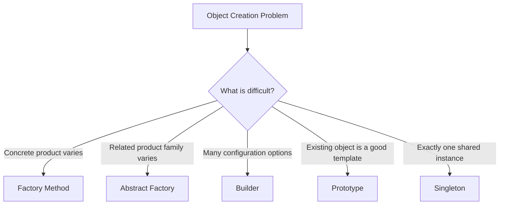
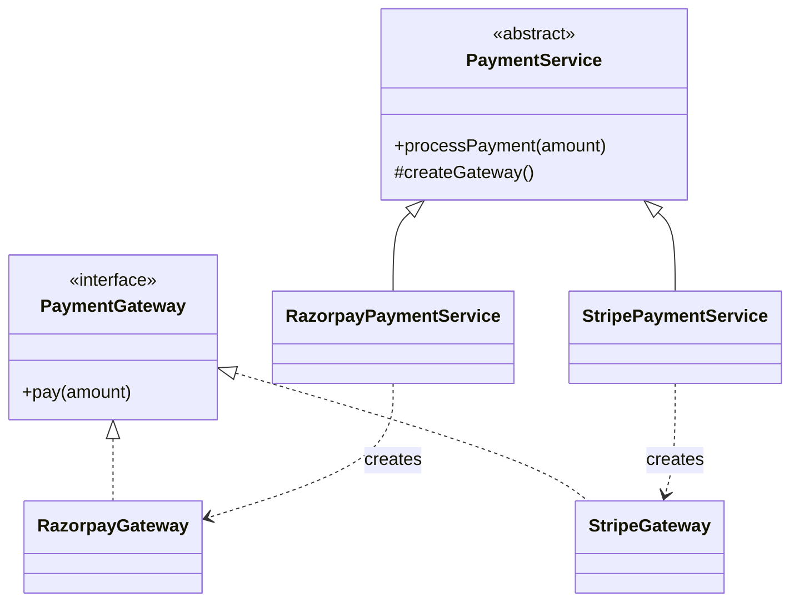
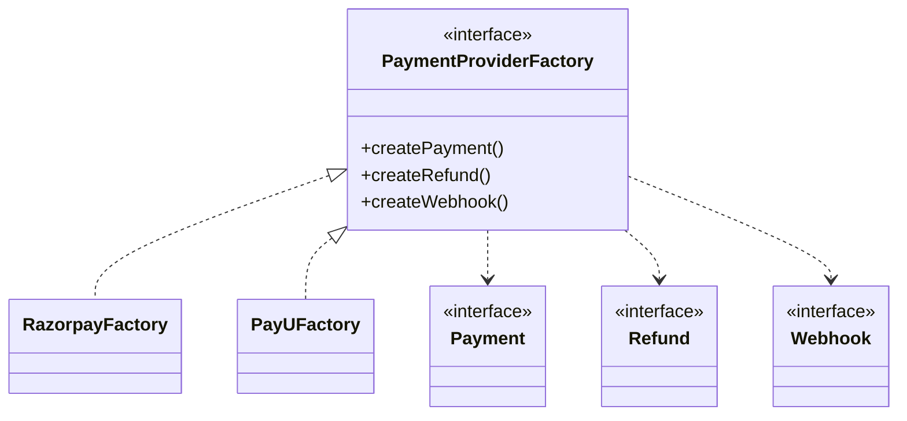
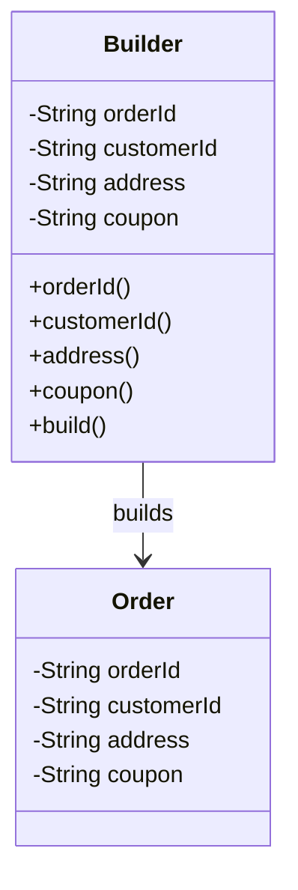
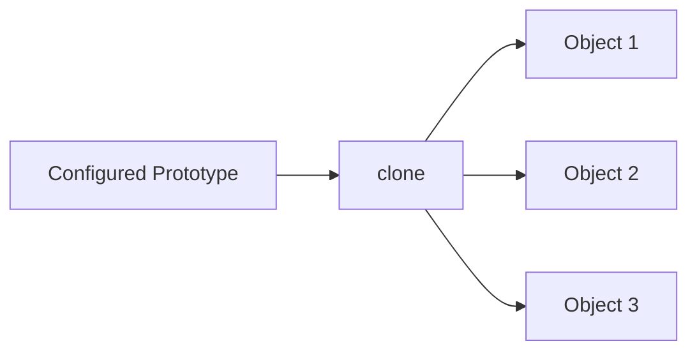
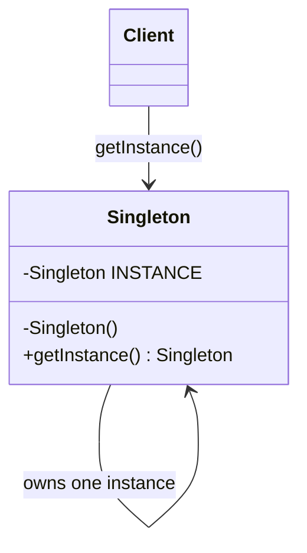

# 05. DESIGN PATTERNS

🏷️ Tags: <!-- shield.io badges -->
`LLD` `Design Patterns` `Creational Patterns` `Java` `OOP` `SOLID` `Interview Prep`

---

## 05.1 CREATIONAL DESIGN PATTERNS

Creational patterns deal with **object creation**.

The important lesson from this section is not "use a pattern whenever you create an object."

The real question is:

> **Does object creation have enough variability or complexity that separating creation from usage improves the design?**

The five patterns covered here solve different problems:

```text
Factory Method   → Which product?
Abstract Factory → Which product family?
Builder          → How to construct a complex object?
Prototype        → Can I copy an existing object?
Singleton        → Should there be one shared instance?
```

---

# 05.1.1 Why Creational Patterns?

🏷️ Tags: `Creational` `Object Creation` `Design Decisions`

---

## ❓ Problem

Object creation can become a design problem when:

- creation logic is complex
- concrete implementations vary
- an object has many optional configuration values
- related objects must be created consistently
- copying an existing object is easier than rebuilding it
- the number/lifecycle of instances needs to be controlled

A common mistake is to assume:

> "Creational pattern = never use `new`."

That is wrong.

Simple object creation is perfectly fine:

```java
User user = new User("Adi");
```

A pattern is justified only when it makes the design clearer or more maintainable.

---

## 📋 Prerequisites

- Java classes and objects
- Constructors
- Interfaces
- Inheritance
- Polymorphism
- Composition
- Basic SOLID principles
- Dependency management

---

## 🎯 Why This Exists

Without separation of creation and usage, business classes can become tightly coupled to concrete implementations.

Example:

```java
class OrderService {

    public void placeOrder() {
        PaymentGateway gateway = new RazorpayGateway();
        gateway.pay();
    }
}
```

Now `OrderService` knows exactly which concrete gateway to instantiate.

If the provider changes, the service changes.

The deeper design issue is:

```text
Business logic
     ↓
Object creation
     ↓
Concrete implementation
```

Creational patterns can separate these concerns when the complexity actually justifies it.

---

## 🧠 Core Concept

The patterns covered in this section are different answers to different creation problems:

| Pattern | Core Question |
|---|---|
| Factory Method | Which concrete product should be created? |
| Abstract Factory | Which related family of products should be created? |
| Builder | How should a complex object be configured and built? |
| Prototype | Can I create a new object by copying an existing one? |
| Singleton | Should only one shared instance exist? |

---

## 🌍 Real-World Analogy

Think of ordering food:

```text
Factory Method
→ Which dish should the kitchen create?

Abstract Factory
→ Which complete cuisine/provider family should be used?

Builder
→ How should the dish be customized?

Prototype
→ Make another dish similar to this existing one.

Singleton
→ One shared kitchen manager/resource.
```

The analogy is only for remembering the intent; actual system designs should be based on requirements.

---

## ❌ Bad Design

Forcing every creation problem into a pattern:

```java
class UserService {

    public User createUser(String name) {
        // unnecessary factory/builder hierarchy
        // for a simple object
        return new User(name);
    }
}
```

This adds abstraction without solving a real problem.

---

## ✅ Better Design

Use the simplest design that handles the actual requirement.

```java
User user = new User("Adi");
```

Introduce a creational pattern only when there is a genuine creation concern.

For example:

```text
Simple object
    ↓
new

Complex construction
    ↓
Builder

Variable concrete product
    ↓
Factory Method

Related product family
    ↓
Abstract Factory

Existing object should be copied
    ↓
Prototype

One controlled shared instance
    ↓
Singleton
```

---

## 💻 Code Example

A simple progression:

```java
// Simple creation
User user = new User("Adi");

// Complex creation
Order order = new Order.Builder()
        .orderId("ORD-1")
        .customerId("C-1")
        .build();

// Variable product
PaymentGateway gateway = factory.createGateway();

// Existing object
Report copy = report.clone();

// Single shared instance
MetricsRegistry registry = MetricsRegistry.getInstance();
```

The important point is that these patterns solve **different creation problems**.

---

## 🗺️ Diagram



---

## 🏢 Real-World Application

Common areas where these ideas can be useful:

- payment providers
- notification providers
- report generation
- database/client configuration
- UI component families
- caching/resource management
- object templates
- application configuration

Do not assume a particular company uses a particular pattern internally unless verified.

---

## ⚖️ Trade-offs

### Benefits

- separates creation from usage
- reduces unnecessary coupling
- makes complex creation easier to understand
- can support variation without spreading construction logic

### Costs

- additional classes
- additional abstractions
- more code
- can become overengineering

### Rule

> **Do not introduce a creational pattern just because a pattern exists.**

---

## 🎯 Interview Questions

### Q1. Why do creational patterns exist?

**Answer:**  
They address object-creation concerns such as varying concrete implementations, complex construction, cloning, related product families, or controlled instance creation.

### Q2. Should you always avoid `new`?

**Answer:**  
No. `new` is completely fine for simple creation.

### Q3. Factory vs Builder?

**Answer:**

```text
Factory → Which object?
Builder → How to construct/configure it?
```

### Q4. What should drive pattern selection?

**Answer:**  
The actual design problem and expected variability, not the desire to use a pattern.

---

## 🧪 Practice Problem

You are designing an e-commerce system.

Requirements:

1. Payment provider varies.
2. Order has 15 optional configuration fields.
3. A preconfigured report must be duplicated many times.
4. A family of Payment, Refund and Webhook objects must always belong to the same provider.

Identify the appropriate pattern for each.

---

## ⚠️ Mistakes / Gotchas

- "Every `new` needs a Factory" → wrong.
- "Factory removes all `if/else`" → wrong.
- "Builder is required for every DTO" → wrong.
- "Prototype means shallow copy" → wrong. Prototype is the pattern; shallow/deep copy are copying techniques.
- "Singleton is automatically good because only one object is needed" → not necessarily.
- Pattern names are less important than the problem they solve.

---

## 🔑 Key Takeaways

- Creational patterns deal with **object creation concerns**.
- Do not use patterns mechanically.
- Factory Method focuses on a concrete product.
- Abstract Factory focuses on a related product family.
- Builder focuses on complex construction.
- Prototype focuses on copying an existing object.
- Singleton focuses on controlled instance count.

---

## 🧾 Key Takeaways

```text
Creation problem                  Pattern
------------------------------------------------
Which concrete product?           Factory Method
Which product family?             Abstract Factory
Complex configuration?            Builder
Copy existing object?             Prototype
Exactly one shared instance?      Singleton

Simple object → use new
Complexity/variation → consider a pattern
```

---

## 🔗 Related Concepts

- OOP
- SOLID
- Dependency Inversion Principle
- Programming to an Interface
- Dependency Injection
- Composition over Inheritance
- Coupling and Cohesion
- Code Quality & Object Design

## 🚧 Pending / Related Topics

- Structural Design Patterns
- Behavioral Design Patterns
- Pattern selection and combination
- Refactoring toward patterns

---

# 05.1.2 Factory Method

🏷️ Tags: `Factory Method` `Creational` `Polymorphism` `Object Creation`

---

## ❓ Problem

Suppose a payment system supports:

```text
Razorpay
Stripe
PayU
```

Business code should work with:

```java
PaymentGateway
```

rather than directly depending on one concrete implementation.

The creation of the concrete gateway may vary.

---

## 📋 Prerequisites

- Interfaces
- Abstract classes
- Polymorphism
- Inheritance
- Dependency inversion

---

## 🎯 Why This Exists

The strict GoF Factory Method separates the **creation of a product** from the code that uses that product.

Important correction from the discussion:

> Factory Method does **not** magically remove every `if/else`.

There are two separate problems:

```text
Selection / routing problem
        ↓
Which provider should be used?

Creation problem
        ↓
How is that concrete provider object created?
```

A map/registry/configuration can solve selection. Factory Method specifically addresses creation.

Do not force Factory Method just because provider selection exists.

---

## 🧠 Core Concept

Factory Method uses a creation method that can be overridden by subclasses.

Example:

```java
interface PaymentGateway {
    void pay(double amount);
}
```

The creator owns the workflow:

```java
abstract class PaymentService {

    public void processPayment(double amount) {
        PaymentGateway gateway = createGateway();
        gateway.pay(amount);
    }

    protected abstract PaymentGateway createGateway();
}
```

Concrete creators decide the product:

```java
class RazorpayPaymentService extends PaymentService {

    @Override
    protected PaymentGateway createGateway() {
        return new RazorpayGateway();
    }
}
```

```java
class StripePaymentService extends PaymentService {

    @Override
    protected PaymentGateway createGateway() {
        return new StripeGateway();
    }
}
```

The important idea is:

```text
Creator workflow
      ↓
createGateway()
      ↓
Concrete subclass decides product
```

---

## 🌍 Real-World Analogy

A restaurant has a standard order process:

```text
Take order
Prepare order
Serve order
```

But the specific dish can vary depending on the specialized kitchen.

The workflow stays similar; the creation decision is delegated.

---

## ❌ Bad Design

```java
class OrderService {

    public void pay(String provider, double amount) {

        PaymentGateway gateway;

        if (provider.equals("RAZORPAY")) {
            gateway = new RazorpayGateway();
        } else if (provider.equals("STRIPE")) {
            gateway = new StripeGateway();
        } else {
            gateway = new PayUGateway();
        }

        gateway.pay(amount);
    }
}
```

Problems:

- business service knows concrete implementations
- creation logic is mixed into the workflow
- adding implementations can make the service grow

However, for a very small and stable mapping, a simple conditional or map may still be better than introducing a hierarchy.

---

## ✅ Better Design

Strict Factory Method:

```java
interface PaymentGateway {
    void pay(double amount);
}

class RazorpayGateway implements PaymentGateway {

    public void pay(double amount) {
        System.out.println("Razorpay: " + amount);
    }
}

class StripeGateway implements PaymentGateway {

    public void pay(double amount) {
        System.out.println("Stripe: " + amount);
    }
}

abstract class PaymentService {

    public void processPayment(double amount) {
        PaymentGateway gateway = createGateway();
        gateway.pay(amount);
    }

    protected abstract PaymentGateway createGateway();
}

class RazorpayPaymentService extends PaymentService {

    protected PaymentGateway createGateway() {
        return new RazorpayGateway();
    }
}

class StripePaymentService extends PaymentService {

    protected PaymentGateway createGateway() {
        return new StripeGateway();
    }
}
```

---

## 💻 Code Example

```java
PaymentService service = new RazorpayPaymentService();

service.processPayment(1000);
```

The client does not directly instantiate:

```java
new RazorpayGateway();
```

The concrete creator does.

---

## 🗺️ Diagram



---

## 🏢 Real-World Application

Useful where a common workflow needs different concrete products.

Examples:

- payment gateways
- notification providers
- storage clients
- parser implementations
- export formats

The exact pattern should depend on the structure of the requirement.

---

## ⚖️ Trade-offs

### Benefits

- creation is separated from usage
- concrete creation can vary
- supports polymorphism
- business workflow can remain stable

### Costs

- additional creator classes
- can be excessive for simple mappings
- selection and creation are still separate concerns

### Important decision

If the requirement is only:

```text
provider → implementation
```

a simple map/registry can be clearer:

```java
Map<String, PaymentGateway> gateways;
```

Do not force GoF Factory Method.

---

## 🎯 Interview Questions

### Q1. What does Factory Method solve?

**Answer:**  
It encapsulates/delegates creation of a product so subclasses can determine the concrete product.

### Q2. Does Factory Method eliminate `if/else`?

**Answer:**  
No. Selection and creation are separate concerns.

### Q3. Factory Method vs Simple Factory?

**Answer:**  
A Simple Factory commonly has one method that chooses and creates a product. Strict GoF Factory Method uses an overridable creation method, commonly implemented by subclasses.

### Q4. Factory Method vs Abstract Factory?

**Answer:**

```text
Factory Method   → one product creation
Abstract Factory → family of related products
```

### Q5. When should you NOT use it?

**Answer:**  
When creation is simple and stable enough that direct construction or a small map/registry is clearer.

---

## 🧪 Practice Problem

Design a notification system:

```text
EmailNotification
SMSNotification
PushNotification
```

Create a common notification workflow where concrete notification creation can vary.

Identify:

- Product interface
- Concrete products
- Creator
- Factory Method

---

## ⚠️ Mistakes / Gotchas

- Saying "Factory removes if/else."
- Confusing Factory Method with every class called `Factory`.
- Creating multiple classes without a real variation problem.
- Ignoring the distinction between provider selection and object creation.
- Using Factory Method for a simple map that would be clearer.

---

## 🔑 Key Takeaways

- Factory Method focuses on **product creation**.
- Strict GoF Factory Method uses an overridable creation method.
- Subclasses can decide the concrete product.
- Selection and creation are not the same problem.
- A simple registry/map may be better for simple provider mapping.
- Don't use the pattern just to eliminate a small `if/else`.

---

## 🧾 Key Takeaways

```text
Factory Method → ONE PRODUCT

Creator
   ↓
createProduct()
   ↓
Concrete Creator
   ↓
Concrete Product

Selection ≠ Creation

Simple mapping → map/registry may be enough
Complex creation variation → consider Factory Method
```

---

## 🔗 Related Concepts

- Polymorphism
- Open/Closed Principle
- Dependency Inversion
- Programming to an Interface
- Abstract Factory
- Dependency Injection

## 🚧 Pending / Related Topics

- Abstract Factory
- Builder
- Prototype
- Singleton
- Structural Design Patterns

---

# 05.1.3 Abstract Factory

🏷️ Tags: `Abstract Factory` `Creational` `Product Family`

---

## ❓ Problem

Suppose a payment provider has multiple related capabilities:

```text
Payment
Refund
Webhook
```

And the system supports:

```text
Razorpay family
PayU family
```

We want:

```text
Razorpay Payment
Razorpay Refund
Razorpay Webhook
```

rather than accidentally mixing:

```text
Razorpay Payment
PayU Refund
Stripe Webhook
```

---

## 📋 Prerequisites

- Interfaces
- Polymorphism
- Factory Method
- Composition

---

## 🎯 Why This Exists

Factory Method answers:

> How do I create one product?

Abstract Factory answers:

> How do I create a **consistent family of related products**?

This was an important distinction during the discussion because both patterns can look similar in code.

---

## 🧠 Core Concept

Define product interfaces:

```java
interface Payment {
    void pay();
}

interface Refund {
    void refund();
}

interface Webhook {
    void handle();
}
```

Then define the abstract factory:

```java
interface PaymentProviderFactory {

    Payment createPayment();

    Refund createRefund();

    Webhook createWebhook();
}
```

Razorpay factory:

```java
class RazorpayFactory implements PaymentProviderFactory {

    public Payment createPayment() {
        return new RazorpayPayment();
    }

    public Refund createRefund() {
        return new RazorpayRefund();
    }

    public Webhook createWebhook() {
        return new RazorpayWebhook();
    }
}
```

PayU factory:

```java
class PayUFactory implements PaymentProviderFactory {

    public Payment createPayment() {
        return new PayUPayment();
    }

    public Refund createRefund() {
        return new PayURefund();
    }

    public Webhook createWebhook() {
        return new PayUWebhook();
    }
}
```

---

## 🌍 Real-World Analogy

Think of buying a complete furniture set.

You don't want:

```text
Brand A chair
Brand B table
Brand C sofa
```

when the requirement is a matching product family.

Instead:

```text
Brand A factory → complete Brand A family
Brand B factory → complete Brand B family
```

---

## ❌ Bad Design

```java
Payment payment = new RazorpayPayment();
Refund refund = new PayURefund();
Webhook webhook = new StripeWebhook();
```

Nothing prevents incompatible combinations.

---

## ✅ Better Design

Choose one factory:

```java
PaymentProviderFactory factory = new RazorpayFactory();

Payment payment = factory.createPayment();
Refund refund = factory.createRefund();
Webhook webhook = factory.createWebhook();
```

The family stays consistent.

---

## 💻 Code Example

```java
interface Payment {
    void pay();
}

interface Refund {
    void refund();
}

interface Webhook {
    void handle();
}

interface PaymentProviderFactory {
    Payment createPayment();
    Refund createRefund();
    Webhook createWebhook();
}
```

Concrete factories produce matching families.

---

## 🗺️ Diagram



---

## 🏢 Real-World Application

Useful when systems support interchangeable families such as:

- provider-specific payment capabilities
- platform-specific UI components
- database/client families
- cloud/provider-specific integrations

The important requirement is **family consistency**, not simply "many implementations."

---

## ⚖️ Trade-offs

### Benefits

- keeps related products consistent
- prevents incompatible combinations
- isolates provider-specific construction

### Costs

- many interfaces/classes
- adding a new product type affects every factory
- can be overengineering for one product

---

## 🎯 Interview Questions

### Q1. Factory Method vs Abstract Factory?

```text
Factory Method
→ ONE product

Abstract Factory
→ FAMILY of related products
```

### Q2. Why use Abstract Factory?

To create compatible/related products together.

### Q3. Can Abstract Factory still have selection logic?

Yes.

Something still has to choose:

```text
RazorpayFactory
```

vs:

```text
PayUFactory
```

That selection may be configuration, a registry, or conditional logic.

The pattern doesn't magically eliminate all decisions.

---

## 🧪 Practice Problem

Design a UI system with:

```text
Button
Checkbox
TextField
```

Support two UI families:

```text
Windows
Mac
```

Ensure a Windows button cannot accidentally be combined with a Mac checkbox.

---

## ⚠️ Mistakes / Gotchas

- "Abstract Factory means one factory method." → incomplete.
- Confusing one product with a product family.
- Thinking selection logic disappears.
- Creating Abstract Factory when only one product type varies.
- Adding every possible operation to a factory without a family requirement.

---

## 🔑 Key Takeaways

- Abstract Factory creates **families of related products**.
- The family should remain internally consistent.
- Factory Method focuses on one product.
- Factory selection is separate from the factory abstraction.
- Adding product types can make all factories harder to maintain.
- Use it when family consistency is a real requirement.

---

## 🧾 Key Takeaways

```text
Factory Method
    ↓
ONE product

Abstract Factory
    ↓
PRODUCT FAMILY

Example:

RazorpayFactory
 ├── Payment
 ├── Refund
 └── Webhook

PayUFactory
 ├── Payment
 ├── Refund
 └── Webhook
```

---

## 🔗 Related Concepts

- Factory Method
- Polymorphism
- Dependency Inversion
- Programming to an Interface
- Product families

## 🚧 Pending / Related Topics

- Builder
- Prototype
- Singleton
- Structural Design Patterns

---

# 05.1.4 Builder

🏷️ Tags: `Builder` `Creational` `Object Construction` `Immutability`

---

## ❓ Problem

An object has many optional configuration fields.

Example:

```text
Order
├── orderId
├── customerId
├── address
├── coupon
├── payment
├── shipping
├── metadata
└── deliveryInstructions
```

A huge constructor becomes difficult to read and maintain.

---

## 📋 Prerequisites

- Constructors
- Classes
- Encapsulation
- Immutability
- Method chaining

---

## 🎯 Why This Exists

Builder separates:

```text
configuration
```

from:

```text
final object creation
```

It is especially useful when:

- many fields are optional
- construction has validation rules
- readability matters
- the resulting object should be immutable

Important discussion point:

> Builder is **not** required for every DTO/model.

A Flutter/Java model with `fromJson()` / `toJson()` is not automatically a Builder.

---

## 🧠 Core Concept

Instead of:

```java
new Order(
    id,
    customer,
    address,
    coupon,
    payment,
    shipping,
    metadata
);
```

use:

```java
Order order = new Order.Builder()
        .orderId("ORD-1")
        .customerId("C-1")
        .address("Bangalore")
        .coupon("SAVE10")
        .build();
```

---

## 🌍 Real-World Analogy

Ordering a customized meal:

```text
Start order
 → choose size
 → choose base
 → choose toppings
 → choose sauce
 → confirm
```

Only when you confirm do you get the final order.

That is the mental model of Builder:

```text
configure → validate → build
```

---

## ❌ Bad Design

### Telescoping constructor

```java
new Order(
    orderId,
    customerId,
    address,
    coupon,
    payment,
    shipping,
    metadata,
    notes
);
```

Problems:

- hard to read
- easy to swap arguments
- optional parameters become awkward
- constructor grows as the model evolves

---

## ✅ Better Design

```java
Order order = new Order.Builder()
        .orderId("ORD-1")
        .customerId("C-1")
        .address("Bangalore")
        .build();
```

---

## 💻 Code Example

```java
public final class Order {

    private final String orderId;
    private final String customerId;
    private final String address;
    private final String coupon;

    private Order(Builder builder) {
        this.orderId = builder.orderId;
        this.customerId = builder.customerId;
        this.address = builder.address;
        this.coupon = builder.coupon;
    }

    public static class Builder {

        private String orderId;
        private String customerId;
        private String address;
        private String coupon;

        public Builder orderId(String orderId) {
            this.orderId = orderId;
            return this;
        }

        public Builder customerId(String customerId) {
            this.customerId = customerId;
            return this;
        }

        public Builder address(String address) {
            this.address = address;
            return this;
        }

        public Builder coupon(String coupon) {
            this.coupon = coupon;
            return this;
        }

        public Order build() {

            if (orderId == null) {
                throw new IllegalArgumentException("orderId required");
            }

            if (customerId == null) {
                throw new IllegalArgumentException("customerId required");
            }

            return new Order(this);
        }
    }
}
```

Usage:

```java
Order order = new Order.Builder()
        .orderId("ORD-1")
        .customerId("C-1")
        .address("Bangalore")
        .coupon("SAVE10")
        .build();
```

---

## 🗺️ Diagram



Flow:

```text
Client
  ↓
Builder
  ↓ configure
Builder
  ↓ build()
Order
```

---

## 🏢 Real-World Application

Builder is useful for:

- configuration objects
- complex domain objects
- request objects with many options
- immutable objects
- objects requiring validation during construction

A normal DTO with:

```text
fromJson()
toJson()
```

does not automatically require Builder.

---

## ⚖️ Trade-offs

### Benefits

- readable construction
- optional parameters are easy to express
- validation can happen in `build()`
- final object can be immutable
- avoids telescoping constructors

### Costs

- extra Builder class
- more code
- unnecessary for simple objects

### Important alternative

For simple objects:

```java
User user = new User("Adi");
```

is often better.

---

## 🎯 Interview Questions

### Q1. Why `return this`?

It enables method chaining:

```java
builder
    .name("A")
    .age(30)
    .city("Bangalore");
```

### Q2. What does `build()` do?

It validates builder state and creates the final object.

### Q3. Why is Builder often nested?

Keeping the builder close to the object it constructs keeps construction logic organized.

### Q4. Why can someone call `build()` too early?

Because the Builder is ordinary code unless it explicitly enforces required fields.

Solution:

```java
public Order build() {
    if (orderId == null) {
        throw new IllegalArgumentException();
    }
    return new Order(this);
}
```

### Q5. Is `fromJson()` Builder?

**No.**

```text
fromJson
→ external representation → object

Builder
→ configuration → object
```

---

## 🧪 Practice Problem

Create an immutable `HttpRequest` with:

```text
method
url
headers
body
timeout
retryCount
```

Only `method` and `url` are required.

Use Builder and validate the required fields.

---

## ⚠️ Mistakes / Gotchas

- Builder for every DTO.
- Confusing Builder with `fromJson`.
- Forgetting validation.
- Assuming `final` reference alone makes an object immutable.
- Using Builder for a class with only two simple parameters.
- Assuming the textbook Builder implementation is the only valid construction style.

---

## 🔑 Key Takeaways

- Builder solves **complex object construction**.
- It is useful when many fields/options exist.
- `build()` can enforce invariants.
- `return this` enables chaining.
- Builder is not the same as JSON serialization.
- Don't use Builder for simple objects.

---

## 🧾 Key Takeaways

```text
Factory  → WHICH object?
Builder  → HOW to configure/build object?

Builder flow:

new Builder()
    ↓
configure
    ↓
validate
    ↓
build()
    ↓
final object
```

---

## 🔗 Related Concepts

- Immutability
- Encapsulation
- Validation
- Telescoping constructors
- Fluent APIs
- Factory Method

## 🚧 Pending / Related Topics

- Prototype
- Singleton
- Structural Design Patterns

---

# 05.1.5 Prototype

🏷️ Tags: `Prototype` `Creational` `Cloning` `Shallow Copy` `Deep Copy`

---

## ❓ Problem

Sometimes creating an object from scratch is expensive or complicated, while a similar object already exists.

Example:

```text
GameCharacter
├── attributes
├── weapons
├── skills
├── appearance
├── equipment
└── configuration
```

Creating hundreds of similar characters from scratch can be unnecessarily repetitive.

---

## 📋 Prerequisites

- Objects and references
- Copying
- Mutable vs immutable state
- Composition

---

## 🎯 Why This Exists

Prototype allows:

> **Create a new object by copying an existing object.**

Important correction:

> Prototype is the design pattern.  
> Shallow copy/deep copy are copying techniques.

They are not interchangeable terms.

---

## 🧠 Core Concept

```text
Existing object
      ↓
     clone()
      ↓
New similar object
```

Example:

```java
interface Prototype<T> {
    T clone();
}
```

```java
class Report implements Prototype<Report> {

    private String title;
    private String format;

    public Report(String title, String format) {
        this.title = title;
        this.format = format;
    }

    @Override
    public Report clone() {
        return new Report(this.title, this.format);
    }
}
```

---

## 🌍 Real-World Analogy

You already have a configured document template.

Instead of:

```text
create formatting
create columns
create filters
create settings
...
```

again, duplicate the configured template and modify only what differs.

---

## ❌ Bad Design

```java
Report report = new Report(
    "Monthly Report",
    "PDF",
    // lots of configuration...
);
```

Repeated hundreds of times.

---

## ✅ Better Design

```java
Report template = new Report(
    "Template",
    "PDF"
);

Report report1 = template.clone();
Report report2 = template.clone();
```

Then customize each clone.

---

## 💻 Code Example

```java
class Report {

    private String title;
    private String format;
    private List<String> filters;

    public Report(String title,
                  String format,
                  List<String> filters) {
        this.title = title;
        this.format = format;
        this.filters = filters;
    }

    public Report shallowClone() {
        return new Report(
                title,
                format,
                filters
        );
    }

    public Report deepClone() {
        return new Report(
                title,
                format,
                new ArrayList<>(filters)
        );
    }
}
```

The important difference is the nested mutable list.

---

## 🗺️ Diagram



---

## 🏢 Real-World Application

Useful for:

- preconfigured templates
- expensive object initialization
- game objects/characters
- document/report templates
- objects with many repeated configuration values

---

## ⚖️ Trade-offs

### Benefits

- avoids repeated complex construction
- useful for many similar objects
- preserves an existing configuration as a starting point

### Costs

- copying nested mutable state can be tricky
- deep copy may be expensive
- clone semantics must be clearly defined

---

## 🎯 Interview Questions

### Q1. Prototype vs Builder?

```text
Builder
→ construct/configure from scratch

Prototype
→ copy an existing object
```

### Q2. Prototype vs Factory?

```text
Factory
→ decide/create a concrete object

Prototype
→ clone an existing object
```

### Q3. What is shallow copy?

Nested references are copied as references.

```text
Original
   ↓
List A ← Clone
```

Both objects may refer to the same list.

### Q4. What is deep copy?

Nested mutable objects are copied too.

```text
Original → List A
Clone    → List B
```

They are independent.

### Q5. Is "shallow Prototype" the pattern name?

No.

```text
Prototype       → design pattern
Shallow/Deep    → copy strategy
```

---

## 🧪 Practice Problem

You have a preconfigured `GameCharacter` with:

```text
20 attributes
weapons
skills
equipment
appearance
```

You need 100 similar characters.

Design a Prototype solution and decide which nested fields require deep copying.

---

## ⚠️ Mistakes / Gotchas

- Calling shallow copy itself "the Prototype pattern."
- Assuming all clones should be deep copies.
- Sharing mutable nested state accidentally.
- Using Prototype when `new` is already simple.
- Forgetting that cloning semantics must be explicit.

---

## 🔑 Key Takeaways

- Prototype creates an object by copying an existing object.
- It is useful for complex/preconfigured objects.
- Shallow and deep copy are implementation/copying techniques.
- Mutable nested objects need special attention.
- Builder constructs; Prototype copies.

---

## 🧾 Key Takeaways

```text
Builder
→ build from scratch

Prototype
→ clone existing object

Prototype ≠ shallow copy

Shallow copy
→ nested references may be shared

Deep copy
→ nested mutable objects are copied
```

---

## 🔗 Related Concepts

- Builder
- Copy semantics
- Immutability
- Mutable state
- Object composition

## 🚧 Pending / Related Topics

- Singleton
- Structural Design Patterns

---

# 05.1.6 Singleton

🏷️ Tags: `Singleton` `Creational` `Thread Safety` `Concurrency` `Global State`

---

## ❓ Problem

Sometimes a system requires a single controlled instance of an object.

Examples discussed:

- configuration
- metrics registry
- certain resource managers
- shared application-level state

The requirement is:

> **One controlled shared instance within the intended scope.**

---

## 📋 Prerequisites

- `static`
- `private` constructors
- basic threads/concurrency
- object references

---

## 🎯 Why This Exists

Normally:

```java
AppConfig config1 = new AppConfig();
AppConfig config2 = new AppConfig();
```

creates two objects.

If the design genuinely requires one shared instance, Singleton restricts construction and exposes controlled access.

Important caution:

> Singleton should not simply be used as a convenient global variable.

---

## 🧠 Core Concept

Three basic characteristics:

```text
1. Private constructor
2. One class-controlled instance
3. Static access mechanism
```

Basic implementation:

```java
public final class Singleton {

    private static final Singleton INSTANCE = new Singleton();

    private Singleton() {
    }

    public static Singleton getInstance() {
        return INSTANCE;
    }
}
```

Usage:

```java
Singleton s1 = Singleton.getInstance();
Singleton s2 = Singleton.getInstance();

System.out.println(s1 == s2); // true
```

---

## 🌍 Real-World Analogy

Think of a building with one central control room.

People can access the control room through a defined entry point, but arbitrary code cannot create another control room.

The analogy is about **controlled uniqueness**, not about making every shared service a Singleton.

---

## ❌ Bad Design

A naive lazy implementation:

```java
public class Singleton {

    private static Singleton instance;

    private Singleton() {
    }

    public static Singleton getInstance() {

        if (instance == null) {
            instance = new Singleton();
        }

        return instance;
    }
}
```

This looks correct in single-threaded execution but has a concurrency problem.

---

## ✅ Better Design

Simple eager initialization:

```java
public final class Singleton {

    private static final Singleton INSTANCE = new Singleton();

    private Singleton() {
    }

    public static Singleton getInstance() {
        return INSTANCE;
    }
}
```

The instance is created when the class is initialized.

A clean lazy Java approach discussed was the holder idiom:

```java
public final class Singleton {

    private Singleton() {
    }

    private static class Holder {
        private static final Singleton INSTANCE =
                new Singleton();
    }

    public static Singleton getInstance() {
        return Holder.INSTANCE;
    }
}
```

---

## 💻 Code Example

### Eager Singleton

```java
public final class MetricsRegistry {

    private static final MetricsRegistry INSTANCE =
            new MetricsRegistry();

    private MetricsRegistry() {
    }

    public static MetricsRegistry getInstance() {
        return INSTANCE;
    }
}
```

The `private` constructor prevents external construction:

```java
// Won't compile
new MetricsRegistry();
```

`static` makes the instance belong to the class.

`final` prevents the `INSTANCE` reference from being reassigned.

---

## 🗺️ Diagram



Thread-safety concept:

```text
Without synchronization:

Thread A                 Thread B
   ↓                         ↓
instance == null        instance == null
   ↓                         ↓
create A                create B

❌ Two instances
```

With synchronized access:

```text
Thread A
   ↓
enters critical section
   ↓
creates instance
   ↓
leaves

Thread B
   ↓
enters
   ↓
sees existing instance
   ↓
returns same instance
```

`synchronized` means access to the synchronized method/section is coordinated through a lock so multiple threads cannot execute that protected section simultaneously for the same lock.

---

## 🏢 Real-World Application

Potential use cases:

- metrics registry
- application configuration
- certain resource managers
- shared registries

In backend applications, dependency injection/container-managed lifecycle is often preferable to manually implementing a global Singleton.

---

## ⚖️ Trade-offs

### Benefits

- controlled instance creation
- one shared instance
- centralized lifecycle/access

### Costs

- global state risk
- hidden dependencies
- harder test isolation
- tight coupling when accessed globally
- mutable Singleton state can cause interference

### Important question

Before implementing Singleton, ask:

> Can dependency injection or a framework/container manage the lifecycle instead?

---

## 🎯 Interview Questions

### Q1. Why is the constructor private?

So external code cannot directly create instances.

### Q2. Why is the instance static?

Because the instance must be accessible at the class level without first creating a Singleton.

### Q3. What is the thread-safety problem?

Two threads can both observe:

```java
instance == null
```

before either creates the object.

Both may then create an instance.

### Q4. What does `synchronized` mean?

It coordinates access to a protected critical section so only one thread at a time can execute that synchronized section for the same lock.

### Q5. Why can Singleton make testing harder?

Because shared global state can leak between tests.

### Q6. GoF Singleton vs Spring Singleton?

```text
GoF Singleton
→ class controls one instance

Spring Singleton
→ Spring container manages one bean instance
  per application context by default
```

These are not the same mechanism.

### Q7. Should you manually implement Singleton in a Spring application?

Not automatically.

If the container already manages the lifecycle, manually creating a static Singleton can introduce unnecessary global state and hidden dependencies.

---

## 🧪 Practice Problem

Design a `MetricsRegistry` that should have one shared instance.

Requirements:

- external code cannot call its constructor
- all callers get the same instance
- creation should be safe when multiple threads request it

Implement it using either eager initialization or the holder idiom.

---

## ⚠️ Mistakes / Gotchas

- Assuming Singleton is always a good design.
- Forgetting the private constructor.
- Ignoring concurrency in lazy initialization.
- Treating `synchronized` as "creates one object" — it actually coordinates concurrent access.
- Confusing GoF Singleton with Spring's singleton scope.
- Using Singleton simply for convenient global access.
- Assuming Singleton automatically makes mutable shared state safe.
- Forgetting that a Singleton can make testing harder.

---

## 🔑 Key Takeaways

- Singleton controls creation/access of one shared instance.
- Private constructor prevents external construction.
- `static` provides class-level access.
- Naive lazy initialization can fail under concurrent access.
- `synchronized` coordinates concurrent access.
- Singleton can introduce global state and hidden dependencies.
- Container-managed lifecycle is often preferable in dependency-injection-based applications.

---

## 🧾 Key Takeaways

```text
Singleton
    ↓
ONE controlled shared instance

private constructor
    ↓
outside code cannot use new

static instance
    ↓
class-level shared reference

getInstance()
    ↓
controlled access

Lazy initialization
    ↓
must consider thread safety

Singleton ≠ automatically good

GoF Singleton
    → class manages instance

Spring Singleton
    → container manages bean lifecycle
```

### Creational Pattern Cheat Sheet

```text
┌──────────────────┬─────────────────────────────────────┐
│ Pattern          │ Think                               │
├──────────────────┼─────────────────────────────────────┤
│ Factory Method   │ Which product?                      │
│ Abstract Factory │ Which product family?               │
│ Builder          │ How do I build this complex object? │
│ Prototype        │ Can I copy this existing object?    │
│ Singleton        │ Should there be only one instance? │
└──────────────────┴─────────────────────────────────────┘
```

---

## 🔗 Related Concepts

- Dependency Injection
- Dependency Inversion Principle
- Global State
- Thread Safety
- Concurrency
- Immutability
- Factory Method
- Abstract Factory
- Builder
- Prototype

## 🚧 Pending / Related Topics

- Java concurrency fundamentals
- Spring dependency injection
- Structural Design Patterns
- Behavioral Design Patterns
- Pattern application and refactoring

---

# 05.1 CREATIONAL DESIGN PATTERNS — FINAL INTERVIEW CHEATSHEET

```text
                     CREATIONAL PATTERNS
                            │
       ┌────────────────────┼────────────────────┐
       │                    │                    │
       ↓                    ↓                    ↓
   ONE PRODUCT          PRODUCT FAMILY       COMPLEX OBJECT
       │                    │                    │
       ↓                    ↓                    ↓
 Factory Method       Abstract Factory       Builder
       │
       │
       ├──────────────────────────────┐
       ↓                              ↓
 EXISTING OBJECT                 ONE INSTANCE
       │                              │
       ↓                              ↓
   Prototype                      Singleton
```

## Pattern Selection

```text
Q: Is creation simple?
→ Use new.

Q: Does concrete product vary?
→ Consider Factory Method.

Q: Do multiple related products need to stay consistent?
→ Consider Abstract Factory.

Q: Does the object have many optional/configurable fields?
→ Consider Builder.

Q: Do I already have a good configured object to copy?
→ Consider Prototype.

Q: Is exactly one shared instance genuinely required?
→ Consider Singleton.
```

## Most Important Distinctions

```text
Factory Method
    → ONE product

Abstract Factory
    → FAMILY of products

Builder
    → CONSTRUCT

Prototype
    → COPY

Singleton
    → ONE INSTANCE
```

## Anti-Cargo-Cult Rule

```text
Don't ask:
"What pattern can I use?"

Ask:
"What design problem do I have?"

Then:
"Does a pattern actually make this design better?"
```

That principle is more important than memorizing the class diagrams.
