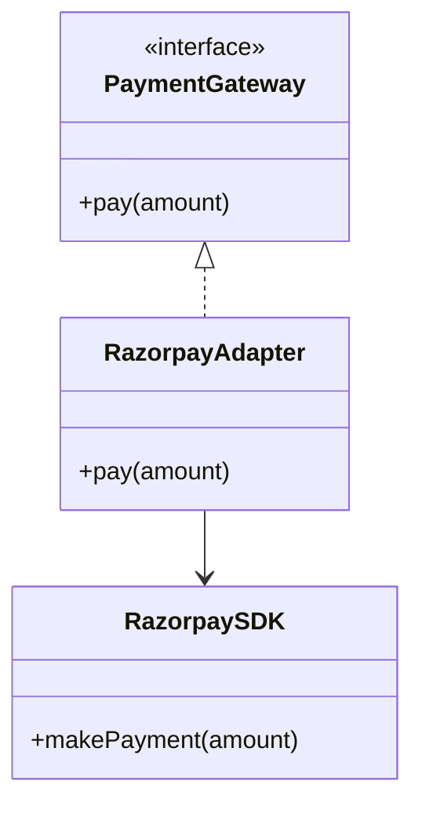
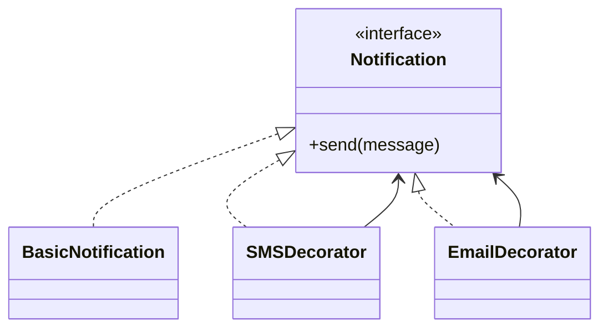
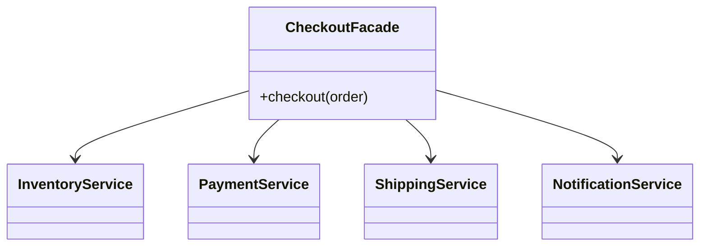
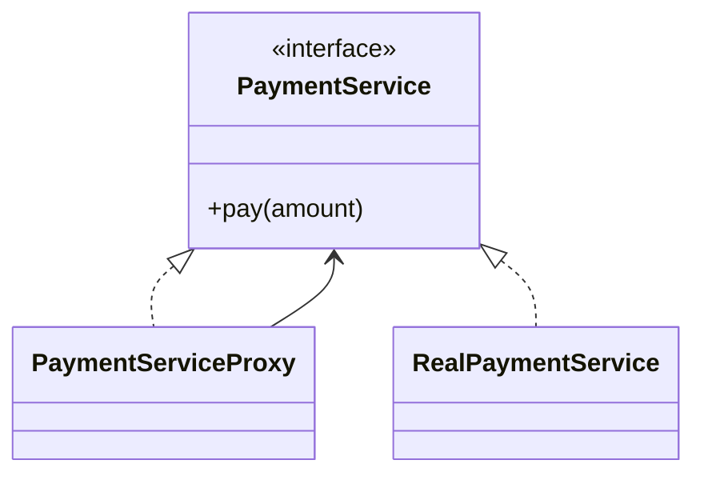
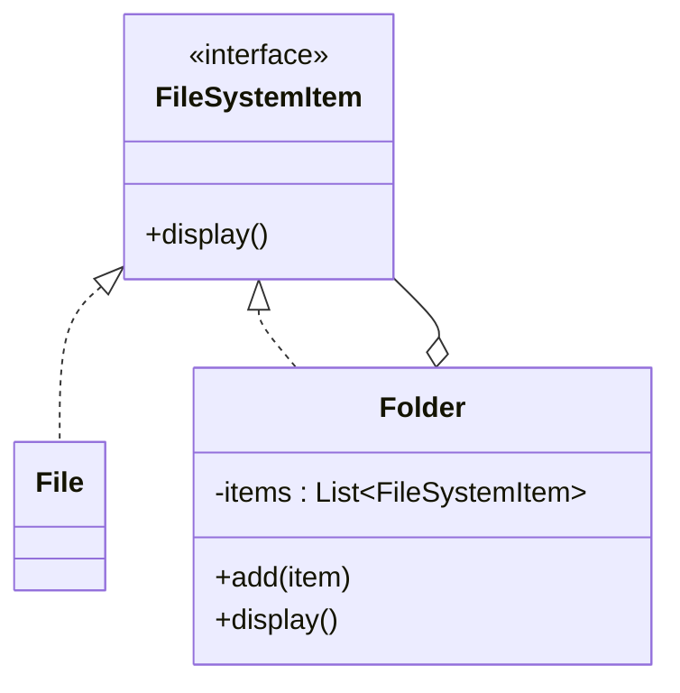
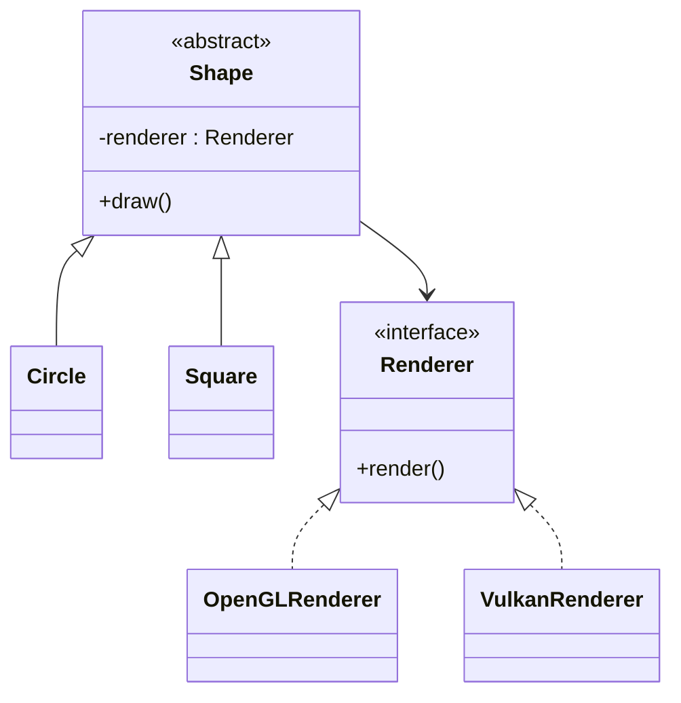
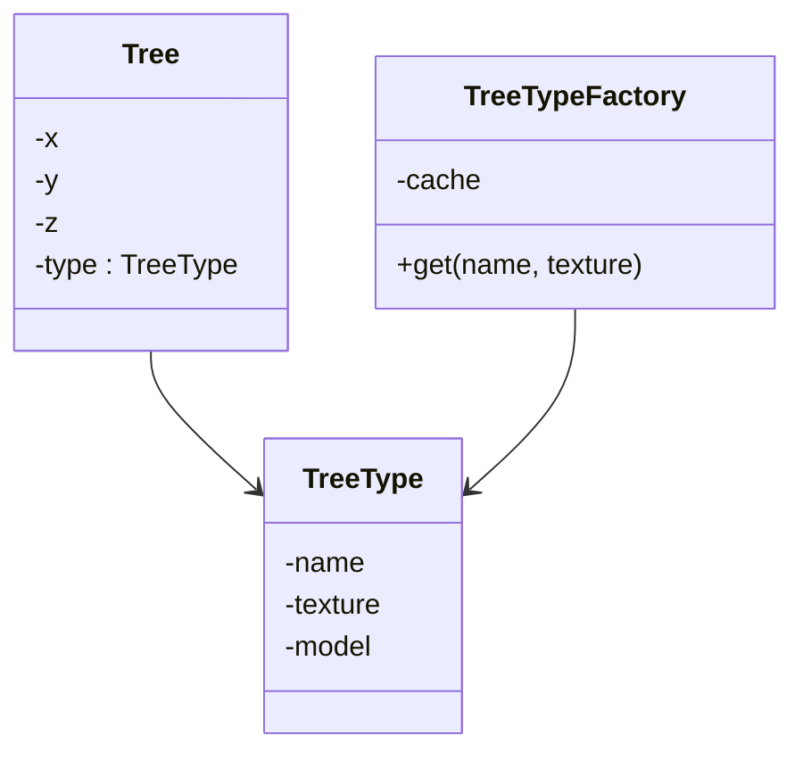

# Structural Design Patterns

🏷️ Tags: `<!-- shield.io badges -->`{=html}

`Design Patterns` `Structural Patterns` `LLD` `Java` `OOP`
`Interview Prep`

------------------------------------------------------------------------

# 05.2.1 Adapter

## ❓ Problem

The application already has a useful external component, but its
interface does not match the interface expected by our code.

Example discussed:

``` text
Application expects:
PaymentGateway.pay()

External SDK provides:
RazorpaySDK.makePayment()
```

The functionality exists; the problem is the incompatible interface.

## 📋 Prerequisites

-   Interfaces and implementations
-   Composition
-   Dependency inversion / programming to an interface
-   Basic object delegation

## 🎯 Why This Exists

Without an Adapter, application code becomes coupled directly to the
external SDK:

``` text
OrderService → RazorpaySDK
```

If the SDK changes, or another provider is introduced, application code
must understand the external API.

Adapter localizes that translation.

## 🧠 Core Concept

Adapter converts an existing incompatible interface into the interface
the client expects.

Memory:

> **Adapter = CHANGE INTERFACE**

The adapter does not fundamentally change the external component. It
translates the client's calls into the adaptee's API.

## 🌍 Real-World Analogy

A travel plug adapter lets a device with one plug format work with a
different wall socket.

The device and socket are not changed; the adapter makes them
compatible.

## ❌ Bad Design

``` java
class OrderService {
    private final RazorpaySDK razorpay = new RazorpaySDK();

    void pay(double amount) {
        razorpay.makePayment(amount);
    }
}
```

`OrderService` now knows the third-party API directly.

## ✅ Better Design

``` java
interface PaymentGateway {
    void pay(double amount);
}

class RazorpaySDK {
    void makePayment(double amount) {
        System.out.println("Razorpay payment");
    }
}

class RazorpayAdapter implements PaymentGateway {
    private final RazorpaySDK sdk;

    RazorpayAdapter(RazorpaySDK sdk) {
        this.sdk = sdk;
    }

    @Override
    public void pay(double amount) {
        sdk.makePayment(amount);
    }
}
```

The application depends on `PaymentGateway`, not the third-party API.

## 💻 Code Example

``` java
PaymentGateway gateway =
        new RazorpayAdapter(new RazorpaySDK());

gateway.pay(1000);
```

The client sees only:

``` java
PaymentGateway.pay()
```

while the adapter performs:

``` text
pay() → makePayment()
```

## 🗺️ Diagram



Flow:

``` text
Client
  ↓
PaymentGateway
  ↓
RazorpayAdapter
  ↓
RazorpaySDK
```

## 🏢 Real-World Application

Useful around:

-   Third-party payment SDKs
-   Cloud SDKs
-   Legacy APIs
-   Vendor-specific clients
-   External storage APIs

A similar approach is useful whenever an external dependency's API does
not match the application's internal abstraction.

## ⚖️ Trade-offs

### Pros

-   Isolates third-party API details
-   Keeps client code stable
-   Makes replacing an external implementation easier
-   Supports programming to an internal interface

### Cons

-   Adds another class
-   Can become unnecessary abstraction for a tiny, stable integration
-   Too many adapters can make a simple integration harder to follow

Use it when the interface mismatch is a real design pressure.

## 🎯 Interview Questions

**Q1. What problem does Adapter solve?**

**Answer:** It makes an existing incompatible interface usable through
the interface expected by the client.

**Q2. Is Adapter the same as Factory?**

**Answer:** No. Factory decides which object to create. Adapter makes an
existing object's interface compatible.

**Q3. Payment SDK exposes `makeTransaction()` while the application
expects `pay()`. Which pattern?**

**Answer:** Adapter.

**Q4. Does Adapter remove the third-party dependency?**

**Answer:** No. It isolates the dependency behind an application-facing
interface.

## 🧪 Practice Problem

Your application expects:

``` java
interface Storage {
    void save(String key, String value);
}
```

A vendor library provides:

``` java
class CloudStorage {
    void upload(String path, String content) {}
}
```

Design an adapter so application code uses `Storage.save()` without
knowing about `CloudStorage.upload()`.

## ⚠️ Mistakes / Gotchas

-   Do not call every wrapper a Proxy.
-   Adapter is about **interface mismatch**.
-   The adapter is not necessarily responsible for object creation.
-   Do not introduce an adapter if both interfaces are under your
    control and can simply be made consistent.
-   Adapter and Bridge are different:
    -   Adapter fixes an existing interface mismatch.
    -   Bridge separates independent dimensions of variation.

## 🔑 Key Takeaways

-   Adapter makes incompatible interfaces compatible.
-   Client depends on the expected abstraction.
-   The adapter delegates/ translates calls to the adaptee.
-   It is particularly useful at integration boundaries.
-   Do not add it merely because a wrapper is possible.
-   **Primary intent: CHANGE INTERFACE.**

## 🧾 Key Takeaways

``` text
Adapter
→ Interface mismatch
→ Client → Adapter → Adaptee
→ CHANGE INTERFACE

Question to ask:
"Do I already have the functionality, but the API doesn't match?"
```

## 🔗 Related Concepts

-   Dependency Inversion Principle
-   Programming to an Interface
-   Factory Method
-   Facade
-   Bridge
-   External integrations

## 🚧 Pending / Related Topics

-   Spring dependency injection
-   Backend integration
-   Detailed external SDK integration patterns

------------------------------------------------------------------------

# 05.2.2 Decorator

## ❓ Problem

An object needs additional behavior, potentially in different
combinations, without modifying its original class or creating a
subclass for every combination.

Example discussed:

``` text
BasicNotification
    ↓
SMSDecorator
    ↓
EmailDecorator
```

## 📋 Prerequisites

-   Interfaces
-   Composition
-   Polymorphism
-   Delegation

## 🎯 Why This Exists

Inheritance can create a class explosion when behaviors can be combined:

``` text
EmailNotification
SMSNotification
EmailSMSNotification
EmailPushNotification
SMSPushNotification
EmailSMSPushNotification
...
```

Decorator lets behavior be composed through wrappers.

## 🧠 Core Concept

Decorator wraps an object implementing the same interface and adds
behavior before/after delegating to the wrapped object.

Memory:

> **Decorator = ADD BEHAVIOR**

The wrapper and wrapped object share the same client-facing abstraction.

## 🌍 Real-World Analogy

Start with a basic coffee.

Then add:

``` text
Coffee
  + Milk
  + Sugar
  + Whipped Cream
```

Each addition wraps the previous object instead of requiring a separate
class for every possible combination.

## ❌ Bad Design

Using inheritance for every combination:

``` text
Notification
├── EmailNotification
├── SMSNotification
├── EmailSMSNotification
├── EmailPushNotification
└── EmailSMSPushNotification
```

As combinations increase, the hierarchy becomes difficult to maintain.

## ✅ Better Design

``` text
BasicNotification
      ↓
SMSDecorator
      ↓
EmailDecorator
      ↓
PushDecorator
```

Behavior is composed dynamically.

## 💻 Code Example

``` java
interface Notification {
    void send(String message);
}

class BasicNotification implements Notification {
    @Override
    public void send(String message) {
        System.out.println("Sending notification: " + message);
    }
}

class SMSDecorator implements Notification {
    private final Notification notification;

    SMSDecorator(Notification notification) {
        this.notification = notification;
    }

    @Override
    public void send(String message) {
        notification.send(message);
        System.out.println("Sending SMS: " + message);
    }
}

class EmailDecorator implements Notification {
    private final Notification notification;

    EmailDecorator(Notification notification) {
        this.notification = notification;
    }

    @Override
    public void send(String message) {
        notification.send(message);
        System.out.println("Sending Email: " + message);
    }
}
```

Usage:

``` java
Notification notification =
    new EmailDecorator(
        new SMSDecorator(
            new BasicNotification()
        )
    );

notification.send("Order placed");
```

## 🗺️ Diagram



## 🏢 Real-World Application

Commonly useful for composable cross-cutting or optional behavior such
as:

-   Logging
-   Metrics
-   Caching
-   Retry behavior
-   Notification channels
-   I/O stream wrappers

The exact implementation varies by system; the key idea is composable
behavior around an existing abstraction.

## ⚖️ Trade-offs

### Pros

-   Avoids subclass explosion
-   Supports runtime composition
-   Follows composition over inheritance
-   Each behavior can remain focused

### Cons

-   Many nested decorators can make debugging difficult
-   Execution order can matter
-   Too many tiny wrappers can make code harder to understand
-   A simple fixed behavior may not justify the pattern

Decorator is not automatically better than inheritance.

## 🎯 Interview Questions

**Q1. What is the primary intent of Decorator?**

**Answer:** Add behavior dynamically while preserving the same
interface.

**Q2. Why use Decorator instead of inheritance?**

**Answer:** When behavior needs flexible combinations rather than a
fixed class hierarchy.

**Q3. Is every wrapper a Decorator?**

**Answer:** No. Intent matters: - Interface mismatch → Adapter - Added
behavior → Decorator - Access control → Proxy

**Q4. What happens if decorators are nested?**

**Answer:** Each decorator delegates to the wrapped component, so
behavior executes according to the nesting order.

## 🧪 Practice Problem

Design a `PaymentService` that can be wrapped with:

``` text
Logging
Metrics
Retry
```

without modifying the core payment implementation.

## ⚠️ Mistakes / Gotchas

-   Do not confuse Decorator with Proxy.
-   Both may wrap the same interface.
-   Decorator's primary intent is **adding behavior**.
-   Proxy's primary intent is **controlling access**.
-   Adapter's primary intent is **changing an incompatible interface**.
-   Do not introduce decorators for behavior that is fixed and simpler
    to implement directly.

## 🔑 Key Takeaways

-   Decorator adds behavior dynamically.
-   Decorator and component normally share the same interface.
-   Composition avoids combinatorial inheritance.
-   Ordering of decorators can affect behavior.
-   Use it when behavior is genuinely composable.
-   **Primary intent: ADD BEHAVIOR.**

## 🧾 Key Takeaways

``` text
Decorator
→ Add behavior
→ Same interface
→ Wrapper → wrapped component
→ ADD BEHAVIOR

Question to ask:
"Do I want to add behavior without modifying the original object?"
```

## 🔗 Related Concepts

-   Composition over Inheritance
-   Proxy
-   Adapter
-   Chain of Responsibility
-   Strategy

## 🚧 Pending / Related Topics

-   Behavioral patterns
-   Cross-cutting concerns in Spring
-   Dependency Injection

------------------------------------------------------------------------

# 05.2.3 Facade

## ❓ Problem

A subsystem may contain many services and coordination steps, while the
client only needs one simple operation.

Example discussed:

``` text
checkout(order)
```

internally requires:

``` text
Inventory
Payment
Shipping
Notification
```

## 📋 Prerequisites

-   Interfaces/classes
-   Composition
-   Service orchestration
-   Dependency management

## 🎯 Why This Exists

Without a Facade, clients can become coupled to many subsystem
components and must understand their invocation order.

## 🧠 Core Concept

Facade provides a simple interface over a complex subsystem.

Memory:

> **Facade = HIDE COMPLEXITY**

Facade does not necessarily replace the underlying services. It provides
a simpler entry point.

## 🌍 Real-World Analogy

A hotel concierge gives you one interface for several internal services.

You ask the concierge for a result instead of coordinating every
internal department yourself.

## ❌ Bad Design

``` java
inventory.check(order);
payment.pay(order);
shipping.createShipment(order);
notification.send(order);
```

The client has to know the whole workflow.

## ✅ Better Design

``` java
checkoutFacade.checkout(order);
```

The Facade coordinates the subsystem.

## 💻 Code Example

``` java
class CheckoutFacade {

    private final InventoryService inventory;
    private final PaymentService payment;
    private final ShippingService shipping;
    private final NotificationService notification;

    CheckoutFacade(
            InventoryService inventory,
            PaymentService payment,
            ShippingService shipping,
            NotificationService notification) {
        this.inventory = inventory;
        this.payment = payment;
        this.shipping = shipping;
        this.notification = notification;
    }

    void checkout(Order order) {
        inventory.reserve(order);
        payment.pay(order);
        shipping.createShipment(order);
        notification.send(order);
    }
}
```

## 🗺️ Diagram



Flow:

``` text
Client
  ↓
CheckoutFacade
  ├── InventoryService
  ├── PaymentService
  ├── ShippingService
  └── NotificationService
```

## 🏢 Real-World Application

Useful at service boundaries where several lower-level operations need
to be coordinated behind a simpler application-facing API.

A similar approach is useful in checkout, onboarding, provisioning, and
other workflows with multiple subsystem calls.

## ⚖️ Trade-offs

### Pros

-   Simplifies client code
-   Reduces client knowledge of subsystem details
-   Centralizes common orchestration
-   Provides a stable entry point

### Cons

-   Facade can become a large "god service" if it absorbs too much
    business logic
-   Adds another abstraction
-   Not useful if the underlying API is already simple

A Facade should simplify access, not become a dumping ground for every
rule.

## 🎯 Interview Questions

**Q1. What problem does Facade solve?**

**Answer:** It hides subsystem complexity behind a simpler interface.

**Q2. How is Facade different from Proxy?**

**Answer:** Facade simplifies access to multiple/complex subsystems;
Proxy controls access to a particular real object/service.

**Q3. Checkout internally calls payment, inventory, shipping and
notification. Client should call only `checkout()`.**

**Answer:** Facade.

## 🧪 Practice Problem

Design an `OrderFacade.placeOrder(order)` that coordinates:

``` text
InventoryService
PaymentService
ShippingService
NotificationService
```

Keep those subsystem classes independent from the client.

## ⚠️ Mistakes / Gotchas

-   Facade is not an access-control pattern.
-   Do not confuse it with Proxy.
-   Do not assume Facade means "only one underlying class"; it commonly
    coordinates several subsystem components.
-   Avoid turning the Facade into a god object.

## 🔑 Key Takeaways

-   Facade hides subsystem complexity.
-   It provides a simpler entry point.
-   Clients need less knowledge of subsystem interactions.
-   It is especially useful for workflows involving multiple services.
-   It should not absorb unrelated business logic.
-   **Primary intent: HIDE COMPLEXITY.**

## 🧾 Key Takeaways

``` text
Facade
→ Complex subsystem
→ Simple entry point
→ Client → Facade → Subsystems
→ HIDE COMPLEXITY

Question to ask:
"Can I give the client one simple API instead of exposing all subsystem coordination?"
```

## 🔗 Related Concepts

-   Service Layer
-   Adapter
-   Proxy
-   Orchestration
-   Separation of Concerns

## 🚧 Pending / Related Topics

-   Backend integration
-   Spring service-layer design
-   Distributed workflow orchestration

------------------------------------------------------------------------

# 05.2.4 Proxy

## ❓ Problem

A client should not directly access the real object/service. Something
needs to happen before or around that access.

Examples discussed:

-   Authorization
-   Logging
-   Caching
-   Lazy loading
-   Remote access
-   Rate limiting

## 📋 Prerequisites

-   Interfaces
-   Composition
-   Delegation
-   Polymorphism

## 🎯 Why This Exists

Direct access:

``` text
Client → RealService
```

may bypass required access-control or interception logic.

Proxy introduces an intermediary with the same client-facing
abstraction.

## 🧠 Core Concept

Proxy controls access to a real object and can perform additional work
before/after delegating.

Memory:

> **Proxy = CONTROL ACCESS**

## 🌍 Real-World Analogy

A security gate controls access to a building.

The building is still there; the gate determines whether and how someone
reaches it.

## ❌ Bad Design

``` java
client → RealPaymentService
```

with authorization/rate limiting scattered throughout every caller.

## ✅ Better Design

``` text
Client
  ↓
PaymentServiceProxy
  ├── authorization
  ├── rate limit
  ├── audit/logging
  ↓
RealPaymentService
```

## 💻 Code Example

``` java
interface PaymentService {
    void pay(double amount);
}

class RealPaymentService implements PaymentService {
    @Override
    public void pay(double amount) {
        System.out.println("Processing payment");
    }
}

class PaymentServiceProxy implements PaymentService {

    private final PaymentService realService;

    PaymentServiceProxy(PaymentService realService) {
        this.realService = realService;
    }

    @Override
    public void pay(double amount) {
        checkAuthorization();
        realService.pay(amount);
    }

    private void checkAuthorization() {
        System.out.println("Authorization checked");
    }
}
```

## 🗺️ Diagram



Flow:

``` text
Client
  ↓
Proxy
  ↓
Real Object
```

## 🏢 Real-World Application

A similar approach is useful for:

-   Authorization around service calls
-   Rate limiting
-   Caching
-   Lazy initialization
-   Remote service clients
-   Audit/logging boundaries

## ⚖️ Trade-offs

### Pros

-   Centralizes access control
-   Can add cross-cutting behavior without modifying the real object
-   Can defer expensive work
-   Can hide remote access details

### Cons

-   Adds another layer
-   Can make call flow less obvious
-   Can become over-engineering if no access-control/interception
    requirement exists
-   Proxy behavior can become difficult to reason about if it
    accumulates unrelated concerns

## 🎯 Interview Questions

**Q1. What is Proxy's primary intent?**

**Answer:** Control access to a real object.

**Q2. Authentication + rate limit + audit before a remote service call.
Which pattern?**

**Answer:** Proxy when the primary design intent is controlling access
to that service.

**Q3. How is Proxy different from Decorator?**

**Answer:**

``` text
Proxy     → CONTROL ACCESS
Decorator → ADD BEHAVIOR
```

They can look structurally similar, so intent is the deciding factor.

## 🧪 Practice Problem

Create:

``` java
PaymentServiceProxy
```

that checks authorization before forwarding requests to
`RealPaymentService`.

Then consider what would change if the requirement instead were only to
add optional logging behavior.

## ⚠️ Mistakes / Gotchas

-   A wrapper is not automatically a Proxy.
-   Authorization/access control → Proxy.
-   Dynamic behavior composition → Decorator.
-   Interface translation → Adapter.
-   Do not call every middleware-like component a Proxy without
    considering intent.
-   The proxy should preserve the abstraction expected by the client
    when using the classic structural form.

## 🔑 Key Takeaways

-   Proxy controls access to a real object.
-   Proxy usually delegates after performing its control/interception
    logic.
-   Authorization and rate limiting are common examples.
-   Proxy and Decorator can look almost identical structurally.
-   Intent distinguishes them.
-   **Primary intent: CONTROL ACCESS.**

## 🧾 Key Takeaways

``` text
Proxy
→ Client → Proxy → Real Object
→ Authorization / access control / interception
→ CONTROL ACCESS

Question to ask:
"Does this wrapper exist primarily to control access to the real object?"
```

## 🔗 Related Concepts

-   Decorator
-   Adapter
-   Facade
-   Authentication / Authorization
-   Caching
-   Rate limiting

## 🚧 Pending / Related Topics

-   Java concurrency
-   Spring AOP / proxies
-   Backend security
-   Distributed service clients

------------------------------------------------------------------------

# 05.2.5 Composite

## ❓ Problem

A system contains individual objects and groups/containers of those
objects, and clients should be able to treat both uniformly.

Example:

``` text
Folder
├── File
├── File
└── Folder
    ├── File
    └── File
```

## 📋 Prerequisites

-   Interfaces
-   Polymorphism
-   Recursion
-   Tree structures
-   Composition

## 🎯 Why This Exists

Without Composite, clients often need to distinguish between:

``` text
File
```

and:

``` text
Folder containing Files/Folders
```

The client then accumulates type checks and special handling.

Composite puts both behind a common abstraction.

## 🧠 Core Concept

Composite represents a part-whole hierarchy and allows individual
objects and groups of objects to be treated uniformly.

Memory:

> **Composite = TREE / PART-WHOLE**

Typical structure:

``` text
Component
├── Leaf
└── Composite
    └── Components
```

## 🌍 Real-World Analogy

A file system has files and folders.

A file is a leaf. A folder is a container that can contain files and
other folders.

## ❌ Bad Design

Client code explicitly checks types:

``` java
if (item instanceof File) {
    ...
} else if (item instanceof Folder) {
    ...
}
```

This makes the client aware of the hierarchy.

## ✅ Better Design

Both expose a common interface:

``` java
interface FileSystemItem {
    void display();
}
```

A `File` is a leaf; a `Folder` is a composite containing
`FileSystemItem`s.

## 💻 Code Example

``` java
interface FileSystemItem {
    void display();
}

class File implements FileSystemItem {
    private final String name;

    File(String name) {
        this.name = name;
    }

    @Override
    public void display() {
        System.out.println("File: " + name);
    }
}

class Folder implements FileSystemItem {
    private final String name;
    private final List<FileSystemItem> items = new ArrayList<>();

    Folder(String name) {
        this.name = name;
    }

    void add(FileSystemItem item) {
        items.add(item);
    }

    @Override
    public void display() {
        System.out.println("Folder: " + name);

        for (FileSystemItem item : items) {
            item.display();
        }
    }
}
```

## 🗺️ Diagram



## 🏢 Real-World Application

Commonly useful for:

-   File systems
-   Organization hierarchies
-   UI component trees
-   Menu/submenu structures
-   Document structures

## ⚖️ Trade-offs

### Pros

-   Uniform treatment of leaves and composites
-   Natural recursive structure
-   Simplifies client code
-   Easy to extend with new component types

### Cons

-   Common interface may force operations that do not naturally apply to
    every component
-   Can make type-specific behavior less explicit
-   Tree structure can be more abstraction than needed for a flat
    collection

## 🎯 Interview Questions

**Q1. What is the defining clue for Composite?**

**Answer:** A part-whole/tree hierarchy where individual objects and
groups should share a common interface.

**Q2. `Document → Section → Page`, all supporting `render()`. Which
pattern?**

**Answer:** Composite.

**Q3. Is Composite about adding behavior?**

**Answer:** No. Its primary purpose is uniform treatment of hierarchical
individual/group objects.

## 🧪 Practice Problem

Design:

``` text
Organization
├── Employee
└── Department
    ├── Employee
    └── Employee
```

Both `Employee` and `Department` should support `getSalary()`, and a
client should calculate total salary without checking which type it
received.

## ⚠️ Mistakes / Gotchas

-   Tree/hierarchy is the major clue.
-   Composite is not the same as Decorator.
-   Decorator wraps for behavior composition.
-   Composite contains children as part of a hierarchy.
-   Do not use Composite merely because one object contains another
    object.

## 🔑 Key Takeaways

-   Composite models part-whole hierarchies.
-   Leaf and composite implement a common abstraction.
-   Composite can recursively contain components.
-   Clients can treat leaf and group uniformly.
-   **Primary intent: TREE / PART-WHOLE.**

## 🧾 Key Takeaways

``` text
Composite
→ Tree / hierarchy
→ Component
   ├── Leaf
   └── Composite → children
→ Treat leaf and group uniformly
```

## 🔗 Related Concepts

-   Tree data structures
-   Recursion
-   Composite vs Decorator
-   UI component trees
-   Organization hierarchies

## 🚧 Pending / Related Topics

-   Iterator
-   Visitor
-   Tree algorithms
-   Behavioral design patterns

------------------------------------------------------------------------

# 05.2.6 Bridge

## ❓ Problem

Two dimensions of variation need to evolve independently.

Example discussed:

``` text
Shape:
Circle
Square
Triangle

Rendering:
OpenGL
DirectX
Vulkan
```

Combining them through inheritance can create many classes.

## 📋 Prerequisites

-   Abstraction vs implementation
-   Interfaces
-   Composition
-   Inheritance trade-offs
-   Polymorphism

## 🎯 Why This Exists

Naive inheritance can produce:

``` text
CircleOpenGL
CircleDirectX
CircleVulkan
SquareOpenGL
SquareDirectX
SquareVulkan
...
```

As both dimensions grow, the number of combinations grows.

Bridge separates the dimensions.

## 🧠 Core Concept

Bridge separates an abstraction from its implementation so the two can
vary independently.

Memory:

> **Bridge = SEPARATE INDEPENDENT DIMENSIONS**

The key is not simply "use composition". The important design pressure
is **two independent axes of variation**.

## 🌍 Real-World Analogy

A universal remote and a device are separate dimensions.

The remote type can vary independently from the device implementation.

## ❌ Bad Design

Encoding both dimensions into subclasses:

``` text
ShapeRenderer
├── CircleOpenGL
├── CircleDirectX
├── SquareOpenGL
└── SquareDirectX
```

## ✅ Better Design

Separate:

``` text
Shape → Renderer
```

Shape controls the abstraction; Renderer controls implementation.

## 💻 Code Example

``` java
interface Renderer {
    void renderCircle();
}

class OpenGLRenderer implements Renderer {
    @Override
    public void renderCircle() {
        System.out.println("OpenGL circle");
    }
}

class VulkanRenderer implements Renderer {
    @Override
    public void renderCircle() {
        System.out.println("Vulkan circle");
    }
}

abstract class Shape {
    protected final Renderer renderer;

    Shape(Renderer renderer) {
        this.renderer = renderer;
    }

    abstract void draw();
}

class Circle extends Shape {

    Circle(Renderer renderer) {
        super(renderer);
    }

    @Override
    void draw() {
        renderer.renderCircle();
    }
}
```

## 🗺️ Diagram



Conceptually:

``` text
        Shape
       /     \
   Circle   Square
      \       /
       \     /
       Renderer
       /     \
   OpenGL   Vulkan
```

## 🏢 Real-World Application

A similar approach is useful when a system has independent dimensions
such as:

-   UI abstraction vs rendering backend
-   Notification abstraction vs delivery provider
-   Device abstraction vs platform implementation

The important criterion is independent evolution of the two dimensions.

## ⚖️ Trade-offs

### Pros

-   Prevents class explosion
-   Independent evolution of abstraction and implementation
-   Reduces tight inheritance coupling

### Cons

-   Adds abstraction and indirection
-   Can be overengineering if there is only one stable implementation
-   More difficult to understand than a simple hierarchy

## 🎯 Interview Questions

**Q1. What is the main reason to use Bridge?**

**Answer:** Two dimensions vary independently and should not be combined
into one inheritance hierarchy.

**Q2. Shape and Renderer both grow independently. Which pattern?**

**Answer:** Bridge.

**Q3. Third-party SDK has the wrong method name for your interface.
Bridge or Adapter?**

**Answer:** Adapter. That is an existing interface mismatch, not two
independent dimensions.

## 🧪 Practice Problem

Design a notification system where:

``` text
Notification:
Alert
Reminder

Provider:
Twilio
Firebase
```

Both notification types and providers should be independently
extensible.

## ⚠️ Mistakes / Gotchas

-   Bridge is not simply "composition".
-   The key clue is **independent dimensions of variation**.
-   Do not use Bridge when the actual problem is an incompatible
    external interface; use Adapter.
-   Do not introduce Bridge for two classes merely because composition
    is available.

## 🔑 Key Takeaways

-   Bridge separates abstraction from implementation.
-   It is useful when two dimensions vary independently.
-   It avoids combinatorial inheritance.
-   Adapter fixes an existing interface mismatch; Bridge designs two
    dimensions separately.
-   **Primary intent: SEPARATE INDEPENDENT DIMENSIONS.**

## 🧾 Key Takeaways

``` text
Bridge
→ Two independent dimensions
→ Abstraction → Implementation
→ Avoid class explosion

Question to ask:
"Will these two dimensions evolve independently?"
```

## 🔗 Related Concepts

-   Composition over inheritance
-   Adapter
-   Strategy
-   Dependency Inversion
-   Polymorphism

## 🚧 Pending / Related Topics

-   Strategy
-   State
-   Backend architecture
-   Advanced LLD pattern selection

------------------------------------------------------------------------

# 05.2.7 Flyweight

## ❓ Problem

A system creates a very large number of similar objects, and many
objects duplicate the same expensive state.

Example discussed:

``` text
Millions of trees/bullets/particles
```

Many share:

``` text
Texture
Model
Color
Configuration
```

while only location or other runtime state differs.

## 📋 Prerequisites

-   Objects and references
-   Composition
-   Memory basics
-   Shared vs per-object state
-   Maps/caches

## 🎯 Why This Exists

Creating millions of objects with duplicate immutable/common data wastes
memory.

Flyweight extracts the common data and shares it.

## 🧠 Core Concept

Flyweight separates:

### Intrinsic state

Shared across many objects.

``` text
TreeType
Texture
Model
Color
```

### Extrinsic state

Specific to each occurrence.

``` text
x
y
z
velocity
```

Memory:

> **Flyweight = SHARE COMMON STATE TO SAVE MEMORY**

## 🌍 Real-World Analogy

A city may have thousands of trees of the same species. You do not need
a complete copy of the species definition for every tree.

You can share the common tree type and keep location separately.

## ❌ Bad Design

``` text
Tree #1 → own texture/model/config
Tree #2 → own texture/model/config
Tree #3 → own texture/model/config
...
```

With millions of objects, duplicated data becomes expensive.

## ✅ Better Design

``` text
Tree instance
├── shared → TreeType
└── unique → x, y, z
```

A cache/factory can reuse the same `TreeType`.

## 💻 Code Example

``` java
class TreeType {

    private final String name;
    private final String texture;

    TreeType(String name, String texture) {
        this.name = name;
        this.texture = texture;
    }
}

class TreeTypeFactory {

    private static final Map<String, TreeType> cache = new HashMap<>();

    static TreeType get(String name, String texture) {
        String key = name + ":" + texture;

        return cache.computeIfAbsent(
            key,
            k -> new TreeType(name, texture)
        );
    }
}
```

Conceptually:

``` java
TreeType type = TreeTypeFactory.get("Oak", "oak.png");

// Each tree stores its own position,
// but multiple trees share `type`.
```

## 🗺️ Diagram



Flow:

``` text
Tree #1 ─┐
Tree #2 ─┼──→ Shared TreeType
Tree #3 ─┤
Tree #N ─┘

Each Tree keeps its own:
x, y, z
```

## 🏢 Real-World Application

A similar approach is useful for:

-   Game entities
-   Large document/object models
-   Large numbers of repeated UI elements
-   Shared immutable metadata
-   Interning/canonicalizing repeated values

The pattern is justified when memory pressure from duplicated state is a
real concern.

## ⚖️ Trade-offs

### Pros

-   Reduces memory usage
-   Reuses immutable/common state
-   Useful for huge object populations

### Cons

-   Adds indirection
-   Requires careful separation of shared and unique state
-   Shared mutable state can create correctness problems
-   Cache management adds complexity
-   If object count is small, the optimization may not be worthwhile

Flyweight is primarily a **memory optimization**, not a general
object-reuse pattern.

## 🎯 Interview Questions

**Q1. What is the primary reason for Flyweight?**

**Answer:** Reduce memory usage by sharing common intrinsic state across
many objects.

**Q2. What is intrinsic state?**

**Answer:** State that can be shared across multiple object occurrences.

**Q3. What is extrinsic state?**

**Answer:** State that is specific to an individual occurrence and
should be supplied/stored outside the shared flyweight.

**Q4. Millions of particles share texture/model/color but have
individual position and velocity. Which pattern?**

**Answer:** Flyweight.

## 🧪 Practice Problem

Design a game where one million bullets exist.

Each bullet has:

``` text
position
velocity
```

but bullets of the same type share:

``` text
texture
model
damage configuration
```

Design the shared flyweight and per-bullet state.

## ⚠️ Mistakes / Gotchas

-   Do not use Flyweight merely because objects can be reused.
-   The important driver is **large object count + shared state + memory
    pressure**.
-   Shared mutable state can cause bugs.
-   Do not confuse Flyweight with Singleton:
    -   Singleton → one shared instance of a particular object.
    -   Flyweight → potentially many logical objects share common state.
-   Do not confuse Flyweight with caching in general; Flyweight
    specifically separates and shares intrinsic state.

## 🔑 Key Takeaways

-   Flyweight shares common intrinsic state.
-   Extrinsic state remains specific to each occurrence.
-   It is useful when object counts are very high.
-   Main motivation is memory optimization.
-   Sharing introduces indirection and state-management complexity.
-   **Primary intent: SHARE COMMON STATE.**

## 🧾 Key Takeaways

``` text
Flyweight
→ Many similar objects
→ Shared intrinsic state
→ Unique extrinsic state
→ Memory optimization

Question to ask:
"Are many objects duplicating expensive state that can safely be shared?"
```

## 🔗 Related Concepts

-   Object pooling
-   Caching
-   Immutability
-   Memory management
-   Composite
-   Singleton

## 🚧 Pending / Related Topics

-   Java memory model
-   Concurrency
-   Caching
-   Behavioral design patterns

------------------------------------------------------------------------

# Structural Pattern Selection Cheat Sheet

The most important interview skill from this section is recognizing the
**design pressure**, not memorizing class diagrams.

``` text
Interface mismatch?
        ↓
     Adapter

Need additional behavior?
        ↓
    Decorator

Need a simple API over a complex subsystem?
        ↓
      Facade

Need to control access to a real object?
        ↓
      Proxy

Need a tree / part-whole hierarchy?
        ↓
    Composite

Two dimensions vary independently?
        ↓
      Bridge

Millions of similar objects + duplicated state?
        ↓
    Flyweight
```

## Adapter vs Decorator vs Proxy

These three can look structurally similar because all may wrap another
object.

The deciding factor is **intent**:

``` text
Adapter
Client → Adapter → Adaptee
"CHANGE INTERFACE"

Decorator
Client → Decorator → Component
"ADD BEHAVIOR"

Proxy
Client → Proxy → Real Object
"CONTROL ACCESS"
```

Do not identify a wrapper by its shape alone.

## Pattern Selection Rule

``` text
Requirement
    ↓
Identify the actual design pressure
    ↓
Ask whether the simple design is insufficient
    ↓
Introduce the smallest pattern that solves the pressure
```

Patterns are tools, not goals.

A simple `if`, direct delegation, composition, or one service class can
be better than introducing a formal GoF pattern when the problem is
small and stable.

------------------------------------------------------------------------

# Structural Patterns --- Final Revision

  -----------------------------------------------------------------------
  Pattern                 Primary Question        Memory
  ----------------------- ----------------------- -----------------------
  Adapter                 Do interfaces not       **CHANGE INTERFACE**
                          match?                  

  Decorator               Do I need dynamic       **ADD BEHAVIOR**
                          additional behavior?    

  Facade                  Is a subsystem too      **HIDE COMPLEXITY**
                          complicated for         
                          clients?                

  Proxy                   Do I need to control    **CONTROL ACCESS**
                          access?                 

  Composite               Do I have a             **TREE**
                          part-whole/tree         
                          hierarchy?              

  Bridge                  Do two dimensions vary  **SEPARATE DIMENSIONS**
                          independently?          

  Flyweight               Are many objects        **SHARE STATE**
                          duplicating shared      
                          state?                  
  -----------------------------------------------------------------------

## Interview Identification Examples

### Example 1

``` text
PaymentGateway.pay()
        ↓
RazorpaySDK.makePayment()
```

→ **Adapter**

### Example 2

``` text
Service
 ↓
Logging
 ↓
Metrics
```

→ **Decorator**

### Example 3

``` text
checkout()
 ↓
Payment + Inventory + Shipping
```

→ **Facade**

### Example 4

``` text
Client
 ↓
Authorization
 ↓
RealService
```

→ **Proxy**

### Example 5

``` text
Folder
 ├── File
 └── Folder
      └── File
```

→ **Composite**

### Example 6

``` text
Shape × Renderer
```

with both dimensions evolving independently

→ **Bridge**

### Example 7

``` text
1,000,000 objects
        ↓
share common texture/model
```

→ **Flyweight**

------------------------------------------------------------------------

# 🔗 Related Concepts

-   SOLID principles
-   Composition over inheritance
-   Dependency Inversion
-   Programming to an Interface
-   Factory Method
-   Abstract Factory
-   Builder
-   Prototype
-   Singleton
-   Java collections
-   Java memory management
-   Dependency Injection
-   Behavioral Design Patterns

------------------------------------------------------------------------

# 🚧 Pending / Related Topics

-   Behavioral Design Patterns
    -   Strategy
    -   Observer
    -   Command
    -   State
    -   Chain of Responsibility
    -   Template Method
    -   Iterator
    -   Mediator
    -   Memento
    -   Visitor
    -   Null Object
-   Pattern Application
    -   Pattern vs Principle
    -   Combining Patterns
    -   Avoiding Overengineering
    -   Identifying Patterns from Requirements
    -   Refactoring Bad Designs
-   Java for LLD
-   Concurrency and Thread-Safe Design
-   Spring DI / Backend Integration
-   Classic LLD interview problems
